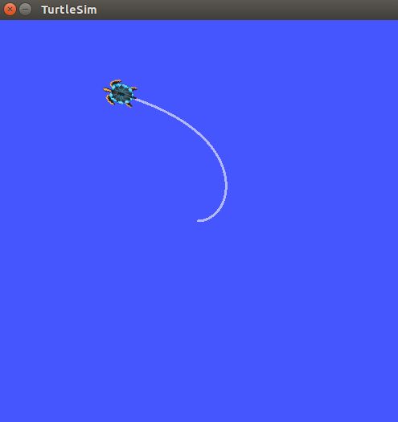
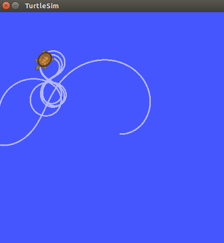

# P Controller with TurtleSim

## Assignment 1

Using the concepts of P control only, create a node that controls the turtle towards a goal. The below example shows a turtle trying to obtain a goal point somehwere in the top left corner from where he originally spawned.

**Requirement:** The regular turtlesim node has a turtle with no mass or inertia etc so it will not behave as any real object would. In order to complete this assignment you will need to install a turtlesim node that has dynamics. This is a link to a git repo containing the package. You can either download the zip or clone it into your workspace.

**Requirement:** You may have noticed by now that using only P control may be insufficient for certain systems as it would be for the jetski example previously given. As requirement one said, the turtle now has mass and inertia so when you reach the destination there is nothing to stop the turtle from continuing to drift. So when your turtle repeatedly overshoots the destination and loops back to try again (shown below), don't worry about it. You will be correcting this inadequacy in the next assignment by using D controls in combination with P controls.

**Requirement:** Make sure that your turtle turns through the smallest possible angle. Don't rotate right through 300 degrees when you could have rotated left through 60 degrees.

**Requirement:** Don't use geometry_msgs/Twist to publish linear and angular velocities in order to control the turtle. In real life you cant just tell a vehicle to go a certain speed. So instead use forces and torques. Think of thrusters on a spaceship. In the turtlesim_dynamics node mentioned above, force and torque are messages that are sent over the geometry_msgs/Wrench topic.

Hint: The node needs to listen to turtle's current position, do proportional control calculations, then publish your control message (forces and torques) to the turtle to adjust his position.

Hint: You may want to use the C++ function atan2(double_y, double_x) which returns the computed arctangent of X and Y coordinates with the appropriate corresponding sign (negative or positive) rather than always positive for both first and third quadrants or always negative for both second and fourth quadrants which is what the regular arctangent function returns.
