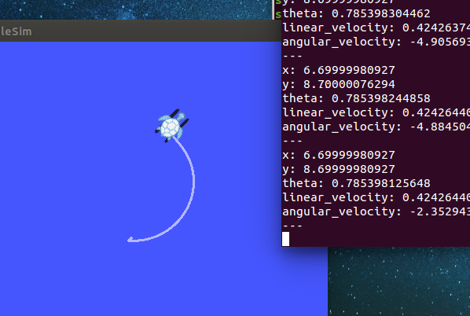

# PID Controller with TurtleSim

## Assignment 3
Use a PID controller to drive the turtle (with dynamics) to a destination in the presence of wind. The turtle should not overshoot the destination and should not stop short of it because of the wind. The turtle should always be approaching the goal (even if slowly). Notice the turtle below from the same situation as before. He now does not stop at (6.7, 8.7) but continues to approach the destination (7, 9). You may have to play with the gains a little in order for the gains of all three terms to work together harmoniously.

While you're at it, if you haven't already, make your node subscribe to some kind of goal message. We should be able to run a rostopic pub on some topic to change the goal of the turtle and make it go wherever we want, without re-compiling the code!
