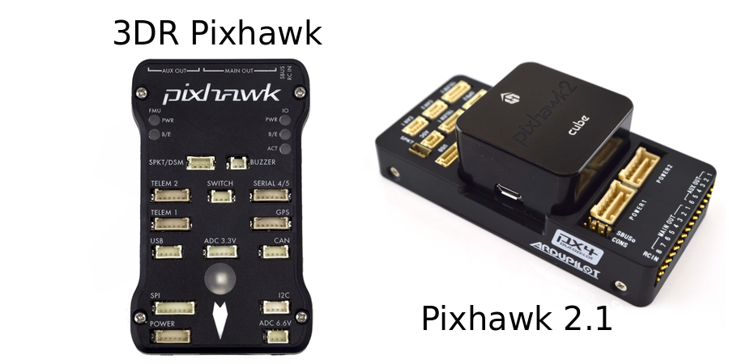
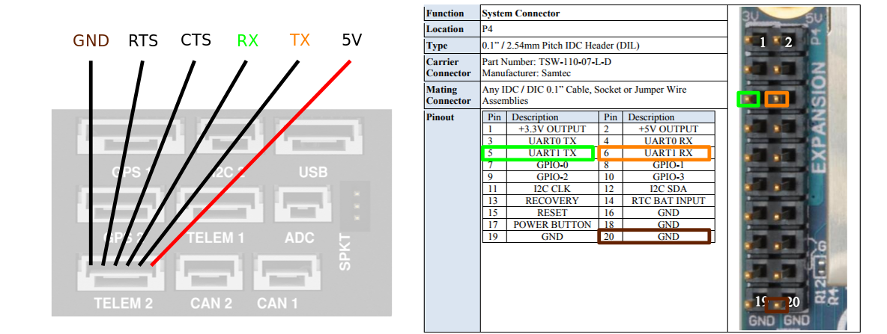

#Pixhawk

This page describes how to set up a Pixhawk autopilot for hardware research purposes in the lab.

## Pixhawk Hardware

The original Pixhawk hardware was open-source, and since then, many flavors of Pixhawk hardware have become available on the market. In the lab we have experience using the original 3DR Pixhawk (no longer manufactured), and the Pixhawk 2.1/The Cube (this is the hardware we currently recommend). Full lists of supported hardware for both PX4 and APM firmware versions can be found [here](https://docs.px4.io/master/en/flight_controller/) and [here](https://ardupilot.org/copter/docs/common-autopilots.html).



##Pixhawk Setup
The following sections describe the steps needed to configure the Pixhawk itself so that it is ready to fly the vehicle, stream sensor data, and accept offboard control commands.

###Firmware Versions

The Pixhawk hardware is typically used with either APM or PX4 firmware. Both firmware versions give the Pixhawk full autopilot capabilites, but there are some pros and cons to each.

The PX4 flight stack is more geared toward researchers and allows streaming of vehicle state data at high rate (50+ Hz). We however only recommend using PX4 for multirotor-type aircraft as their fixed-wing development is not well documented.

The APM flight stack is more popular with commerical companies and hobbyists. It is very stable and thoroughly tested. Some have also noted that APM is easier to tune for large multirotor-type aircraft than PX4. If you are using Pixahawk for fixed-wing, then you should opt to use APM. The most significant drawback to APM is that it provides its internal state data at a much lower rate (10-20 Hz).

###PX4 Setup

PX4 for multirotors is well-documented and you should follow their setup and configuration guides. The main setup guide can be found at [https://docs.px4.io/en/](https://docs.px4.io/en/). A guide for developers and lower-level interfacing with PX4 can be found here [https://dev.px4.io/en/](https://dev.px4.io/en/). In order to set parameters and configure PX4 for your research, you will need to install the Ground Control Station (GCS) QGroundControl. A guide for installing QGroundControl can be found here [https://docs.qgroundcontrol.com/en/](https://docs.qgroundcontrol.com/en/).

####Flight Parameters

Follow the user guide to tune the PID loops of your multirotor with a safety pilot at the controls. Once the vehicle is tuned connect your vehicle to QGroundControl and navigate to the 'Parameters' -> 'Multicopter Position Control' sub-menu. We recommend that you set the following parameters to give more docile, research-friendly flight during Auto and Offboard mode operations.

| Parameter | Recommended Value |
| --- | --- |
| MPC_ACC_DOWN_MAX | 5.0 |
| MPC_ACC_HOR | 2.0 |
| MPC_ACC_HOR_MAX |	5.0 |
| MPC_ACC_UP_MAX |	5.0 |
| MPC_CRUISE_90 | 2.0 |
| MPC_MAN_TILT_MAX | 25.0 |
| MPC_TILTMAX_AIR | 25.0 |
| MPC_TILTMAX_LND | 10.0 |
| MPC_XY_CRUISE | 3.0 |
| MPC_XY_VEL_MAX | 5.0 |

####Startup Script

If you are using PX4, a startup script can be placed on the Pixhawk's SD card and allows you to configure the rates that certain internal data streams (e.g., position, attitude) are made available. To add a startup script, create a folder called `etc` on the main level of the SD card. After creating the folder, create a file called `extras.txt` and place it in the `etc` folder. Now the next time PX4 boots up, this script will be read and the stream rates that you set will be setup. If you are using MAVROS, you can use `rostopic hz /mavros/local_position/pose` to verify that the rates you set in your `extras.txt` file have been applied. An example `extras.txt` file that has been used in the lab is given below:

```bash
leep 100000
#start mavlink custom stream on telem2 (/dev/ttyS2 internally)
# with 921600 and ftp enabled (-x)
mavlink start -m custom -d /dev/ttyS2 -b 921600 -x
usleep 100000
mavlink stream -d /dev/ttyS2 -s HEARTBEAT -r 5
usleep 100000
mavlink stream -d /dev/ttyS2 -s STATUSTEXT -r 1
usleep 100000
mavlink stream -d /dev/ttyS2 -s SYS_STATUS -r 1
usleep 100000
mavlink stream -d /dev/ttyS2 -s PARAM_VALUE -r 5
usleep 100000
mavlink stream -d /dev/ttyS2 -s HIGHRES_IMU -r 100
usleep 100000
mavlink stream -d /dev/ttyS2 -s ATTITTUDE -r 60
usleep 100000
mavlink stream -d /dev/ttyS2 -s ATTITUDE_QUATERNION -r 60
usleep 100000
mavlink stream -d /dev/ttyS2 -s VFR_HUD -r 10
usleep 100000
#mavlink stream -d /dev/ttyS2 -s GPS_RAW_INT -r 5
#usleep 100000
mavlink stream -d /dev/ttyS2 -s GLOBAL_POSITION_INT -r 5
usleep 100000
mavlink stream -d /dev/ttyS2 -s LOCAL_POSITION_NED -r 60
usleep 100000
mavlink stream -d /dev/ttyS2 -s HOME_POSITION -r 5
```

Notice here that attitude and position data have been set to stream at 60 Hz over the Pixhawk's Telem2 port. Some have reported in the PX4 Issues section on GitHub that attitude data can be set to stream at up to 250 Hz. Keep in mind however that there is limited bandwidth on the serial port. Only set stream rates as high as you need, and realize that if you are also sending high-rate commands to the PX4, this also takes up bandwidth.


###APM Setup

Documentation for APM can be found [here](https://ardupilot.org/ardupilot/).


###Connection to a Companion Computer

If you are using Pixhawk for research purposes, you will likely wish to send commands and process vehicle state data via a connection to an on-board companion computer (OBC). Documentation for companion computer setup can be found [here](https://dev.px4.io/en/companion_computer/pixhawk_companion.html) for PX4, or [here](https://ardupilot.org/dev/docs/companion-computers.html) for APM. In both cases, you will setup a physical serial connection between the Telem2 port of the Pixhawk, and your OBC (e.g., Jetson TX2, Odroid XU4, Brix i7, RaspberryPi).

####Using an FTDI Cable
You can use an FTDI cable to connect the TELEM2 on the Pixhawk to one of your OBC's USB ports. Use a 3.3V FTDI cable (3.3V I/O, 5V supply). The following table summarizes the connections to make (connect the TELEM2 pin in the left column to the FTDI pin or wire in the right column). Do not connect VCC (pin 1 on Pixhawk TELEM2 port, pin 3/red wire on FTDI cable). To know which pin is which, be sure to refer to the Telem2 pinout of your Pixhawk hardware, and the pinout of your FTDI device.

| Telem2 | FTDI |
| --- | --- |
| TX | RX |
| RX | TX |
| CTS | CTS |
| RTS | RTS |
| GRD | GRD |

####Direct UART Connection

If your OBC has an auxilary UART serial port that is made readily available (e.g., Raspberry Pi, TX2 with Orbitty Carrier board), then you can save yourself from using up a USB port, and conect the Telem2 port of the Pixhawk directly to the UART pins of your OBC using just 3 wires. When possible, we recommend connecting your Pixhawk and OBC in this way because it saves weight, allows you to use your USB port(s) for other things like cameras, and the phisical connection is typically more reliable (USB ports can wiggle loose in flight). Refer to the pinout of your Pixhaw hardware's Telem2 port and the pinout of your OBC's UART, and then connect the pins as shown in the following table (connect the Telem2 pin in the left column, to the UART pin in the right column).

| Telem2 | UART |
| --- | --- |
| TX | RX |
| RX | TX |
| GRD | GRD |

If you are using the Pixhawk 2.1 with the Jetson TX2 and the Orbitty carrier board, you may refer to the pinout pictured below:



##ROS Overview

###MAVROS

[MAVROS](https://wiki.ros.org/mavros) is a widely used ROS package for communicating with Pixhawk and other MAVLink hardware. It can be thought of as a two-way communications bridge between your on-board computer and the Pixhawk that converts ROS messages to MAVLink messages, and MAVLink messages to ROS messages. MAVROS makes certain Pixhawk data available such as state data, IMU, and the Pixhawk's internal status. It also allows you to publish commands to the Pixhawk such as position, velocity, or attitude.

####Installation

This [guide](https://dev.px4.io/en/ros/mavros_installation.html) gives two steps to install mavros:

```bash
sudo apt install ros-kinetic-mavros ros-kinetic-mavros-extras
```
and

```bash
wget https://raw.githubusercontent.com/mavlink/mavros/master/mavros/scripts/install_geographiclib_datasets.sh
./install_geographiclib_datasets.sh
```

Once installed, you can launch MAVROS with your Pixhawk connected over USB by running `roslaunch mavros px4.launch` or `roslaunch mavros apm.launch` depending on which firmware (PX4 or APM) that your Pixhawk is running. After launching, opening a new terminal and running `rostopic list` should now display several topics of Pixhawk data.

It is not recommended to connect to the Pixhawk over USB when you are conducting actual flight tests. In this case, you should connect to the Pixhawk via the Telem2 port. To do this, you can use an FTDI cable or a direct UART connection as was discussed earlier on this page.

####Coordinate Frames

Although both APM and PX4 firmware do their own internal state estimation and control in the local NED coordinate frame, and the front-right-down (FRD) body frame, MAVROS converts Pixhawk state data to be expressed in the ENU local frame and the FLU body frame. MAVROS does this to be consistent with standard ROS conventions. In our lab however, we generally prefer to use the NED/FRD coordinate systems and therefore you will need to convert MAVROS data back to being expressed in NED/FRD. There are two ways to do this: The first way (and the most correct way), is to setup your TF tree to handle the coordinate frame conversions for you. The second way would be to write a re-publisher node that subscribes to the MAVROS ENU/FLU data, performs the necessary ENU to NED rotations, and then publishes new data in NED/FRD.
