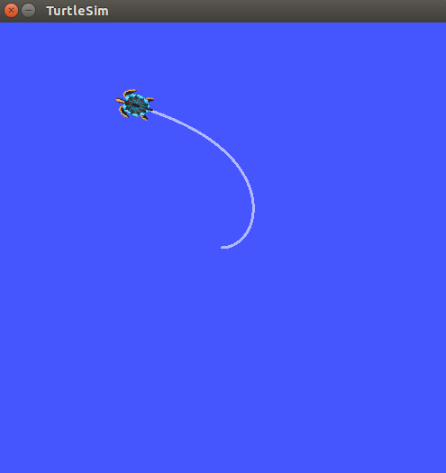

# PD Controller with TurtleSim

## Assignment 2

Use a PD controller to drive the turtle towards a destination without overshooting the mark. As you complete this assignment, do so in the absence of wind. You can either edit the wind parameters in the turtle.cpp file of the turtlesim_dynamics folder that you installed in the last tutorial, or you could create a launch file with parameter arguments to set the wind values (might be useful for the next assignment anyway).

To set a param inside a node, use this syntax
~~~~
<node name="turtle" pkg="turtlesim_dynamics" type="turtlesim_node">
  <rosparam name="parameter_name" value="2"/>
</node>
~~~~

