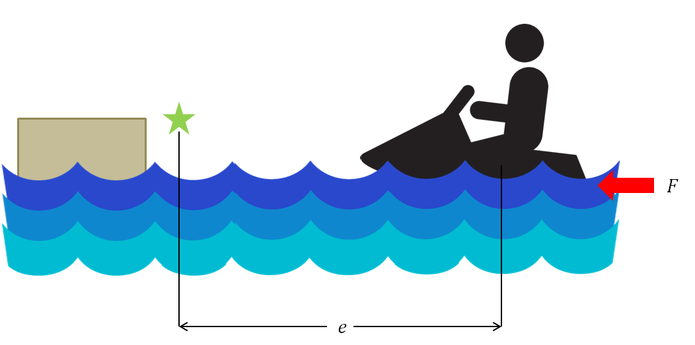
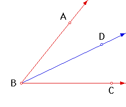

# Controls tutorials: P Controller

## Example
Let's use an example to illustrate:

In this image, we have a jetski rider, who is trying to approach the dock. He has the jet out the back of the ski, which we will model as a linear force on the back of the jetski. The question is, how much force should he apply to get where he wants to go?

The simplest answer is for the jetski rider to apply a lot of force when he is far away from the goal, and less if he is closer. Say, he applies a force "proportional" to his position error. That is the idea behind P control.

### P Control

Let's look at P control in the context of turtlesim since that is your next assignment. All you will be doing in this assignment is using a linear force to drive the turtle and a torque to steer the turtle towards a destination. The magnitude of the force and torque will be proportional to a calculated error (difference between where you are and where you want to be). If you remember the P term of the entire PID equation it looked like this <math> t </math>

$$K_p e(t)$$

K is just a gain coefficient - a constant. Error is what's important. The point is to constantly check your error and output a force and torque scaled according to the amount of error. If you're way off your mark, your error is large and your applied force will be larger than if you were really close.

### TurtleSim Example

Use the picture below as an example. Pretend like the turtle's current position is point B and he is pointing to D. The turtle's goal is point A. Line BC will be used as a reference 0 degrees.

There will be two errors that you need to calculate in the turtle's positioning. They are 1) distance from goal and 2) difference between current angle and desired angle. Thus you will have distance error and angle error which will scale both a linear force and an angular torque respectively.

### The Math

Let's use the Pythagorean theorem to calculate the distance to the goal (distance error).

$$ d_e = \sqrt{(Goal_x - Current_x)^2 + (Goal_y - Current_y)^2} $$

Use the arc-tangent to calculate the goal angle (ABC), the angle to which you need to align yourself.

$$ \psi_{goal} = arctan(\frac{Goal_y - Current_y}{Goal_x - Current_x}) $$

The angle error (ABD) is then calculated as the difference between goal angle and current angle (DBC).

$$ \psi_e=\psi_g-\psi_c $$

where \\( \psi_e \\), \\( \psi_g \\) and \\( \psi_c \\) are the error, goal and current values for \\( \psi \\).

You can then use these calculated errors to drive your turtle to your goal!
