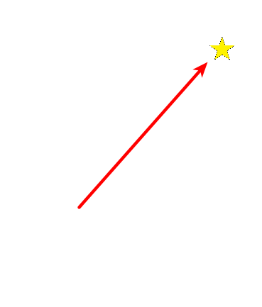
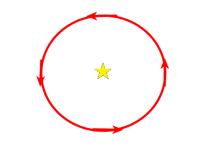
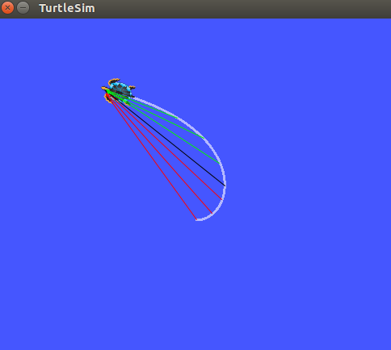

# PD Controller

## Derivative Term

Hopefully you noticed in the last assignment that your turtle consistently overshot his destination. This is because he couldn't predict the future of arriving at the destination and slow down. In this assignment we will add the derivative term which will correct this problem by providing prediction through linear extrapolation. Your equation will now look like this.

A human will recognize that it is ok to go really fast when far away from the destination but when approaching, it might be a good idea to slow down. If you think about what a human intuitively knows in order to do this, you recognize that it will be necessary to know the velocity so you can know if you're going too fast and need to slow down as you approach. But you also need to know the destination location. Combining the two, you need to know your velocity in relation to where you are relative to your destination. This is what the derivative of error yields.

The derivative of the error is the change in error (distance from destination) over time. If you think about what that actually means you will recognize that this is similar to velocity. After all it is a change in position over time. You will find, however, that it is a little more specific than velocity in the fact that it gives you change in position relative to your destination. Let's compare velocity with error derivative so you can understand the difference. Consider the two situations below of approaching a destination (star).

 $$ u(t) = K_p e(t) + K_d \frac{de}{dt} $$

A human will recognize that it is ok to go really fast when far away from the destination but when approaching, it might be a good idea to slow down. If you think about what a human intuitively knows in order to do this, you recognize that it will be necessary to know the velocity so you can know if you're going too fast and need to slow down as you approach. But you also need to know the destination location. Combining the two, you need to know your velocity in relation to where you are relative to your destination. This is what the derivative of error yields.

The derivative of the error is the change in error (distance from destination) over time. If you think about what that actually means you will recognize that this is similar to velocity. After all it is a change in position over time. You will find, however, that it is a little more specific than velocity in the fact that it gives you change in position relative to your destination. Let's compare velocity with error derivative so you can understand the difference. Consider the two situations below of approaching a destination (star).

Approaching a destination in a straight line.

|  |  |
| :-----------------------------------------------------------------: | :---------------------------------------------------------: |
| \\( \frac{de}{dt} \propto velocity \\) | \\( \frac{de}{dt}=0 \\) and \\( velocity \ne 0 \\) |
| The derivative of the error is proportional to velocity | The derivative of the error equals zero while the velocity does not |

Can you now see how the error derivative is more than just a measure of velocity? It is a measure of velocity with relation to your destination.

The below illustration explains this concept more precisely. The turtle's destination is in the top left corner from where he spawned at the center.

$$ \frac{de}{dt} = \frac{error - error_{previous}}{dt} $$

If you think carefully about the error derivative as the turtle goes around the curve, you will notice it is positive (red lines) when the turtle first starts out. The turtle is moving away from the destination and so error is increasing. At the end of the journey the turtle is getting closer to the destination, thus error is decreasing and the error derivative is negative (green arrows). At some point it must transition between positive and negative and will thus be zero (black arrow, similar to circle case above).

The ability to be either positive or negative is very valuable and that is how we can either increase or decrease the value of the controls, by adding to, or subtracting from the original P term. If the turtle is moving away from the destination, the derivative term is positive and says, "lets step on the gas a little and travel around this curve a little faster," so it adds to the P term. When the turtle is moving towards the destination the D term is negative and says, "we are going to hit our mark pretty quick, lets slow down a little" and so it subtracts from the P term. This is what is meant by "ability to predict the future through use of derivation."

As with the P control assignment, there is a linear component and an angular component in D controls. This tutorial only explained linear D controls since it is easier to visualize. The principles are the same and easily applied to the angular component.
