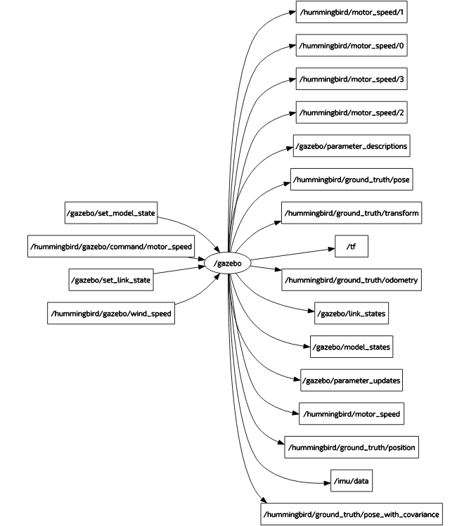
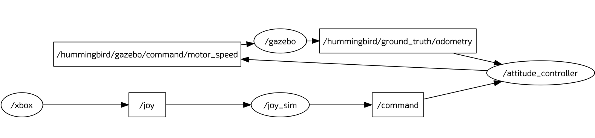

# Interfacing ROS With Gazebo

## Interfacing ROS With Gazebo
Okay, so now we have our MAV showing up in Gazebo, let's tell it to do something with ROS.

Go ahead and launch your test.launch file for the multirotor and look at the `rqt_graph`. It should look something like this. 



You may have additional sensors beyond ground_truth and imu, but the idea is the same.

All we need to do to make our MAV fly is publish to the `/hummingbird/gazebo/command/motor_speed` topic.

We can manually override the position of the MAV by publishing to the `/gazebo/set_model_state` topic, and we can retrieve truth information from the `/hummingbird/ground_truth/*` topics. Our Cortex motion capture system publishes the same kind of message as the `/hummingbird_ground_truth/transform` topic, so if you leverage that message, then it is a drop-in replacement for the `cortex_ros` package.

The `attitude_controller` package can be used to publish the motor commands to gazebo, and it accepts roll, pitch, yaw_rate and thrust commands. The `joy_sim` package publishes these kinds of commands based on joystick inputs, and the `pid_controller` package publishes these commands based on velocity inputs from other nodes. Here is an example of the `rqt_graph` for `joy_sim -> attitude_controller -> gazebo`. 



Here is the launch file that produced this graph: *make sure you are on the* `attitude_controller` *branch* as of 4/16/2016 

```xml
<launch>
  <arg name="mav_name"            default="hummingbird"/>

  <include file="$(find gazebo_ros)/launch/empty_world.launch">
    <arg name="world_name" value="$(find fcu_sim)/worlds/basic.world"/>
    <arg name="paused" value="false"/>
    <arg name="gui" value="true"/>
  </include>

  <!-- Spawn MAV -->
  <include file="$(find rotor_gazebo)/launch/spawn_mav.launch">
    <arg name="mav_name"            value="$(arg mav_name)" />
    <arg name="model"               value="$(find fcu_sim)/urdf/$(arg mav_name)/$(arg mav_name)_base.xacro" />
  </include>

  <!-- Joystick -->
  <node name="xbox"                pkg="joy"                 type="joy_node"/>
  <node name="joy_sim" pkg="joy_sim" type="joy_sim" >
    <rosparam command="load" file="$(find joy_sim)/param/$(arg mav_name).yaml"/>
  </node>

  <!-- Attitude Control -->
  <rosparam command="load" file="$(find attitude_controller)/param/$(arg mav_name).yaml"/>
  <node name="attitude_controller" pkg="attitude_controller" type="attitude_controller_node">
    <rosparam command="load" file="$(find fcu_sim)/param/$(arg mav_name).yaml"/>
    <remap from="odometry" to="$(arg mav_name)/ground_truth/odometry"/>
    <remap from="command/motor_speed" to="$(arg mav_name)/gazebo/command/motor_speed"/>
  </node>
```
As you can see, we have developed the simulator such that it is easy to replace the hardware with the actual software. For example, the same `/command topic` is accepted by `naze_ros` and `mavros` for controlling the Naze and Pixhawk autopilots, respectively. With the drop-in replacement for `cortex_ros`, simulations can be performed in a simulated motion capture room, then moved right in and flown on hardware with only a few changes in launch files! 
