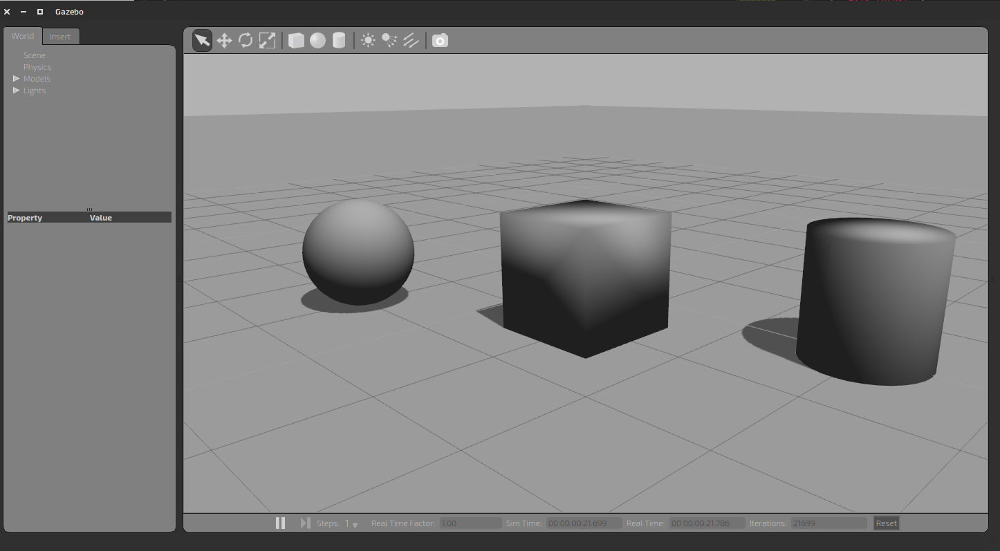

# Make a World

## Making a World

One of the best parts of gazebo is how well it simulates environments.  In this lesson, we'll learn how to build our own environments and use them in our simulations.
Worlds in gazebo are defined as SDFs.  These are very much like the xacro files we were using earlier, so like the xacros it's very strongly typed.  (most of the world files I've made are in the 1000's of lines long).  Don't let that dissuade you though, it's not very hard.

### Using Primitives

First, let's just use primitive shapes (the box, the cylinder, and the sphere).  Let's make an empty world, with one of each of them inside.  Open up a terminal and type

```bash
 gazebo
```

This will open a blank gazebo window.  On the top toolbar, click the box and drag it somewhere in the world.  Repeat with the cylinder, and the sphere until you have one of each.



Then on the window menu, click "Save World As" and save the world somewhere. We can now use the resulting file to build the world.  You'll find different blocks in the file such as the one below which defines the box.

```xml
<pre class="prettyprint">
    <model name='unit_box_2'>
      <pose>1.41311 -4 0.5 0 -0 0</pose>
      <link name='link'>
        <inertial>
          <mass>1</mass>
          <inertia>
            <ixx>1</ixx>
            <ixy>0</ixy>
            <ixz>0</ixz>
            <iyy>1</iyy>
            <iyz>0</iyz>
            <izz>1</izz>
          </inertia>
        </inertial>
        <collision name='collision'>
          <geometry>
            <box>
              <size>1 1 1</size>
            </box>
          </geometry>
          <max_contacts>10</max_contacts>
          <surface>
            <bounce/>
            <friction>
              <ode/>
            </friction>
            <contact>
              <ode/>
            </contact>
          </surface>
        </collision>
        <visual name='visual'>
          <geometry>
            <box>
              <size>1 1 1</size>
            </box>
          </geometry>
          <material>
            <script>
              <uri>file://media/materials/scripts/gazebo.material</uri>
              <name>Gazebo/Grey</name>
            </script>
          </material>
        </visual>
        <velocity_decay>
          <linear>0</linear>
          <angular>0</angular>
        </velocity_decay>
        <self_collide>0</self_collide>
        <kinematic>0</kinematic>
        <gravity>1</gravity>
      </link>
      <static>0</static>
    </model>
</pre>
```

You don't need everything in the above block to make it work.  But there are some important parts.

* `pose` - This is the coordinates for the center of the box. x y z r p y
* `mass`/`inerital` - you need these blocks for anything to appear at all
* `collision` - you don't need to worry about the surface part of the block, but you will want to make sure collision is defined if you want it
* `visual` - you can change the color by replacing Gazebo/Grey with something else.  This is a list of all available colors <a href="http://library.isr.ist.utl.pt/docs/roswiki/simulator_gazebo(2f)Tutorials(2f)ListOfMaterials.html">link</a>
* `velocity_decay`/`self_collide`/kinematic - you can ignore these block entirely
* `static` - if 0, then it will move if it is crashed into.  If 1, then it will not move.  I generally make everything in my worlds static.

After making those adjustments, I then copy the primitive block over and over, naming the subsequent models "`box_1`, `box_2` ..." and changing the pose and sizes as necessary.  This is how I made the cylinders worlds and the box worlds in the `rotor_gazebo` package.  Look at those files for reference.

### Editing World Parameters

There are couple of other useful blocks in the file we just made.  Let's highlight a few of them.

```xml
<pre class="prettyprint">
    <physics type="ode">
      <max_step_size>0.001</max_step_size>
      <real_time_factor>1</real_time_factor>
      <real_time_update_rate>1000</real_time_update_rate>
      <gravity>0 0 -9.8</gravity>
    </physics>
</pre>
```

This block is really useful if you are finding that your computer cannot run the simulation fast enough.  By increasing the `max_step_size`, and decreasing the `real_time_update_rate`, you can reduce the computational load.  You do have to make sure that `max_step_size` x `real_time_update_rate` = 1.0.  Otherwise, you'll run at slower than or faster than real time.  Here is an example of an ode block that lets us run our full simulation on a 5 year old computer.

```xml
<pre class="prettyprint">
    <physics name="ode_fast" type="ode" default="true">
      <max_step_size>0.03</max_step_size>
      <gravity>0 0 -9.8</gravity>
      <real_time_factor>1</real_time_factor>
      <real_time_update_rate>34</real_time_update_rate>
      <ode>
        <solver>
          <type>quick</type>
          <iters>70</iters>
        </solver>
      </ode>
    </physics>
</pre>
```

I also changed the default number of ode solve iterations from 1000 to 70 to reduce computation as well.

The next useful block is the gui block, as follows:

```xml
<pre class="prettyprint">
    <gui fullscreen='0'>
      <camera name='user_camera'>
        <pose>8.68371 -6.64602 3.18089 0 0.275643 2.35619</pose>
        <view_controller>orbit</view_controller>
      </camera>
    </gui>
</pre>
```

Namely, the fullscreen and pose parts.  This positions the camera view for the simulation. I find that the best way to get this is to build your world, move the camera into position, then save the world and copy just this block to get the camera right.

There is usually a very large state block.  This describes exactly how all of your models are oriented in the world, which is unnecessary for what we want to do.  I generally delete this block entirely.

Any other block in the file should probably be left.  I'm not sure what everything in there does, so I can't say for sure whether it's important or not.

### More Complicated Worlds

You can add more complicated models by using the "Insert" Tab, and looking under the http:gazebosim.org/models.  This will download the model you click on and add it to the world.  There are  number of models there which you can use to build more complicated environments (such as the international space station and the fire hydrant blow).  When you're done building, simply click "Save World As" and put it somewhere you can find it.  (`rotor_gazebo/worlds` is a great place to put it).


These models can be saved into a world file just like the primitives and manipulated the same way.

If you're interested in building your own models and adding them to the world, you'll have to read up on the [gazebo tutorials](https://gazebosim.org/tutorials)
