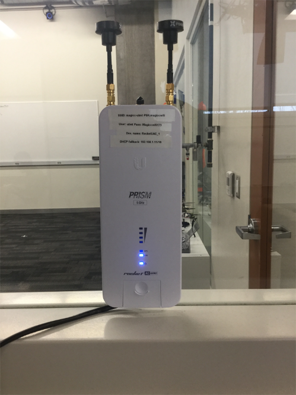
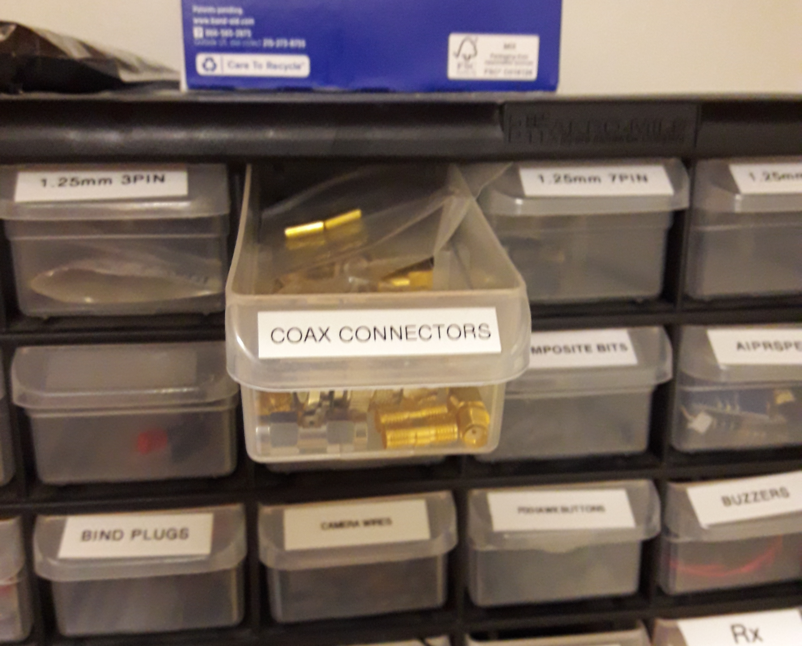
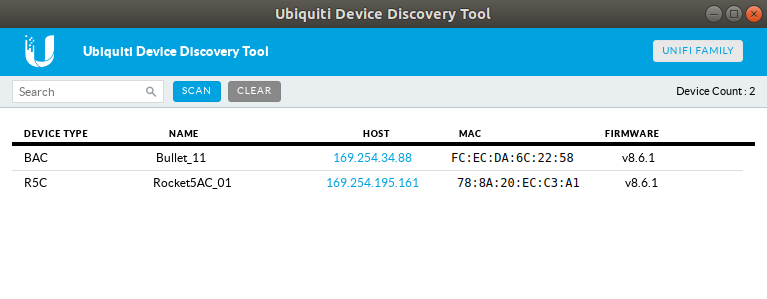

Ubiquiti: Bullets and Rockets
==========================
The Ubiquiti Rocket can be thought of as a powerful wifi broadcaster that provides a very strong long-range connection to a Bullet.

## Rocket ##
The MAGICC Lab has a Rocket sitting on the wall behind the printer.

## Bullet ##

Bullets can be ordered [here](https://www.ui.com/airmax/bullet-ac/)

In the lab, we typically strip down the bullet in order to reduce its size.

### Stripping Down the Bullet ###

1. Use the hacksaw to saw off the metal cylinder extending from the plastic tube.

2. Take the plastic tubing off.

3. Detach the metal cylinder from the bullet. Be careful not to rip any of the five pads off the bullet while doing so.

4. Desolder the connection points for the metal cylinder.

5. Get a Coax Connector and solder it to all five pads. The connectors are located in the back of the lab.

    
    

6. Insert the bullet into a heatshrink envelope.

7. Use the heat gun to shrink the plastic until it fits tightly.

8. Cut the plastic around the heatsink, ethernet port, and end of the Coax Connector.

9. Attach an antenna like the [Lumenier AXII](https://www.lumenier.com/products/antennas).

### Bullet Configuration ###

1. Download [Google Chrome](https://www.google.com/chrome/)

2. Download the [Ubiquiti Device Discovery Tool](https://chrome.google.com/webstore/detail/ubiquiti-device-discovery/hmpigflbjeapnknladcfphgkemopofig?hl=en)

3. Ensure the rocket in the Lab is operating.

4. Plug the bullet into an ethernet cable that provides power, as shown below. Wait for two lights to come on.

    

5. Launch the Ubiquiti Device Discovery Tool. Select clear, then scan. You should see both the rocket and bullet in the list.

    

6. Click the link for the host of the bullet. This will open a page in your browser. The browser will warn you that the connection is not private. Select advanced and click proceed to enter the bullet's setup page.

8. Log in to the bullet. The username and password are both ubnt. Dismiss any firmware update prompts.

9. The lab updates the firmware for all of the bullets once/year. Check to see which firmware the other bullets are using, and then download that same firmware from [here](https://www.ui.com/download/airmax-ac/bullet-ac).

10. Click the gear icon on the left to access the settings pane. In the top right sector, select upload firmware. Upload the firmware downloaded in the previous step.

    

11. Update the username of the bullet to ubnt. Password should be Magiccwifi123

12. Update the name of the bullet to b##_MCU_character of your choice.

13. Now repeat steps 4-8 with another bullet that has already been setup. (We will call this one bullet2) The username for bullet2 is ubnt. The password to bullet2 is Magiccwifi123.

14. On bullet2, click the gear icon on the left to access the settings page. Scroll to the bottom and select backup configuration to download the configuration to your computer. Alternatively, access the config files for each bullet on the private MAGICC wiki.

    

15. Follow the previous step to download the configuration file for bullet1 as well.

16. Open Atom. Install the sort-lines package by following directions [here](https://atom.io/packages/sort-lines).

17. Install the split-diff package in Atom via the settings window and install. You can find more information on the package [here](https://atom.io/packages/split-diff).

18. Open bullet1.cfg in Atom. Select the entire text. In the view drop-down menu, select Toggle Command Palette. Then type sort::list in order to sort bullet1.cfg alphabetically.

19. Open bullet2.cfg side-by-side with bullet1.cfg. Toggle the command palette again and run split-diff command.

20. The things that should be different between the two .cfg files are names, IP addresses, Hardware Addresses, and the passwords. You can ignore anything with a # in front of it, as those lines are commented out.

21. All other configurations in bullet1.cfg should match bullet2.cfg. NEVER modify bullet2.cfg.

22. Once everything is up-to-date on the new bullet1.cfg file, upload the configuration to the bullet on its webpage. The bullet will then need to restart with the proper configuration. Once it does so, the bullet will have all its lights blinking.

23. Update the MAGICC Hardware Inventory on the private wiki page under Inventory and Standard HW to include the new bullet, its MAC address, the project it falls under, and the date acquired.

24. Upload the bullet1.cfg configuration file to the Ubiquiti_configs repo under the folder bullet_configs. Edit the file ownership.txt to include your new bullet.

## Using a Bullet/Rocket Combination ##
Avoid turning on any additional rockets within the lab. Doing so may adversely affect the lab's primary bullet near the MOCAP room.
