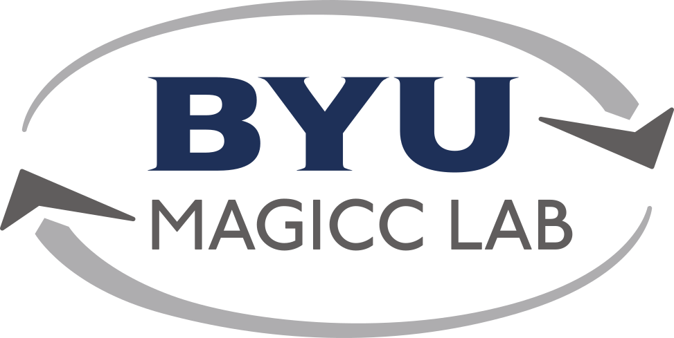

# MAGICC Lab Public Wiki

!!! note
    This is the public-facing MAGICC Lab wiki. The private wiki is found here: [https://github.com/byu-magicc/wiki-private](https://github.com/byu-magicc/wiki-private)

    You need to be logged into GitHub and be a member of the byu-magicc organization for this link to work.

This is the wiki for the BYU MAGICC lab, where we keep all useful guides/links/information for lab members or any interested viewers.
For instructions on editing the wiki, view the [source repository README](https://github.com/byu-magicc/wiki).

## Links
- [Main Website](https://magicc.byu.edu/)
- [GitHub](https://github.com/byu-magicc)
- [Write Brothers Scoreboard](https://keepthescore.com/board/ppwrmcdqpnywr)

