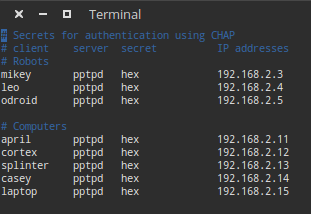
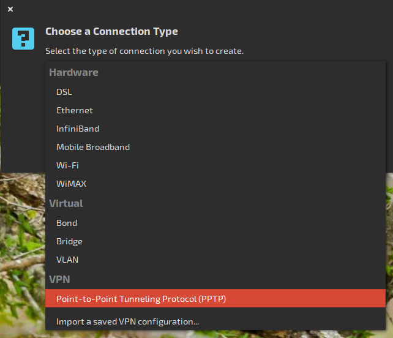

# VPN Setup #

A VPN (Virtual Private Network) allows several devices that are on different networks to be placed on a common subnet.
Routing can be configured such that only specific data is sent to the VPN while _normal requests_ are sent to the open internet.
However, that functionality is out of the scope here.
We will provide a method that routes **_all_** network requests to the vpn.

!!! Note
    There are much simpler solutions available to solve the original problem that served as motivation for this article.
    You can read about that motivation in the [Legacy: Intro](#intro) paragraph.
    If you still want a VPN, WireGuard can now be used to create a simple, secure, and _fast_ VPN.
    A few details are included here.

TODO: describe how to set up wireguard vpn with hub and spokes

# Legacy #

## Intro ##

The VPN (Virtual Private Network) Allows us to tie several networks together under the same "subnet," allowing all of the ROS computers to think they are on the same network, and function properly.
This was a problem when we needed to add an odroid to the hex to process incoming USB data in real time and wireless connections were not fast enough so we tied the odroid to shredder with an ethernet cable and made a network between them.
The only problem was that it was impossible to have the laptop, casey, or splinter be a part of that ROS network, and visualize or send commands.
To solve that, we created a VPN with shredder as the host.
Shredder assigns IPs on an arbitrary subnet that is accessible by any computer who is attached to shredder in any way.
Therefore the odroid, and casey can both talk to each other as if they were next to each other in the network.

We use a PPTP (Point-to-point tunneling protocol) VPN with virtually no security hosted by shredder.
This will show you how to set it up.

Most of this tutorial comes from [Digital Ocean](https://www.digitalocean.com/community/tutorials/how-to-setup-your-own-vpn-with-pptp)

## Establishing Shredder as the Host ##
Use an hdmi cable to connect shredder to a monitor.
Click on the network connections manager.
Click "edit connection." click "add."
Make sure that the highlighted selection is "ethernet."
Click create. Change the "connection name" as desired.
Click "ipv4 settings."
Change the "method" to "shared to other computers."
Click save and you're done.
Shredder will now act as host for other computers to connect on the network.

## Setting Up the VPN Hosts ##
The VPN host is going to act as the relay between networks.
All the computers needs to be able to resolve it's IP address, so in our case, we made shredder the host, since it was a part of both networks.
All of the following commands require root access, so just save yourself some typing and open a root command prompt.

```bash
sudo bash
```

### Setting up pptpd ###
First, install the pptp server on shredder

```bash
apt install pptpd
```

Next, we need to go in and tell shredder which IP addresses to assign to clients and what to assign itself on the network.
Use vim to edit "/etc/pptpd.conf".
Find, uncomment and edit the following lines to look as follows:

```bash
localip 192.168.2.2
remoteip 192.168.2.3-20
```

or something like that.
This sets the hosts's IP to be 192.168.2.2, and opens up the next 28 addresses to be used by clients attached to the network.

Next, we need to set up the authentication on the network.
Each client will have a username and password and a static IP assigned to it, found in /etc/ppp/chap-secrets.
Shredder's looks like the following:



Now we need to add some DNS servers, so that computers hooked to the VPN can have internet access.
Historically, we've just used Google's DNS servers.

Edit /etc/ppp/pptpd-options, find the lines starting with "ms-dns" uncomment these lines and add the following lines:

```bash
ms-dns 8.8.8.8
ms-dns 8.8.4.4
```

Now just start up the pptp service and the VPN is up and running!

```bash
service pptpd restart
```

### Setting up the IPtables Rules ###
Now the hard part, we need to set up the port forwarding.
First allow IPv4 and IPv6 address forwarding by editing `/etc/sysctl.conf` and uncomment the following two lines

```bash
net.ipv4.ip_forward = 1
```

and in the next section

```bash
net.ipv6.conf.all.forwarding=1
```

Next, we will set some NAT rules (Network Address Translation - the sole purpose of our VPN).
In the command prompt, type the following rules.
These rules assume that the host is accessing the network(s) on eth0 and wlan0, and the VPN will be on ppp0 Check ipconfig to make sure that the adapters are right.
Sometimes, the adapters are on other devices, just swap them out in the following commands for whichever connections you want.

```bash
iptables -t nat -A POSTROUTING -o eth0 -j MASQUERADE && iptables-save
iptables -t nat -A POSTROUTING -o wlan0 -j MASQUERADE && iptables-save
iptables --table nat --append POSTROUTING --out-interface ppp0 -j MASQUERADE
iptables -I INPUT -s 10.0.0.0/8 -i ppp0 -j ACCEPT
iptables --append FORWARD --in-interface eth0 -j ACCEPT
iptables --append FORWARD --in-interface wlan0 -j ACCEPT
```

To be completely honest, I'm not 100% sure what these commands do.
If someone else decided to dive through and figure out what all these things are, then that would be great.
All I know is that iptables is the firewall in linux, and these commands make the computer act as a router on the various network connections.

### Special Consideration for a Cloud Server ###
If you are using a cloud server, such as the AWS or Google Compute Engine, in order to connect to the VPN, you'll need to change the security on the cloud server to allow TCP traffic on the appropriate ports.
(Students have in the past just opened up TCP on all ports from anywhere.
This is not secure. Do **_NOT_** do this.)

### Special Considerations for the Odroid ###
The host in our setup needed an ethernet connection to the odroid on board.
This required an additional step in which we created a bridge to the odroid.
To do this, all you have to do is open the network manager on the host (From the GUI), and edit the wired connection.
Under the IPv4 Settings, change it from "Automatic" to "Shared to Other Computers."
This creates a network between the two computers.
Pull up ipconfig and make a note of the host's IP address on this wired network, because this will be the gateway for the odroid.

## Connecting a Client ##
We will now be connecting a client (odroid) to the host that we just set up.
Connect the odroid to a monitor with an hdmi cable.

First, if you are running lubuntu (odroid), pptp does not come default, install it with

```bash
sudo apt install network-manager-pptp
```

It comes default with the standard ubuntu install.
Open the network manager and add a connection.
Scroll down and select PPTP, then create



In the following dialog, name the connection something other than "VPN Connection 1" add the hosts IP as the gateway, and the username and password (from the chap-secrets file) of the client that is connecting to the host.
Click "Advanced" and check the box "Use Point-to-Point encryption MPPE"

[Image:VPN_1] [Image:VPN_2]

Click "OK" then "Save" and close the network manager.

To Connect to the VPN, simply click the network icon in the upper right, hover over VPN Connections, and select the newly created VPN.
It should think for a minute, then display "VPN Connection Successful".

If you type

```bash
ifconfig
```

into the command prompt, you should now see an additional pppX connection with a new IP address.

## Auto connecting to the VPN ##
To automatically connect to the VPN, such as when using the Odroid, there are a few steps.

### Disable the keyring ###
First, you have disable the "Default Keyring" (that annoying pop-up that asks for your password every time you log in).
You have to install and open the password manager found in regular Ubuntu

```bash
sudo apt install seahorse
seahorse
```

In the leftmost column under Passwords, right click the "Default" folder, and select "change password"
Type the keyring password, then leave the new password fields blank.
It will give you some message about it being unsafe, just ignore it and reboot the Odroid.

### Automatically Connect to the Ethernet ###
Although you have already disabled the keyring, you still have to get around it for user permission issues.
To do this, edit the VPN connection file /etc/NetworkManager/system-connections/shredder and change the field

```bash
password-flags=0
```

and then add at the bottom the two lines

```bash
[vpn-secrets]
password=<password>
```

you also need to tell the ethernet connection to automatically connect to the VPN.
Go to Network connections manager.
Make sure the ethernet connection is highlighted and click "edit."
Then click the "general" tab.
Check the box that says "automatically connect to VPN when using this connection."

Then reboot the odroid.
It should automatically connect to the VPN, the Ethernet and the WiFi without any intervention
