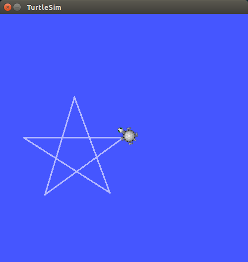

# Assignment 10: Draw a Star

Now it's time to get some experience building your own ROS node in both C++ and Python.  This assignment is intended to be more challenging than previous ones, and will probably require using knowledge gained from additional tutorials, lab mates, and/or online resources.

1. First create a node using C++ which makes the turtle in TurtleSim draw a star when run.
2. Then try again using Python instead of C++.

NOTE: The star doesn't have to be perfect.

Hint: A useful tool for C++ might be the `rclcpp::Rate` class.  A useful tool for python might be the `rclpy.Rate` class, `rclpy.time` class and/or the `rclpy.duration` class.
