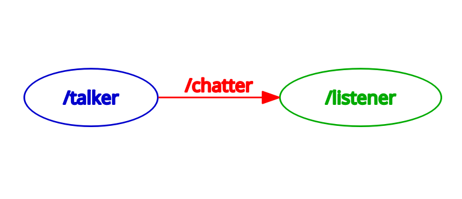

# Assignment 1: Running Nodes: Listener and Talker

Try to run these two nodes in **two different terminal**, and see what will happen. 
```bash
ros2 run demo_nodes_py listener
```

```bash
ros2 run demo_nodes_cpp talker
```

Then, explain the rqt graph below:


* We are running what nodes from what packages? 
* The two nodes are communicating with each other through which topic? 
* Which node is receiving messages and which node is sending messages through the topic? Which node is a "subscriber"? Which node is a "publisher"?