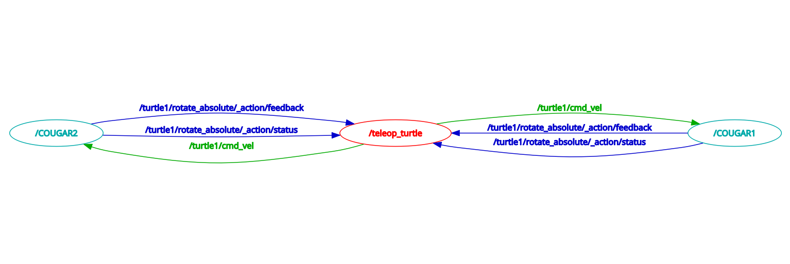
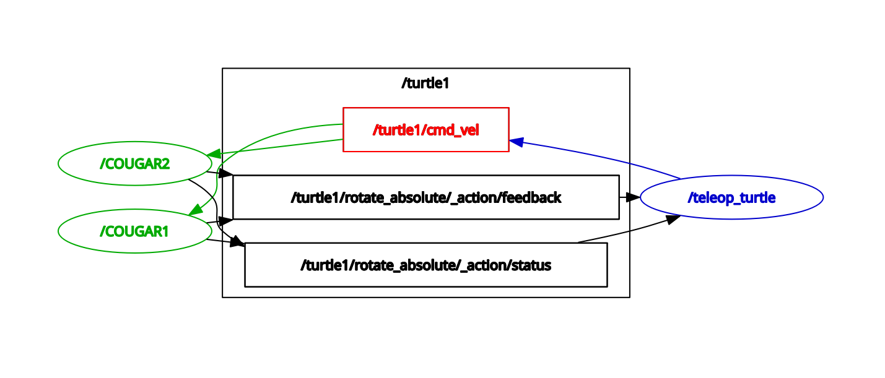

# Assignment 2: Turtlesim Assignment

Replicate the following scenario using the tools which you have learned in the two previous tutorials:

* Note 1: **/COUGAR1** and **/COUGAR2** are renamed `turtlesim_node` (Lesson 2 for Node Renaming). **/teleop_turtle** is from the `turtle_telelop_key` node.

* Note 2: Choose **"Nodes only"** / **"Nodes/Topics (active)"** mode for the rqt tool, and you will see  different graphs.

