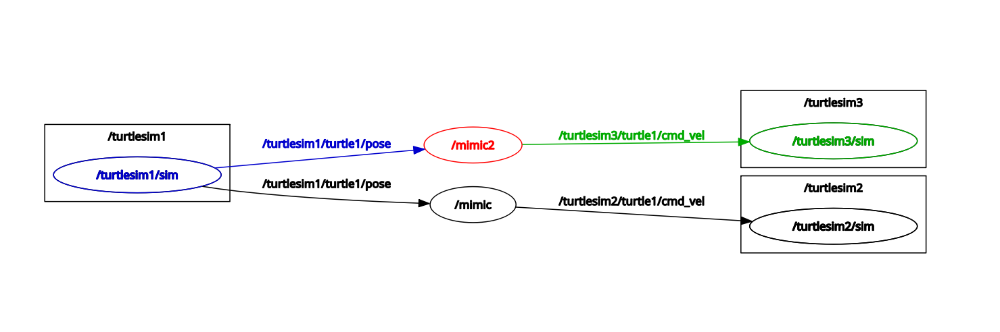

# Assignment 6: More Launch File Practice 1
According to what you've learned in [Lesson 5: Launch Files](../launch_files.md) and [Lesson 7: Topic Remapping](../topic_remapping.md), create a launch file for turtlesim mimicing that can
- launch three `turtlesim_node`
- make two of the three `turtlesim_node` mimic the other one

This rqt node graph is what you might get:
