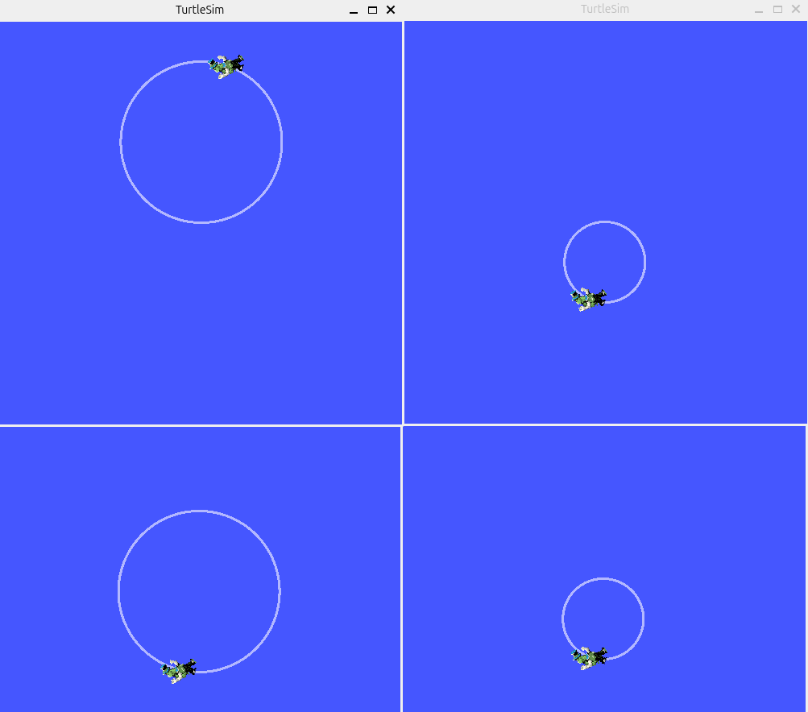
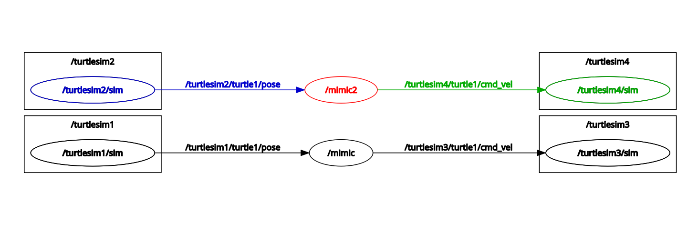

# Assignment 7: More Launch File Practice 2

According to what you've learned in [Lesson 5: Launch Files](../launch_files.md) and [Lesson 7: Topic Remapping](../topic_remapping.md),  create a launch file that can:
- launch four `turtlesim_node`
- make turtlesim3 mimic turtlesim1; turtlesim4 mimic turtlesim2.

In a **new terminal**, run:
```bash
 ros2 topic pub -r 1 /turtlesim1/turtle1/cmd_vel geometry_msgs/msg/Twist "{linear: {x: 2.0, y: 0.0, z: 0.0}, angular: {x: 0.0, y: 0.0, z: -1.8}}"
```

In a **new terminal**, run:
```bash
 ros2 topic pub -r 1 /turtlesim2/turtle1/cmd_vel geometry_msgs/msg/Twist "{linear: {x: -4.0, y: 0.0, z: 0.0}, angular: {x: 0.0, y: 0.0, z: -1.8}}"
```




Run the rqt tool:
```bash
rqt
```
