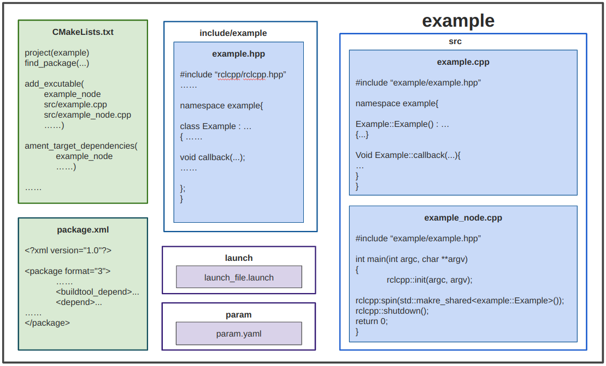

# Nodes Based on Classes (C++)


# Classes

If you have taken CS 142, you'll remember C++ classes. If you haven't or you have and you're totally lost, then you should probably brush up on your C++.  [This](https://www.cplusplus.com/doc/tutorial/) is a pretty good tutorial that should help you get up to speed on C++ programming.

In short, we use classes because they are convenient.  They may not seem so convenient at first, but being able to split up your code into different files makes it a lot easier, and classes make it easy to store variables in between function calls, and limit the scope of functions.  You could just program every node in one giant main cpp file, but that eventually becomes unreasonable.

In the MAGICC lab, we generally organize our nodes as follows:



We have the `CMakelists.txt` file that you're used to seeing, the `package.xml`, but then we make an include folder with the `.hpp` file inside, the `.cpp` file that implements the class functions, and then the main file, which is more of a ROS2 daemon than anything (spins up the node, and connects it to ROS2).  Almost all of the actual work is done in the class `.cpp` file.


# Example: Moving Sensor Package

The picture above has the general outline of what is in each node, but here's an example node which listens to the turtlesim pose message and publishes a boolean flag of whether or not it is moving. The "moving_sensor" package is in the `ros2-tutorials` git repo. "Bool.msg" in "bool_interfaces/msg" is a message type I created which is simply "bool data". If you're interested in creating custom msg and srv files, see [here](https://docs.ros.org/en/jazzy/Tutorials/Beginner-Client-Libraries/Custom-ROS2-Interfaces.html).

The file structure appears as follows:

```
moving_sensor
├── CMakeLists.txt
├── package.xml
├── include
│   ├── moving_sensor
│   │   └── moving_sensor.hpp
├── src
│   ├── moving_sensor.cpp
│   └── moving_sensor_node.cpp
```


### CMakeLists.txt

Let's look at the `CMakeLists.txt` of this package.  I've highlighted what each line does in this file below

``` Cmake
cmake_minimum_required(VERSION 3.8)
project(moving_sensor)  # <-- this is the project name, should match in the package.xml

if(CMAKE_COMPILER_IS_GNUCXX OR CMAKE_CXX_COMPILER_ID MATCHES "Clang")
  add_compile_options(-Wall -Wextra -Wpedantic)
endif()

find_package(ament_cmake REQUIRED)        # This goes out and finds the packages required for our moving sensor.
find_package(turtlesim REQUIRED)          # We need turtlesim because we are listening to turtlesim/msg/Pose messages.
find_package(bool_interfaces REQUIRED)    # We need bool_interfaces because we are publishing a bool_interfaces/msg/Bool.
find_package(rclcpp REQUIRED)             # Often, we need Eigen, tf, and other packages that we use in the node.


include_directories(include) # This line makes sure the compiler looks in the include folder for our headers
include_directories(
  ${ament_INCLUDE_DIRS}      # This line adds in the headers already added by ament.
)

## Declare a cpp executable
add_executable(moving_sensor_node src/moving_sensor_node.cpp src/moving_sensor.cpp)
# These lines create the executable (node).  You can make more than
# one node per package, each node should have only one main() function.
# We explicitly tell it which .cpp files to compile into that node

## Add ament target dependencies of the executable/library
ament_target_dependencies(moving_sensor_node rclcpp turtlesim bool_interfaces)
# This ensures that the turtlesim and bool_interfaces packages, including their messages, are properly set up before your node is built.

install(TARGETS
  moving_sensor_node
  DESTINATION lib/${PROJECT_NAME})

ament_package()
```


### package.xml

Let's look now at the `package.xml`.  This file is by far the easiest of the bunch it's pretty much self-explanatory

``` xml
<?xml version="1.0"?>

<package format="3">
  <name>moving_sensor</name>
  <version>0.0.0</version>
  <description>The moving_sensor package</description>

  <maintainer email="hebeshen@byu.edu">hebeshen</maintainer>

  <license>Apache-2.0</license>

  <buildtool_depend>ament_cmake</buildtool_depend>
  <depend>turtlesim</depend>
  <depend>bool_interfaces</depend>
  <depend>rclcpp</depend>

  <export>
    <build_type>ament_cmake</build_type>
  </export>

</package>
```


### moving_sensor.hpp

``` C++
#ifndef MOVING_SENSOR_HPP
#define MOVING_SENSOR_HPP

#include "rclcpp/rclcpp.hpp"
#include "turtlesim/msg/pose.hpp"
#include "bool_interfaces/msg/bool.hpp"

namespace moving_sensor
{

class MovingSensor : public rclcpp::Node
{
public:
  MovingSensor();

private:
  //***************** PUBLISHERS AND SUBSCRIBERS ***************//
  rclcpp::Subscription<turtlesim::msg::Pose>::SharedPtr pose_subscriber_;
  // will end up getting hooked up to the callback for the Pose message

  rclcpp::Publisher<bool_interfaces::msg::Bool>::SharedPtr bool_publisher_;
  // will publish the flag to ROS2

  //***************** PARAMETERS ***************//
  double threshold_;
  // a parameter we get from the ROS2 server, in this case the value below which
  // we consider the turtle as not moving.  This is basically a class variable
  // at this point,

  //***************** STATE VARIABLES ***************//
  // in this node, we don't have any variables.  Often though, we need to remember
  // things between loops, so we could create variables here to hold those values

  //***************** CALLBACKS ***************//
  void poseCallback(const turtlesim::msg::Pose::SharedPtr msg);
  // this function will get called every time ROS2 "spins"
  // and there is a Pose message in the queue.  More on this
  // later

  //***************** FUNCTIONS ***************//
  // Also, in this node, we don't have any "helper" functions.  These are useful
  // if you need to break up the work in the node into different functions
};

} // namespace moving_sensor

#endif // MOVING_SENSOR_HPP
```


### moving_sensor.cpp

``` C++
#include "moving_sensor/moving_sensor.hpp"

namespace moving_sensor
{

MovingSensor::MovingSensor() : Node("moving_sensor_node")
{
  //***************** RETRIEVE PARAMS ***************//
  this->declare_parameter<double>("threshold", 0.0001);
  this->get_parameter("threshold", threshold_);
  // This will pull the "threshold" parameter from the 2 server, and store it in the threshold_ variable.
  // If no value is specified on the ROS2 param server, then the default value of 0.0001 will be applied.

  //***************** NODE HANDLES ***************//
  pose_subscriber_ = this->create_subscription<turtlesim::msg::Pose>(
    "turtle1/pose", 1, std::bind(&MovingSensor::poseCallback, this, std::placeholders::_1)
  );
  // This connects the poseCallback function with the reception of a Pose message on the "turtle1/pose" topic
  // ROS2 will essentially call the poseCallback function every time it receives a message on that topic.
  // the "1" indicates the length of the queue to hold messages before tossing them.  In this case, our callback
  // function is so fast that 1 is sufficient.

  bool_publisher_ = this->create_publisher<bool_interfaces::msg::Bool>("is_moving", 1);
  // This connects a std_msgs::Bool message on the "is_moving" topic.  The 1 also indicates the length of the queue
  // before tossing messages.  Publishers are generally so fast that 1 almost always works.
}

void MovingSensor::poseCallback(const turtlesim::msg::Pose::SharedPtr msg)
// This function runs every time we get a turtlesim::Pose message on the "turtle1/pose" topic.
// We generally use the const <message>ConstPtr &msg syntax to prevent our node from accidentally
// changing the message, in the case that another node is also listening to it.
{
  bool_interfaces::msg::Bool out_flag;  // create a new message to store the result of our check in
  out_flag.data = msg->linear_velocity > threshold_;
  // figure out if our velocity is more than the threshold and save the result in our new message

  // publish the message to ROS2
  bool_publisher_->publish(out_flag);
}

} // namespace moving_sensor

```

### moving_sensor_node.cpp

``` C++
#include "moving_sensor/moving_sensor.hpp"

int main(int argc, char **argv)
{
  rclcpp::init(argc, argv);
  rclcpp::spin(std::make_shared<moving_sensor::MovingSensor>());
  // instatiate our class object and check for new messages and call the callback if we get one

  rclcpp::shutdown();
  return 0;
}
```
