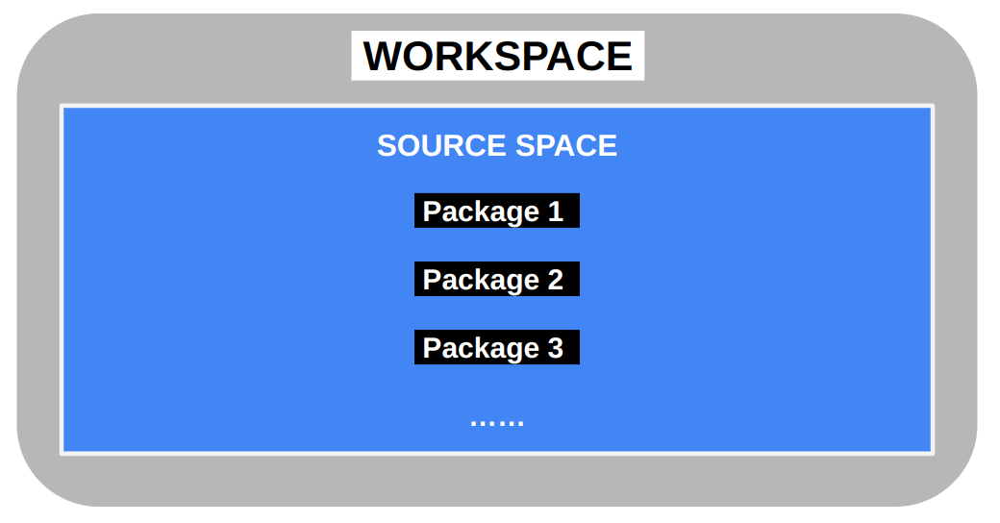

# The ROS Filesystem

## Package

Now that you have gotten a little experience with ROS2, you're ready to start working within the file system.

Packages are the software organization unit of ROS2 code. Each package can contain libraries, executables, scripts, or other artifacts. For example, the `turtlesim` and `teleop_turtle` nodes are both contained in the `turtlesim` package.


## Filesystem Tool: ros2 pkg

`ros2 pkg` allows you to get information about packages. 

### ros2 pkg prefix

`ros2 pkg prefix` returns the prefix path to the package.

Usage:
```bash
 ros2 pkg prefix [package_name]
```

Example:
```bash
 ros2 pkg prefix rclcpp
```

Would return (might be different if you have a different installation path):
```
 /opt/ros/jazzy
```

`ros2 pkg prefix` only gives you the prefix path instead of the absolute path. To actually "cd" (Change Directory) to a certain package, try:
```bash
 cd $(ros2 pkg prefix [package_name])
 cd share/[package_name]
```


### ros2 pkg list

`ros2 pkg list` outputs a list of available packages.


### ros2 pkg executables

`ros2 pkg executables` outputs a list of package specific executables.

Example:
```bash
ros2 pkg executables turtlesim
```
```
turtlesim draw_square
turtlesim mimic
turtlesim turtle_teleop_key
turtlesim turtlesim_node
```


### ros2 pkg create

`ros2 pkg create` is used to create a new package. You'll learn more about this command in [Lesson 5](launch_files.md).


## More Filesystem Concepts

### colcon

In ROS1, the build tool we often use is "*catkin_make*". In ROS2, we use **colcon** which is an iteration on catkin_make, catkin_make_isolated, catkin_tools, and ament_tools.

Please install colcon with:
```bash
 sudo apt install python3-colcon-common-extensions
```

[More information about colcon](https://docs.ros.org/en/jazzy/Tutorials/Beginner-Client-Libraries/Colcon-Tutorial.html)

### Workspace & Package

Normally we would put our packages in one place, and a workspace is the directory where you can store your packages.



A single workspace can have as many packages as you need. Every package has its own folder, and can be of different build types (ament_python, ament_cmake, cmake).

In order to complete the following tutorial in [Lesson 5](launch_files.md) we need a package in which to place our launch file in. Go ahead and complete these two tutorials from the official ROS tutorials.

[Creating a workspace](https://docs.ros.org/en/jazzy/Tutorials/Beginner-Client-Libraries/Creating-A-Workspace/Creating-A-Workspace.html)

[Creating a package](https://docs.ros.org/en/jazzy/Tutorials/Beginner-Client-Libraries/Creating-Your-First-ROS2-Package.html)


## Review

 - ROS2 packages: an organizational unit for ROS2 code
 - `ros2 pkg`: a filesystem tool to interface with packages
    - `ros2 pkg prefix`: output the prefix path of a package
    - `ros2 pkg list`: outputs a list of available packages
    - `ros2 pkg executables`: outputs a list of package specific executables
    - `ros2 pkg create`: create a new package
