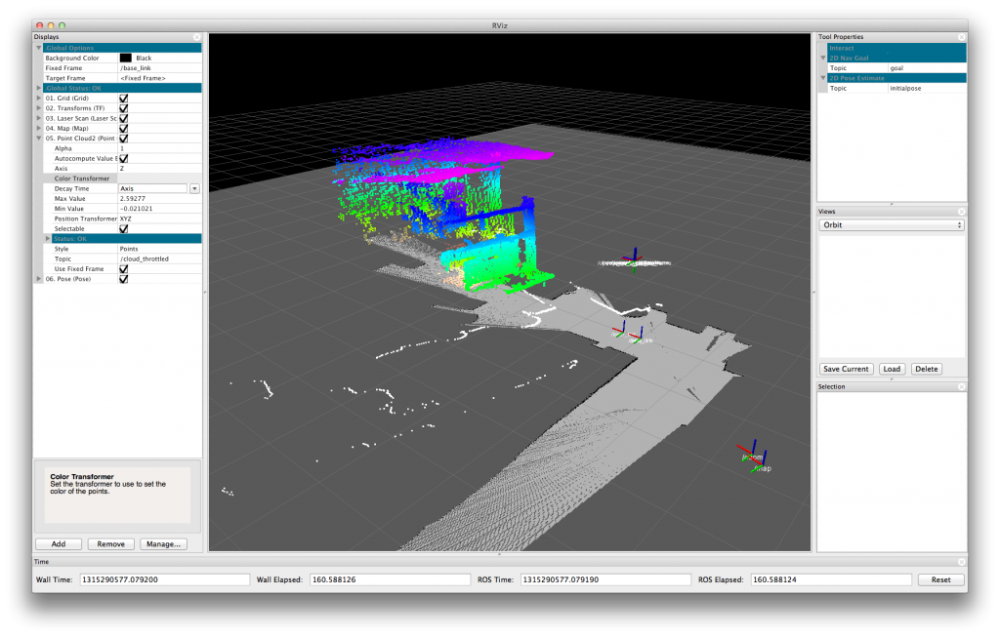

# Introduction to ROS2

## ROS

#### Why ROS?

According to the [ROS website](https://www.ros.org/blog/why-ros/), "ROS (Robot Operating System) is an open source software development kit for robotics applications. ROS offers a standard software platform to developers across industries that will carry them from research and prototyping all the way through to deployment and production." Specifically, ROS simplifies the plumbing required to connect together the components of a robotic system, it provides tools for simulating and inspecting the behavior of the system, and it provides a common platform that enables the sharing of technologies and ideas. 

#### Why ROS2?

“Since ROS was started in 2007, a lot has changed in the robotics and ROS community. The goal of the ROS 2 project is to adapt to these changes, leveraging what is great about ROS 1 and improving what isn’t.” 

Pros of ROS2:
- decentralized (no master node) 
- uses DDS-based middleware for communication
- compatible with Linux, Windows, Mac, and microcontroller RTOSs
- supports Python 3
- introduces new concepts, such as node [life cycles](https://design.ros2.org/articles/node_lifecycle.html)
- offer standardized framework for multi-robot cooperation

ROS2 offers better robustness, flexibility, and safety. 

[Picture Link](https://ieeexplore.ieee.org/document/7743223)

## Plumbing

One of the challenges of developing a robotic system is developing the "plumbing" to connect data from all of the different subsystems together. Consider, for example, the requirements for a robot that, using an altimeter, Xbox Kinect, and IMU, can safely drive through a room making a map as it goes. A graph of the components of this system is depicted below, the arrows indicate the flow of data from one component to another. 

Starting from scratch, much of the development time (and frustration) on a system like this would be spent figuring out how to get data from one subsystem to another. If you aren't careful, the result could be very brittle, requiring extensive rework if a component is changed, or if system requirements change. To solve these issues you could spend hours creating a modular system for message passing, or you could use ROS2. ROS2 was developed to solve problems such as this. It enables high modularity by creating standalone nodes that can be easily reused and that have well-defined data interfaces. These interfaces are known as topics. Below is a figure depicting the example system from above as a set of ROS2 *nodes* (blue boxes), communicating with each other through messages known as *topics* (green arrows). 

Every message "input" on a node is referred to as a subscriber, and every message "output" is known as a publisher. There can be multiple publishers and subscribers to a topic. 

[Picture Link](https://docs.ros.org/en/jazzy/Tutorials/Beginner-CLI-Tools/Understanding-ROS2-Topics/Understanding-ROS2-Topics.html)

## Tools

ROS2 provides many helpful tools for debugging and inspecting the behavior of a system. This is a brief overview of some of the most useful.

#### rqt_graph

rqt_graph gives a graphical representation of the currently active nodes and topics, allowing you to see what nodes are subscribing to and to make sure that everything is connected the way you intended.

#### rqt_plot

rqt_plot will subscribe to topics and plot their data over time.

#### ros2 bag

The ros2 bag command allows you to record all of the data that is being published, and save it into a file known as a ros2 bag. This file can then be replayed as if the system were currently running, or examined using rqt\_bag.

#### rqt\_bag

rqt\_bag reads a ros2 bag and provides a nice gui for interacting with it. It shows a graph of when messages were published, and it can plot data from specific messages.

#### tf (tf2)

tf (tf2 for ROS2) keeps track of coordinate frames and transformations, doing the kinematics for you.

#### RViz

RViz provides a visualization environment for visualizing coordinate frames, point clouds, paths, goals, models, etc.

#### PlotJuggler

PlotJuggler is a "Fast, intuitive and extensible time series visualization tool". It "works seamlessly with both ROS and ROS2" on rosbag loading, topic subscribing, and message re-publishing and visualization in RViz.

[Website Link](https://plotjuggler.io/)

This overview was based on a [powerpoint]((https://docs.google.com/presentation/d/1qsfSCJSmvBuR3nP3ah90LNJuTdCqxITZBdDG7mQyiS8/edit?usp=sharing)) by Paul Nyholm and David Wheeler.

## ROS2 Versions

A new version of ROS2 is released every year on May 23rd. Releases on even-numbered years are LTS releases that will be supported for 5 years; releases on odd-numbered years are normal releases that will be supported for only 1.5 years. 

Updating ROS2 distributions can be pretty time-consuming, so to avoid frequent updates, we generally use only the LTS versions of ROS2. The LTS version released in 2024 was **Jazzy Jalisco**. As of this writing, we are using Jazzy. 

Ubuntu LST releases are published every two years, and there are Ubuntu interim releases every six months. Ubuntu **24.04** LTS (April 2024) **Noble Numbat** is the current LTS version that we use. 

Different versions of ROS2 are designed to be compatible with specific versions of Ubuntu, so please check your Ubuntu version before downloading ROS2. Also, ROS2 doesn't always support other releases besides the LTS. To be safe, just stick with the LTS versions.

### Linux Mint, Elementary OS, and other distros

There are several variants of Linux, all of which have their own pros and cons. Theoretically, since many of these distros are based on Debian (which is what Ubuntu is based on), and many of them are based directly on Ubuntu, they will be compatible with ROS2. If you're just getting started, you may want to avoid these distros for developing ROS2. You could encounter issues since not all Linux distros are created equal.

### Installing Linux and ROS

Here are the links for installing Ubuntu and ROS2:

- [Installing Ubuntu](https://ubuntu.com/download)
- [Installing ROS2 Jazzy](https://docs.ros.org/en/jazzy/Installation.html)
