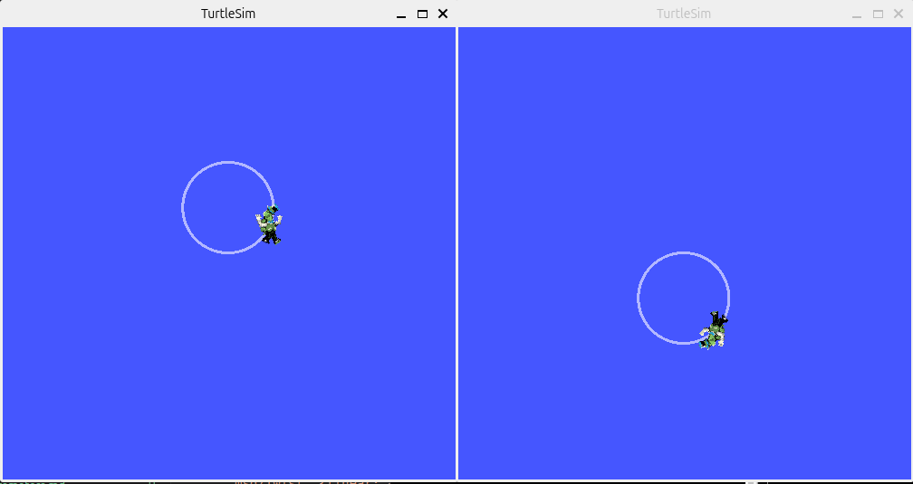
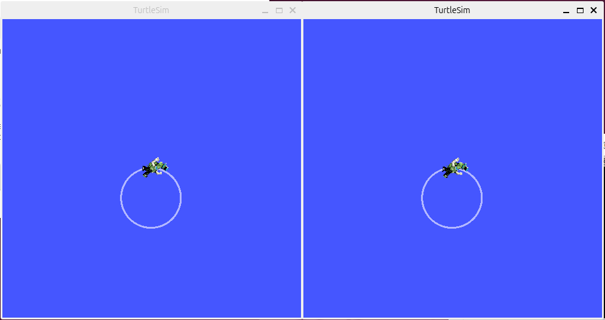
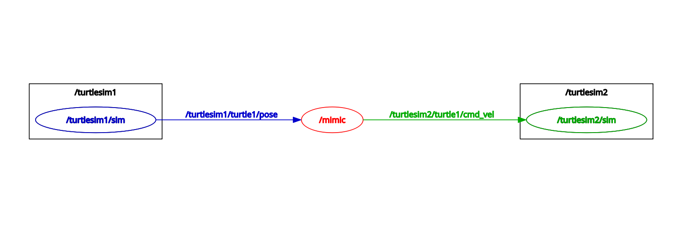

# Launch Files

Hopefully by this point you've realized that starting every node individually is not always the best option.  Doing so not only takes time, but it also results in a plethora of command terminals.  **`ros2 launch`** is a tool in ROS2 that allows you to start multiple nodes (which are defined in a launch file) with only one command.


## Prerequisites

In order to complete this tutorial we need a package to place our launch file. You should complete these two official tutorials first:

[Creating a workspace](https://docs.ros.org/en/jazzy/Tutorials/Beginner-Client-Libraries/Creating-A-Workspace/Creating-A-Workspace.html)

[Creating a package](https://docs.ros.org/en/jazzy/Tutorials/Beginner-Client-Libraries/Creating-Your-First-ROS2-Package.html)

If you're interested in learning more about the build tool, see ["A universal build tool"](https://design.ros2.org/articles/build_tool.html).


## Using ros2 launch

`ros2 launch` starts nodes as defined in a launch file.

Usage:
```bash
 ros2 launch [package_name] [launchfile_name]
```

Example:
```bash
 ros2 launch turtlesim multisim.launch.py
```
Notice that you've launched two `turtlesim` nodes with only one command. This command will run the following launch file:
``` Python
# turtlesim/launch/multisim.launch.py

from launch import LaunchDescription
import launch_ros.actions

def generate_launch_description():
    return LaunchDescription([
        launch_ros.actions.Node(
            namespace= "turtlesim1", package='turtlesim', executable='turtlesim_node', output='screen'),
        launch_ros.actions.Node(
            namespace= "turtlesim2", package='turtlesim', executable='turtlesim_node', output='screen'),
    ])
```

And then, in a **new terminal**, try: 
```bash
 ros2 topic pub  /turtlesim1/turtle1/cmd_vel geometry_msgs/msg/Twist "{linear: {x: 2.0, y: 0.0, z: 0.0}, angular: {x: 0.0, y: 0.0, z: 1.8}}"
```

And in a **third terminal**, try:
```bash
 ros2 topic pub  /turtlesim2/turtle1/cmd_vel geometry_msgs/msg/Twist "{linear: {x: 2.0, y: 0.0, z: 0.0}, angular: {x: 0.0, y: 0.0, z: -1.8}}"
```




## Creating a Launch File

First, go to `my_package` we [created and built](https://docs.ros.org/en/jazzy/Tutorials/Beginner-Client-Libraries/Creating-Your-First-ROS2-Package.html) earlier.
``` bash
 cd ~/ros2_ws/src/my_package
```
```
Then let's make a launch directory:
``` bash
 mkdir launch
 cd launch
```

**NOTE**: The directory to store launch files doesn't necessarily have to be named as "launch". In fact, you don't even need to store them in a directory. `ros2 launch` command automatically looks into the passed package and detects available launch files. However, it is good practice to do so.

### The Launch File

Now let's create a launch file called "turtlesim_mimic_launch.py" (or "turtlesim_mimic_launch.xml"). After navigating to the launch directory (`cd launch`), you could create the file by entering `touch turtlesim_mimic_launch.py` (The 'touch' command is used to create a file). Then copy&paste the following content into your file:

(Python Version)
``` python
from launch import LaunchDescription
from launch_ros.actions import Node

def generate_launch_description():
    return LaunchDescription([
        Node(
            package='turtlesim',
            namespace='turtlesim1',
            executable='turtlesim_node',
            name='sim'
        ),
        Node(
            package='turtlesim',
            namespace='turtlesim2',
            executable='turtlesim_node',
            name='sim'
        ),
        Node(
            package='turtlesim',
            executable='mimic',
            name='mimic',
            remappings=[
                ('/input/pose', '/turtlesim1/turtle1/pose'),
                ('/output/cmd_vel', '/turtlesim2/turtle1/cmd_vel'),
            ]
        )
    ])
```


(XML Version)
``` XML
<launch>
  <node pkg="turtlesim" exec="turtlesim_node" name="sim" namespace="turtlesim1"/>
  <node pkg="turtlesim" exec="turtlesim_node" name="sim" namespace="turtlesim2"/>```
### Python Launch File

The **import** statements pull in necessary Python launch modules:
``` python
from launch import LaunchDescription
from launch_ros.actions import Node
```

Here we start the launch description:
``` python
def generate_launch_description():
   return LaunchDescription([......])
```

Here we start two nodes with a namespace tag of `turtlesim1` and `turtlesim2` with a `turtlesim_node` named `sim`. Therefore, the first two actions are running two `turtlesim` node:
``` python
Node(
    package='turtlesim',
    namespace='turtlesim1',
    executable='turtlesim_node',
    name='sim'
),
Node(
    package='turtlesim',
    namespace='turtlesim2',
    executable='turtlesim_node',
    name='sim'
),
```

Here we start the mimic node with the topics input and output renamed to turtlesim1 and turtlesim2. This remap will make turtlesim2 mimic turtlesim1:
``` python
Node(
    package='turtlesim',
    executable='mimic',
    name='mimic',
    remappings=[
      ('/input/pose', '/turtlesim1/turtle1/pose'),
      ('/output/cmd_vel', '/turtlesim2/turtle1/cmd_vel'),
    ]
)
```

### XML Launch File

The first two actions are running two `turtlesim` nodes:
``` XML
<node pkg="turtlesim" exec="turtlesim_node" name="sim" namespace="turtlesim1"/>
<node pkg="turtlesim" exec="turtlesim_node" name="sim" namespace="turtlesim2"/>
```

The next action is to remap and launch the mimic node:
``` XML
<node pkg="turtlesim" exec="mimic" name="mimic">
  <remap from="/input/pose" to="/turtlesim1/turtle1/pose"/>
  <remap from="/output/cmd_vel" to="/turtlesim2/turtle1/cmd_vel"/>
</node>
```


## Launching
Now let's go to the launch directory and `ros2 launch` the launch file you created:
``` bash
 ros2 launch turtlesim_mimic_launch.py
```
or
```bash
 ros2 launch turtlesim_mimic_launch.xml
```

With one command from the command line, we were able to start multiple nodes! This is obviously a cleaner and easier approach to start multiple nodes than starting them individually.

Then, in a **new terminal**, enter:
```bash 
 ros2 topic pub -r 1 /turtlesim1/turtle1/cmd_vel geometry_msgs/msg/Twist "{linear: {x: 2.0, y: 0.0, z: 0.0}, angular: {x: 0.0, y: 0.0, z: -1.8}}"
```

You'll see the two turtlesims start to move in the same way even though the publish command is only being sent to `turtlesim1`.


**NOTE:** Don't worry too much about understanding the `ros2 topic pub` command yet. We will return to it in the next lesson. Basically, this usage of the command continuously publishes commands to `turtlesim` which tells the turtle to travel in a circle.

We can also use `rqt` to better understand what our launch file did. Run:
```bash 
 rqt
```


