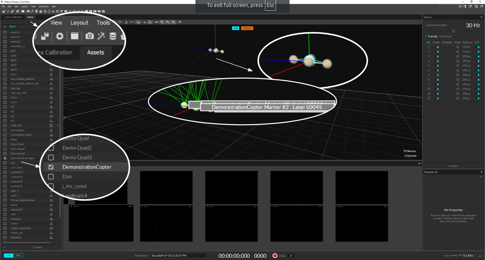
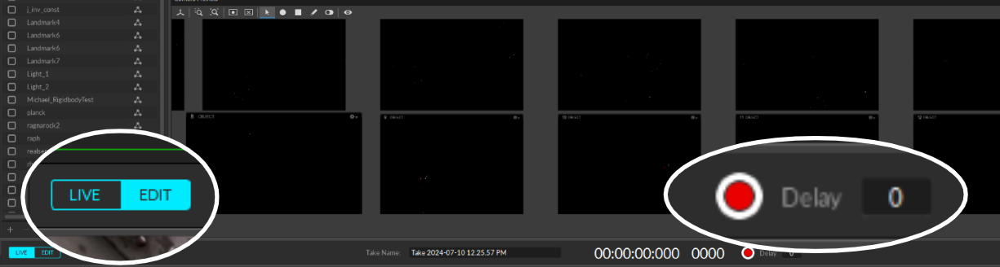
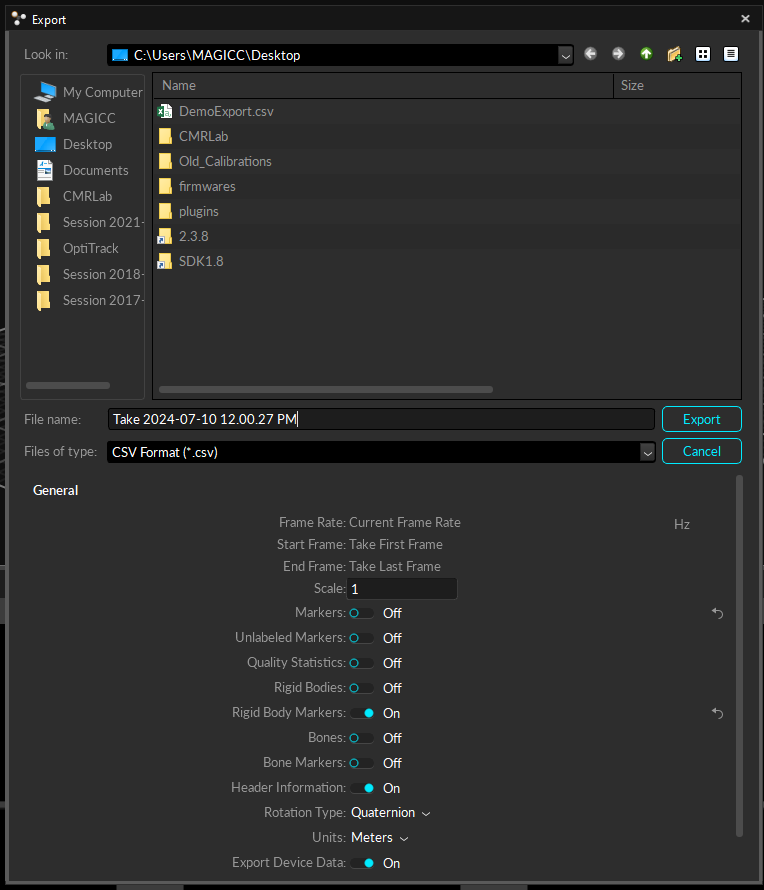
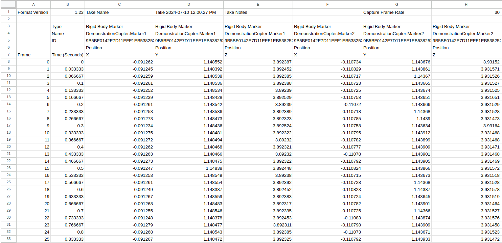

# Motion Capture Tutorial

## Prerequisite

1. Setting markers for the object you want to track

2. Connect to the Magicc network

    Turn Between the lab conference room and the flight room (146A and 146C), there's a Netgear box used for the mocap system. To turn it on, press the power button marked "**MoCap**" that is under the desk. *Pressing the wrong button might cause serious problems!* And don't forget to turn it off when you're finished.

3. Open [Motive](https://optitrack.com/software/motive/) (can be found on the Windows desktop). ***Make sure Motive is not blocked by the firewall!***


## Tracking the vehicle/object

1. In the menu, select "View -> Assets Pane".

2. On the left sidebar check the boxes, and you should see the markers on the perspective view. Choose the markers you want to track. 

    In this case, "*DemonstrationCopter*" is being tracked (containing four markers).
    


## Data Collecting with ROS

1. Download the [vrpn_client_ros](https://gitlab.magiccvs.byu.edu/lab/vrpn_client_ros2.git) package.

In the `src` of your workspace, run:
```bash
 git clone https://gitlab.magiccvs.byu.edu/lab/vrpn_client_ros2.git
```

And in your workspace, build the package:
```bash
 colcon build
```

2. Run the `vrpn_client_ros` node.
```bash
 ros2 run vrpn_client_ros vrpn_client_node 
```

```
[INFO] [1726270601.321879825] [vrpn_client_node]: Connecting to VRPN server at localhost:3883
[INFO] [1726270602.324711875] [vrpn_client_node]: Connection established
```

3. The tracked object's pose information is publishing to your device through ROS topics.
```bash
 ros2 topic list
```
```
/DemonstrationCopter/pose
/DemonstrationCopter/pose_enu
/DemonstrationCopter/pose_ned
/parameter_events
/rosout
```
The topic `DemonstrationCopter_enu` publishes the pose in the ENU frame (East, North, Up), and the topic `DemonstrationCopter_ned` publishes the pose in the NED frame (North, East, Down).

```bash
 ros2 topic echo /DemonstrationCopter_ned
```
```
header:
  seq: 1810
  stamp:
    secs: 1720634981
    nsecs: 653036405
  frame_id: "optitrack_ned"
pose:
  position:
    x: 0.557237863541
    y: 3.70402407646
    z: -1.14867293835
  orientation: 
    x: -0.0940773898464
    y: -0.711429558216
    z: 0.676397042416
    w: 0.165845259493
---
```

## Data Collecting with the Motive Record Function

1. Make sure you're under the **LIVE** mode. Click on the red recording button. Click on it again to end the recording.
    

2. Click on "EDIT" to switch to the **EDIT** mode. Select "File -> Export Tracking Data", and save the file in the CSV format.
    

    Your file should look like this:
    

### When you are finished, be sure to unplug the mocap system box from power.
