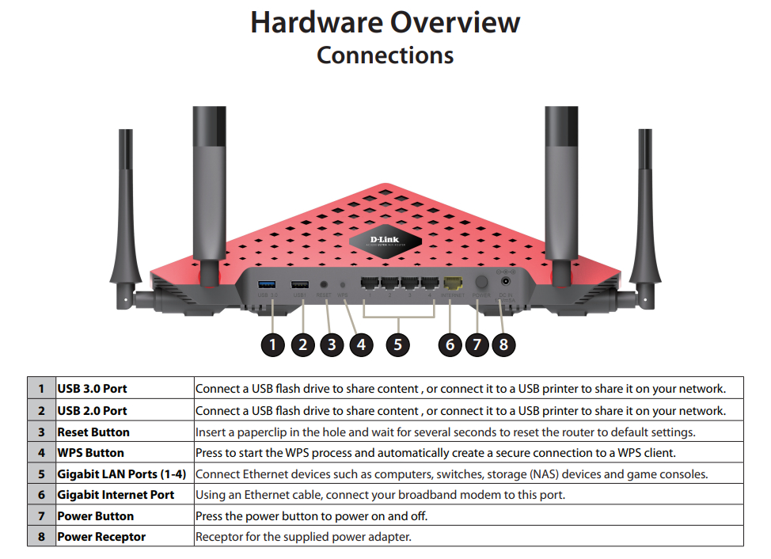
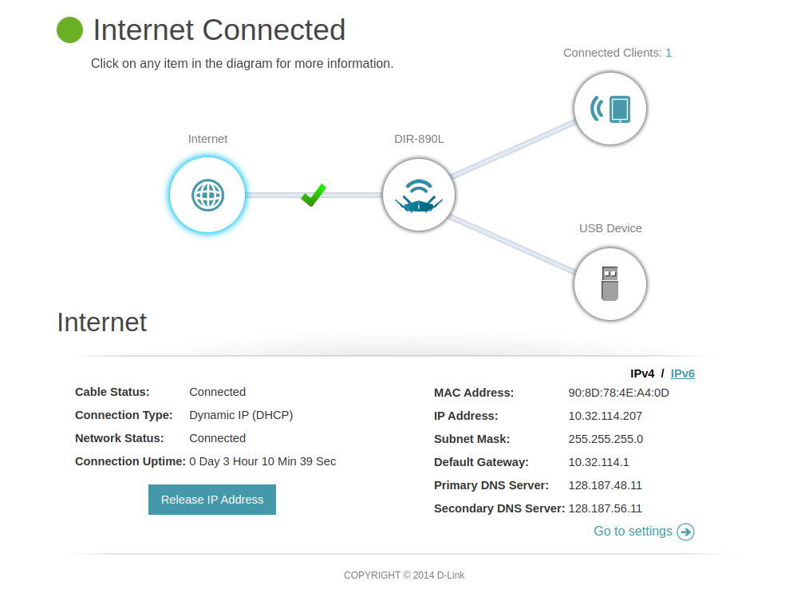

# ROS2 on Multiple Machines

Sometimes we want to run ROS2 on multiple computers when working with multiple robots, enabling more scalable, reliable, and capable robotic systems. In this tutorial, we're using a GIGABYTE BRIX (Mini-PC Barebone) as our example of the second machine, but the steps to run ROS2 on multiple machines should be the same.


## Prerequisite

- You need to install ROS2 on the machines.
- You may need a router and some ethernet cables.


## Network configuration

At first, you need to make sure all your machines are under the same network. To do so, connect all the machines to one router. 


### Connect through a Router

This is the router we're using in the MAGICC lab: D-Link AC3200 ULTRA WIFI ROUTER (You may use a different router).


For more information about connecting the router to one of your machines, See page 10-12 in the [Dlink user manual](https://media.dlink.eu/support/products/dir/dir-890l/documentation/dir-890l_a1_manual_v1.00(eu).pdf).




Wait for the router to boot up and both the Power LED and the Internet LED to turn white, turn on the machine and go to [http://dlinkrouter.local/](http://dlinkrouter.local/info/Login.html). You don't need to configure the router. Instead, you can directly log in with the admin password labeled on the router. You would see a webpage similar to this:

 

And then, connect all the other machines to the Gigabit LAN ports of the router through ethernet cables. The "Connected Clients" on the right-upper of the website should show the number of machines connected.


## Running ROS2


### Addresses of the Hosts

**Machine 1:**
Run:
```bash
hostname -I
```

It should return the addresses of the host (192.168.0.XXX by default):
```
192.168.0.219 
```

**Machine 2:**
Run:
```bash
hostname -I
```

It should return the address of the second host:
```
192.168.0.145 
```

To check if the network connection works well, try:
```bash
ping [address_of_the_other_hosts]
```

Example:

**Machine 1:**
```bash
ping 192.168.0.145
```
```
PING 192.168.0.145 (192.168.0.145) 56(84) bytes of data.
64 bytes from 192.168.0.145: icmp_seq=1 ttl=64 time=0.431 ms
64 bytes from 192.168.0.145: icmp_seq=2 ttl=64 time=0.322 ms
64 bytes from 192.168.0.145: icmp_seq=3 ttl=64 time=0.287 ms
```

**Machine 2:**
```bash
ping 192.168.0.219
```
```
PING 192.168.0.219 (192.168.0.1219) 56(84) bytes of data.
64 bytes from 192.168.0.219: icmp_seq=1 ttl=64 time=0.779 ms
64 bytes from 192.168.0.219: icmp_seq=2 ttl=64 time=0.552 ms
64 bytes from 192.168.0.219: icmp_seq=3 ttl=64 time=0.545 ms
```


### Running a Talker and a Listener

Let's test ROS2 by running a talker on one machine and a listener on the other.

**Machine 1:**
```bash
ros2 run demo_nodes_cpp talker
```
```
[INFO] [1722972652.321040926] [talker]: Publishing: 'Hello World: 1'
[INFO] [1722972653.321038414] [talker]: Publishing: 'Hello World: 2'
[INFO] [1722972654.321045644] [talker]: Publishing: 'Hello World: 3'
[INFO] [1722972655.321057633] [talker]: Publishing: 'Hello World: 4'
[INFO] [1722972656.321018001] [talker]: Publishing: 'Hello World: 5'
```

**Machine 2:**
```bash
ros2 run demo_nodes_cpp listener
```
```
[INFO] [1722970595.418757978] [listener]: I heard: [Hello World: 1]
[INFO] [1722970596.418662019] [listener]: I heard: [Hello World: 2]
[INFO] [1722970597.418683848] [listener]: I heard: [Hello World: 3]
[INFO] [1722970598.418696562] [listener]: I heard: [Hello World: 4]
[INFO] [1722970599.418693184] [listener]: I heard: [Hello World: 5]
```

Your listener on Machine 1 should be able to listen to the talker on Machine 2.


### Use of ROS_DOMAIN_ID

For more information about **ROS_DOMAIN_ID**, see ["3.1 The ROS_DOMAIN_ID variable"](https://docs.ros.org/en/jazzy/Tutorials/Beginner-CLI-Tools/Configuring-ROS2-Environment.html#check-environment-variables) of the offical tutorial ["Configuring environment"](https://docs.ros.org/en/jazzy/Tutorials/Beginner-CLI-Tools/Configuring-ROS2-Environment.html) and the documentation ["The ROS_DOMAIN_ID"](https://docs.ros.org/en/jazzy/Concepts/Intermediate/About-Domain-ID.html#the-ros-domain-id).

When you want to run different ROS2 applications, you can use **ROS_DOMAIN_ID** to isolate ROS2 environments in the same network. Only machines with the same ROS_DOMAIN_ID can communicate with each other.

Usage:
``` 
export ROS_DOMAIN_ID=[your_domain_id]
```

Example:

**Machine 1:**
```bash
export ROS_DOMAIN_ID=2
```

At this moment, if you run a talker on Machine 1 and a listener on Machine 2, the listener cannot receive the messages from the talker.

**Machine 2:**
```bash
export ROS_DOMAIN_ID=2
```

Now, the talker and the listener should be able to communicate with each other again.

