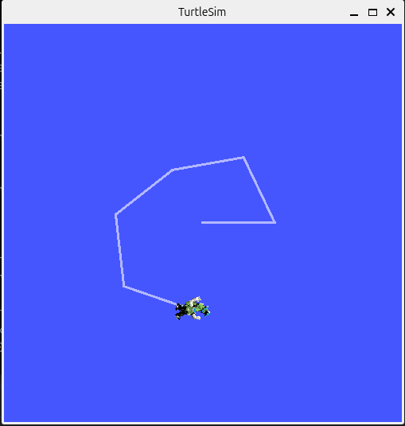
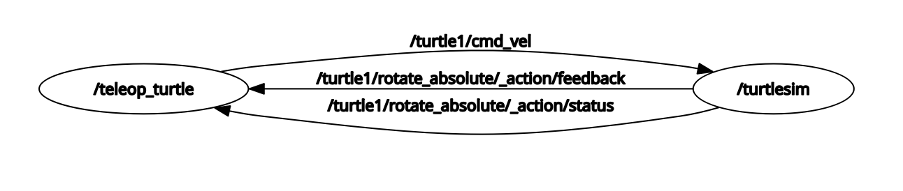
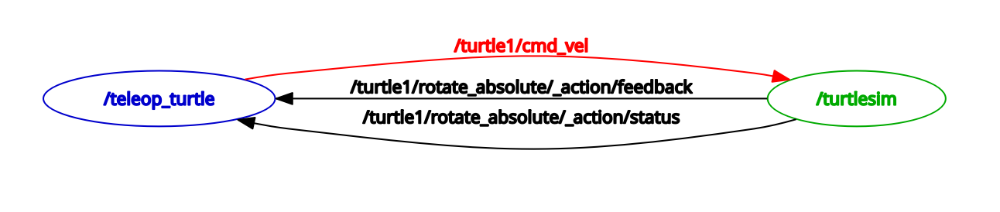

# Getting Info About Nodes

## ROS2 Topics

“ROS 2 breaks complex systems down into many modular nodes. Topics are a vital element of the ROS graph that act as a bus for nodes to exchange messages.” In order to communicate, ROS2 **nodes** publish and/or subscribe to ROS2 **topics**. 


[Picture link](https://docs.ros.org/en/jazzy/Tutorials/Beginner-CLI-Tools/Understanding-ROS2-Topics/Understanding-ROS2-Topics.html)

Nodes can also send messages through services and actions. If you’re interested, you could look at the official documentations:

[ROS2 Services](https://docs.ros.org/en/jazzy/Tutorials/Beginner-CLI-Tools/Understanding-ROS2-Services/Understanding-ROS2-Services.html) 

[ROS2 Actions](https://docs.ros.org/en/jazzy/Tutorials/Beginner-CLI-Tools/Understanding-ROS2-Actions/Understanding-ROS2-Actions.html)


## Setup

#### turtlesim

In a **new terminal**, run:
```bash
 ros2 run turtlesim turtlesim_node
```

#### turtle keyboard teleoperation

We'll also need something to drive the turtle around with. Let's see what other nodes are in the turtlesim package. Open a **new terminal** and type:
```bash
 ros2 run turtlesim<now press TAB twice>
```

The following should appear:
```
 draw_square        mimic        turtlesim_node        turtle_teleop_key
```

These are the four nodes in the `turtlesim` package.  Each node is an individual executable, or program, but all are organized into a single package.  Let's try the executable `turtle_teleop_key`. Enter:
```bash
 ros2 run turtlesim turtle_teleop_key
```

```
Reading from keyboard
---------------------------
Use arrow keys to move the turtle.
Use g|b|v|c|d|e|r|t keys to rotate to absolute orientations. 'f' to cancel a rotation.
'q' to quit.
```

Now you can use the arrow keys(←↑↓→) of your keyboard to drive the turtle around. Remember to **select the terminal window of the turtle_teleop_key** first to make sure that the keys you type are recorded.


In this case, the `turtlesim` node and the `teleop_turtle` node are communicating with each other over the ROS2 topic `command_velocity`: The `teleop_key` publishes keystrokes to the ROS2 topic `/turtle1/cmd_vel`, and the `turtlesim` node subscribes to the same topic `/turtle1/cmd_vel` to receive the keystroke messages.  


## rqt_graph

Using the **rqt_graph** tool we visualize the node interactions.

Unless you already have `rqt` installed, run:
``` bash
 sudo apt update
 sudo apt install ~nros-jazzy-rqt*
```

In a **new terminal**, run:
```bash
 rqt
```

You will see a blank window but no worries. We need to select the rqt plugin we want to use. From the **Plugins** menu, select **Introspection** and then **Node Graph**. Now you should be able to see a graph of the relationship between topics and nodes. 



If you place your mouse over **/turtle1/cmd_vel**, it will highlight the nodes (blue and green here) and topics (red here). As stated before, the `teleop_turtle` node and the `turtlesim` node are communicating on the topic named `/turtle1/cmd_vel`.



## ros2 node

`ros2 node` is a useful tool for finding information about nodes.


### ros2 node list

`ros2 node list` returns a list of all currently running nodes. This will become a more and more useful tool as you run more and more nodes.

In a **new terminal** run:
```bash
 ros2 node list
```

Assuming you still have the `turtlesim` and `teleop_turtle` nodes running, you should see:
```
 /teleop_turtle
 /turtlesim
```


### ros2 node info

`ros2 node info` returns information about a specified node. 

Example:
```bash
 ros2 node info /turtlesim
```

(Don't forget the forward slash "`/`" here.)

You should see something similar to:
```
/turtlesim
  Subscribers:
    /parameter_events: rcl_interfaces/msg/ParameterEvent
    /turtle1/cmd_vel: geometry_msgs/msg/Twist
  Publishers:
    /parameter_events: rcl_interfaces/msg/ParameterEvent
    /rosout: rcl_interfaces/msg/Log
    /turtle1/color_sensor: turtlesim/msg/Color
    /turtle1/pose: turtlesim/msg/Pose
  Service Servers:
    /clear: std_srvs/srv/Empty
    /kill: turtlesim/srv/Kill
    /reset: std_srvs/srv/Empty
    /spawn: turtlesim/srv/Spawn
    /turtle1/set_pen: turtlesim/srv/SetPen
    /turtle1/teleport_absolute: turtlesim/srv/TeleportAbsolute
    /turtle1/teleport_relative: turtlesim/srv/TeleportRelative
    /turtlesim/describe_parameters: rcl_interfaces/srv/DescribeParameters```_atomically: rcl_interfaces/srv/SetParametersAtomically
  Service Clients:

  Action Servers:
    /turtle1/rotate_absolute: turtlesim/action/RotateAbsolute
  Action Clients:

```

Note that `ros2 node info` allows us to see publications, subscriptions as well as services and actions associated with a certain node.


## Review

 - ROS2 topics: named buses over which nodes exchange messages
 - rqt_graph: a tool for visualizing interactions among nodes
 - `ros2 node`: a tool to get information about a node
    - `ros2 node info`: output information about a node
    - `ros2 node list`: output a list of available nodes
