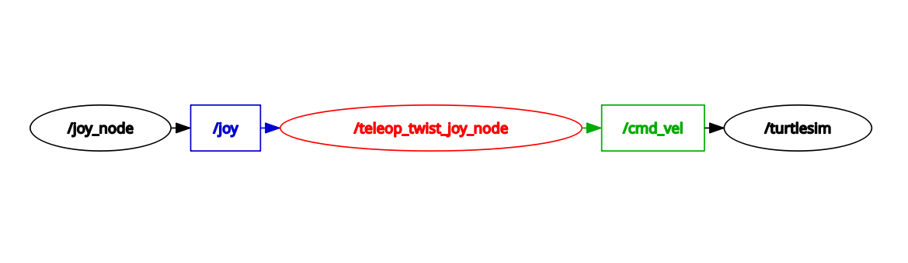
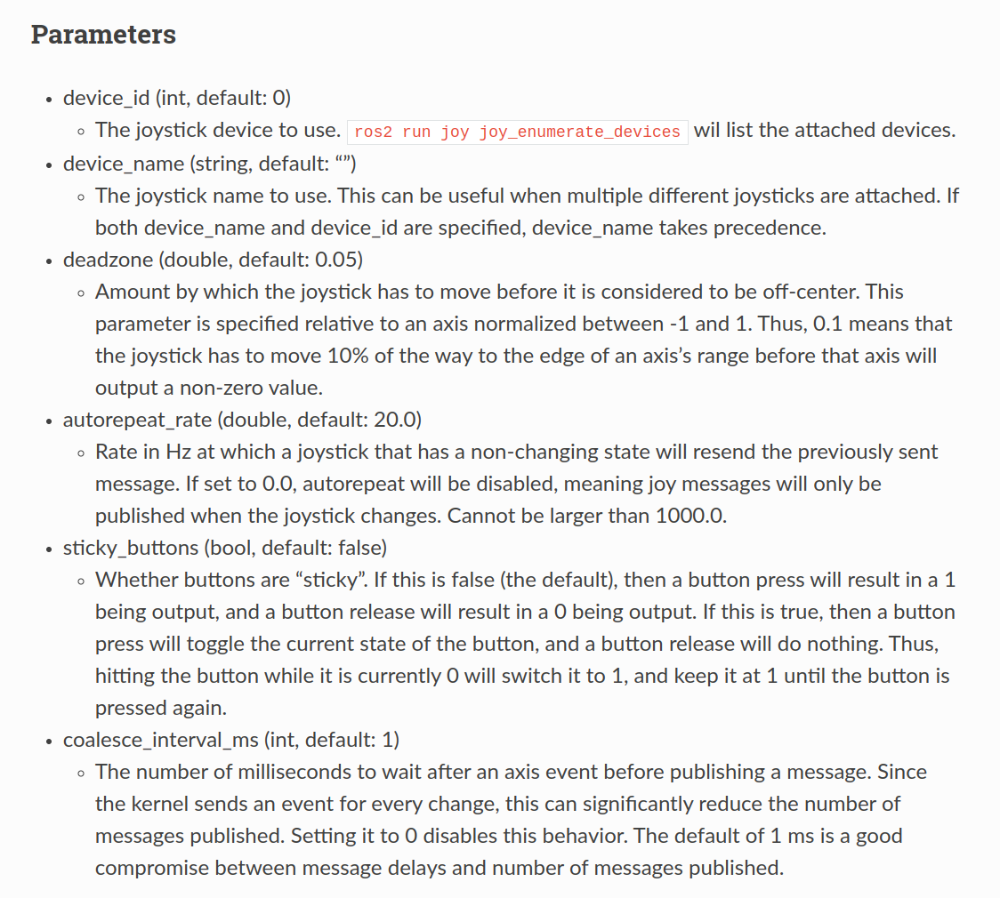
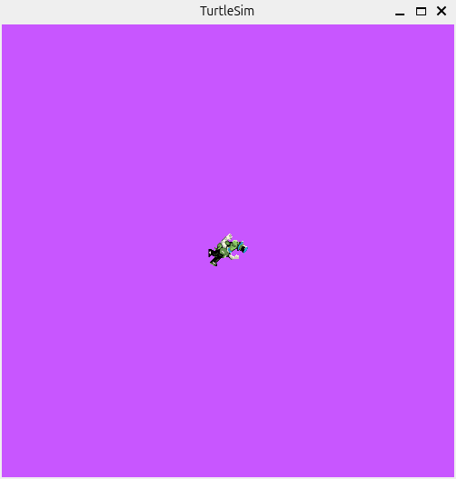
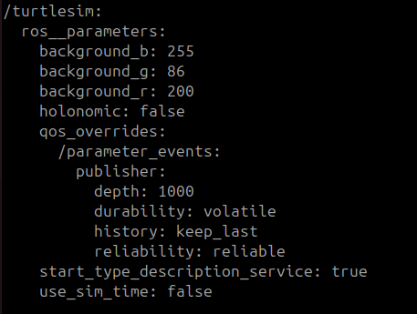
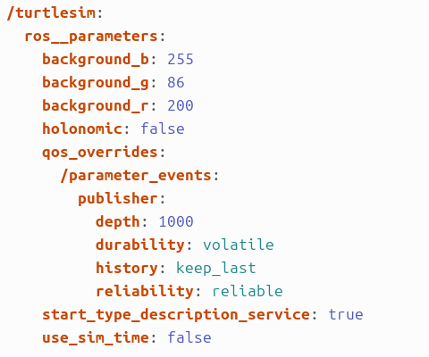

# ROS2 Parameters

## Joy

### Continually Publishing Messages on Joy

Start by replicating the same scenario we had in the previous tutorial:


Now try getting the turtle to go continually in any direction.  You'll notice that the turtle stops after a certain distance.

Display the output of the `joy` node:
``` bash
 ros2 topic echo joy
```

Now move the joystick, the output should be similar to the following:
``` 
 ---
 header:
   seq: 3
   stamp:
     secs: 1439228031
     nsecs: 139606633
   frame_id: ''
 axes: [0.13516968488693237, 0.0, 0.0, 0.0, 0.0, 0.0]
 buttons: [0, 0, 0, 0, 0, 0, 0, 0, 0, 0, 0, 0, 0, 0, 0]
 ---
 header:
   seq: 4
   stamp:
     secs: 1439228031
     nsecs: 248627279
   frame_id: ''
 axes: [0.14702372252941132, 0.0, 0.0, 0.0, 0.0, 0.0]
 buttons: [0, 0, 0, 0, 0, 0, 0, 0, 0, 0, 0, 0, 0, 0, 0]
 ---
```

Note that `joy` stops publishing when you stop moving the joystick.  The result is that holding the joystick fixed in any position will cause our turtle to stop moving. Suppose we wanted to keep publishing at these moments. Fortunately those who created the joy package built in that capability. Try:
``` bash
 ros2 run joy joy_node _autorepeat_rate:=10
```

`joy` should now be continually publishing messages at a rate of 10 Hz when no new messages are received.


### Joy Parameters

Take a look at the [Joy Documentation](https://docs.ros.org/en/jazzy/p/joy/).



By building these parameters into the code, joy can be customized to fit many different situations without requiring a change in the code each time.

Parameters can be changed either by passing them in as we did with "ros2 run joy joy_node _autorepeat_rate:=10" on the parameter autorepeat_rate (note the underscore preceding the parameter) or by changing the parameters value on the ROS2 Parameter Server using `ros2 param`.


 ## Using ros2 param

`ros2 param` allows you to store and manipulate data on the ROS2 [Parameter Server](https://wiki.ros.org/Parameter%20Server). The Parameter Server can store integers, floats, boolean, dictionaries, and lists. `ros2 param` uses the YAML markup language for syntax. In simple cases, YAML looks very natural: **1** is an integer, **1.0** is a float, **one** is a string, **true** is a boolean, **[1, 2, 3]** is a list of integers, and **{a: b, c: d}** is a dictionary. `ros2 param` has many commands that can be used on parameters, as shown below:
```
Commands:
  delete    Delete parameter
  describe  Show descriptive information about declared parameters
  dump      Show all of the parameters of a node in a YAML file format
  get       Get parameter
  list      Output a list of available parameters
  load      Load parameter file for a node
  set       Set parameter
```


### ros2 param list

Let's look at what parameters are currently on the param server:
``` bash
 ros2 param list
```

The `turtlesim` node has three parameters on the param server for background color.  You can also see that `joy`'s autorepeat_rate parameter is on the parameter server:
```
/joy_node:
  autorepeat_rate
  ......
```
```
/teleop_twist_joy_node:
  ......
```
```
/turtlesim:
  background_b
  background_g
  background_r
  ......
```


### ros2 param get

We can retrieve the current value of parameters on the parameter server by using `ros2 param get`:

Usage:
``` bash
 ros2 param get [node_name] [parameter_name]
```

Let's try this command with "background_r":
``` bash
 ros2 param get /turtlesim background_r
```
```
Integer value is: 69
```


### ros2 param set

Let's now use `ros2 param set`:

Usage:
``` bash
 ros2 param set [node_name] [parameter_name] [value]
```

Let's change the **"background_r"** parameter to a higher value:
``` bash
 ros2 param set /turtlesim background_r 200
```
```
Set parameter successful
```

The command should change the background color of the turtlesim.



### ros2 param dump

Setting parameters with the set command will **NOT** change parameters permanently. However, you can save your settings and reload them for the next time. If you wish to store all current parameter values in a file you can use `ros2 param dump`.

Usage:
``` bash
 ros2 param dump [node_name] > [filename.yaml]
```

Example:
``` bash
 ros2 param dump /turtlesim > turtlesim.yaml
```

The "turtlesim.yaml" file gets saved in your current working directory. Open the file, and you'll see:




### ros2 param load

To load parameter values from a file simply use `ros2 param load`.

Usage:
``` bash
 ros2 param load [node_name] [filename.yaml]
```

Example:
```bash
 ros2 param load /turtlesim turtlesim.yaml
```

You can also load yaml files on node startup:
```bash
 ros2 run [package_name] [node_name] --ros-args --params-file [filename.yaml]
```

Example:
``` bash
 ros2 run turtlesim turtlesim_node --ros-args --params-file turtlesim.yaml
```

The background of the turtlesim should turn purple again.


## Review

 - ROS2 packages: a configuration value of a node
 - `ros2 param`: a tool to interface with parameters
    - `ros2 param list`: output a list of available parameters
    - `ros2 param get`: get parameter    
    - `ros2 param set`: set parameter
    - `ros2 param dump`: show all of the parameters of a node in a YAML file format    
    - `ros2 param load`: load parameter file for a node