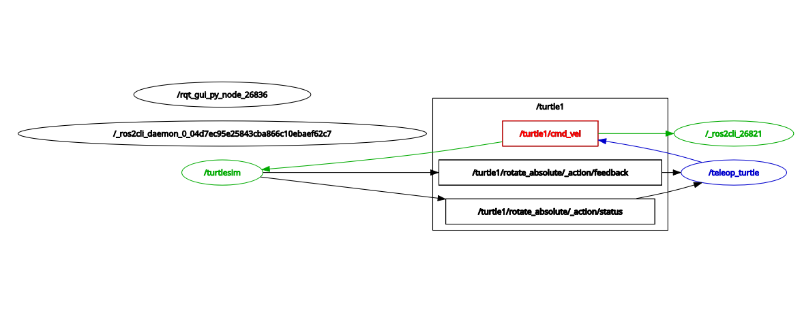
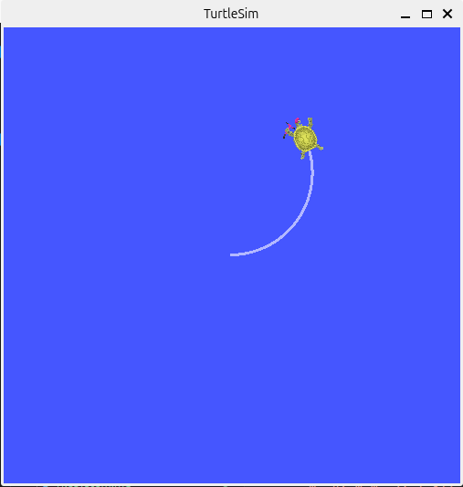
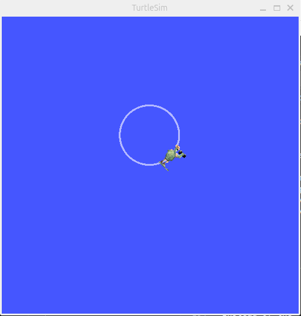
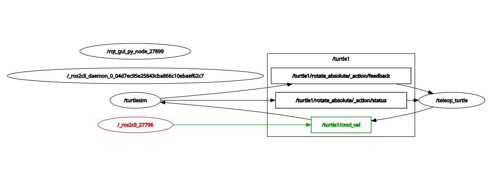

# ROS2 Topics

## Prerequisites

Start `turtlesim`, `teleop_turtle`, and `rqt`.


## Introducing ros2 topic

The `ros2 topic` tool allows you to get information about ROS2 topics.

You can use the help option to get the available sub-commands for `ros2 topic`
```bash
 ros2 topic -h
```

```
......

Commands:
  bw     Display bandwidth used by topic
  delay  Display delay of topic from timestamp in header
  echo   Output messages from a topic
  find   Output a list of available topics of a given type
  hz     Print the average publishing rate to screen
  info   Print information about a topic
  list   Output a list of available topics
  pub    Publish a message to a topic
  type   Print a topic's type

......
```

Let's use some of these sub-commands to examine turtlesim.


### ros2 topic list

`ros2 topic list` returns a list of available topics currently subscribed to and published.

Example:
```bash
 ros2 topic list
```
```
/parameter_events
/rosout
/turtle1/cmd_vel
/turtle1/color_sensor
/turtle1/pose
```

Let's get into some *topic list* sub-command arguments. Run:
```bash
 ros2 topic list -h
```
```
usage: ros2 topic list [-h] [--spin-time SPIN_TIME] [-s] [--no-daemon] [-t]
                       [-c] [--include-hidden-topics] [-v]

Output a list of available topics

options:
  -h, --help            show this help message and exit
  --spin-time SPIN_TIME
                        Spin time in seconds to wait for discovery (only
                        applies when not using an already running daemon)
  -s, --use-sim-time    Enable ROS simulation time
  --no-daemon           Do not spawn nor use an already running daemon
  -t, --show-types      Additionally show the topic type
  -c, --count-topics    Only display the number of topics discovered
  --include-hidden-topics
                        Consider hidden topics as well
  -v, --verbose         List full details about each topic
```


With the `-t` (show-types) option:
```bash
 ros2 topic list -t
```

This gives the same list but with the topic type appended in brackets:
```
/parameter_events [rcl_interfaces/msg/ParameterEvent]
/rosout [rcl_interfaces/msg/Log]
/turtle1/cmd_vel [geometry_msgs/msg/Twist]
/turtle1/color_sensor [turtlesim/msg/Color]
/turtle1/pose [turtlesim/msg/Pose]
```


With the `-v` (verbose) option:
```bash
 ros2 topic list -v
```

This displays a verbose list of topics with message type and publisher/subscriber information.
```
Published topics:
 * /parameter_events [rcl_interfaces/msg/ParameterEvent] 3 publishers
 * /rosout [rcl_interfaces/msg/Log] 3 publishers
 * /turtle1/cmd_vel [geometry_msgs/msg/Twist] 1 publisher
 * /turtle1/color_sensor [turtlesim/msg/Color] 1 publisher
 * /turtle1/pose [turtlesim/msg/Pose] 1 publisher

Subscribed topics:
 * /parameter_events [rcl_interfaces/msg/ParameterEvent] 3 subscribers
 * /turtle1/cmd_vel [geometry_msgs/msg/Twist] 1 subscriber

```

Feel free to try some of the other options.


### ros2 topic type

Communication on topics happens by sending ROS2 **messages** between nodes. For a publisher to talk to a subscriber, such as the publisher `teleop_turtle` and the subscriber `turtlesim`, the publisher and subscriber must send and receive the same **type** of the message. The **type** of the message on a topic can be determined by using `ros2 topic type` which returns the message type of any topic being published.

Usage:
```bash
 ros2 topic type [topic_name]
```

Example:
```bash
 ros2 topic type /turtle1/cmd_vel
```
You should get:
```
geometry_msgs/msg/Twist
```

We can look at the details of a message using `ros2 interface show`:
```bash
 ros2 interface show geometry_msgs/msg/Twist
```

```
# This expresses velocity in free space broken into its linear and angular parts.

Vector3  linear
	float64 x
	float64 y
	float64 z
Vector3  angular
	float64 x
	float64 y
	float64 z

```

You may also choose to look up certain type of message of its details. From this documentation ["geometry_msgs/msg/Twist Message"](https://docs.ros2.org/galactic/api/geometry_msgs/msg/Twist.html), you can learn that this message contains two 3D vectors of translational and rotational velocity.


### ros2 topic echo

`ros2 topic echo` shows the data published on a topic.

Usage:
```bash
 ros2 topic echo [topic_name]
```

Let's look at the command velocity data published by the `teleop_turtle` node, which is published on the `/turtle1/cmd_vel` topic. 
```bash
 ros2 topic echo /turtle1/cmd_vel
```

```
WARNING: topic [/turtle1/cmd_vel] does not appear to be published yet
Could not determine the type for the passed topic
```
You'll probably receive a warning because no data is currently being published on this topic. Let's make `teleop_turtle` publish data by pressing our arrow keys. *If the turtle isn't moving, you might need to select the* `teleop_turtle` *terminal.*

You should now see the following when you press up and then left:
```
linear:
linear:
  x: 2.0
  y: 0.0
  z: 0.0
angular:
  x: 0.0
  y: 0.0
  z: 0.0
---
linear:
  x: 0.0
  y: 0.0
  z: 0.0
angular:
  x: 0.0
  y: 0.0
  z: -2.0
---
```

Those are the 3D vectors we saw in the message information.  If you'll notice, when you turn, the **angular.z** changes, and when you move forward and backward, the **linear.x** changes.

So, what if we wanted to control the turtle with something other than the `teleop_turtle` node?  All we would need to do is to publish **geometry_msgs/msg/Twist** on the `/turtle1/cmd_vel` topic.  The turtle will turn if we publish messages to the **angular.z**, and it will move when we publish messages to the **linear.x**.

Now let's look at `rqt`. Press the refresh button in the upper-right corner and **uncheck the "Debug" box**.



The `/_ros2cli_26821` node is created by the echo command. As you can see, it is now subscribed to the `/turtle1/cmd_vel` topic.


### ros2 topic pub

`ros2 topic pub` publishes data on to a topic currently advertiseda message to a topic.

Usage:
```bash
 ros2 topic pub [topic_name] [msg_type] '<args>'
```

The '<args>' argument is the actual data you’ll pass to the topic. 

Example:
```bash
 ros2 topic pub --once /turtle1/cmd_vel geometry_msgs/msg/Twist "{linear: {x: 4.0, y: 0.0, z: 0.0}, angular: {x: 0.0, y: 0.0, z: 2.0}}"
```

The optional argument "--once" means “publish one message then exit”. This whole command sends a single message to turtlesim telling it to move with a linear velocity of 4.0 and an angular velocity of 2.0.



The output in the terminal:
```
publisher: beginning loop
publishing #1: geometry_msgs.msg.Twist(linear=geometry_msgs.msg.Vector3(x=4.0, y=0.0, z=0.0), angular=geometry_msgs.msg.Vector3(x=0.0, y=0.0, z=2.0))
```

Another example is:
```bash
 ros2 topic pub --rate 1 /turtle1/cmd_vel geometry_msgs/msg/Twist "{linear: {x: 2.0, y: 0.0, z: 0.0}, angular: {x: 0.0, y: 0.0, z: 1.8}}"
```

Instead of the `--once` option, we use the `--rate 1` option here to keep publishing the command in a steady stream at 1 HZ. As you can see the turtle is running in a continuous circle.



This is a pretty complicated example, so let's look at each argument in detail.
* This command will publish messages to a given topic:
  ```
  ros2 topic pub
  ```

* This option causes rostopic to publish messages at a steady stream of 1 Hz:
  ```
  --rate 1
  ```

* This is the name of the topic to publish to:
  ```
  /turtle1/cmd_vel
  ```

* This is the message type to use when publishing the topic:
  ```
  geometry_msgs/msg/Twist
  ```

* As noted before, a **"geometry_msgs/msg/Twist"** message has two vectors, and each of the two vectors has three floating point elements:
  ```
  {linear: {x: 2.0, y: 0.0, z: 0.0}, angular: {x: 0.0, y: 0.0, z: 1.8}}
  ```

`{x: 2.0, y: 0.0, z: 0.0}` is the **linear** value with `x=2.0`, `y=0.0`, and `z=0.0`, and `{x: 0.0, y: 0.0, z: 1.8}` is the **angular** value with `x=0.0`, `y=0.0`, and `z=1.8`.




### ros2 topic hz

`ros2 topic hz` reports the rate at which data is published.

Usage:
```bash
 ros2 topic hz [topic_name]
```

Let's see how fast the `turtlesim` node is publishing on `/turtle1/pose`:
```bash
 ros2 topic hz /turtle1/pose
```
```
average rate: 62.247
	min: 0.010s max: 0.022s std dev: 0.00257s window: 64
average rate: 62.513
	min: 0.010s max: 0.022s std dev: 0.00209s window: 127
average rate: 62.439
	min: 0.010s max: 0.022s std dev: 0.00201s window: 190

```


## Review

 - `ros2 topic`: a ros2 tool to interface with topics
    - `ros2 topic list`: output a list of available topics
    - `ros2 topic type`: print a topic's type
    - `ros2 topic echo`: output messages from a topic
    - `ros2 topic pub`: publish a message to a topic
    - `ros2 topic hz`: print the average publishing rate to screen

