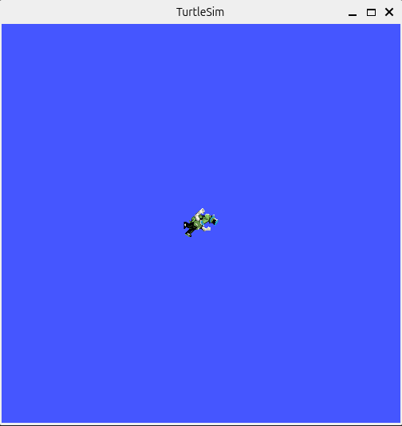

# Starting Nodes

## Environment Configuration

Every time you open a new shell, before using any ROS2 command, you *must* source the setup files first:

```bash
 source /opt/ros/jazzy/setup.bash
```

If you don’t want to do this every time you open a new shell, you need to add the source command to your shell startup script:

```bash
 echo "source /opt/ros/jazzy/setup.bash" >> ~/.bashrc”
```


## Runing Nodes

A node isn't really much more than an executable executable file from a package. `ros2 run` allows you to use the package name to directly run a node within a package (without having to know the package path).

Usage:
```bash
 ros2 run [package_name] [executable_name]
```


## Starting Turtlesim

According to the [ROS2 website](https://docs.ros.org/en/jazzy/Tutorials/Beginner-CLI-Tools/Introducing-Turtlesim/Introducing-Turtlesim.html), "Turtlesim is a lightweight simulator for learning ROS 2. It illustrates what ROS 2 does at the most basic level to give you an idea of what you will do with a real robot or a robot simulation later on." 

We can now run the `turtlesim` node in the `turtlesim` package. In a new terminal, we start `turtlesim` with:

```bash
 ros2 run turtlesim turtlesim_node
```

You will see the turtlesim window (your turtle could look different but that's okay):




## Renaming Nodes

Sometimes, you might want to give nodes a new name. Through remapping, you can change default node properties, including node names. 

For example, we can rename the `turtlesim` node with:  
```bash
 ros2 run turtlesim turtlesim_node --ros-args --remap __node:=[new_name]
```


## Tab Completion

**NOTE**: If you're using *Zsh* instead of *Bash*, see [here](https://scriptingosx.com/2019/07/moving-to-zsh-part-5-completions/).

It can get tedious to type out an entire package or excutable name. For example, `turtle_teleop_key` is a fairly long name. Luckily, some ROS2 tools support [TAB completion](https://en.wikipedia.org/wiki/Command_line_completion).


Start by typing: 
```bash
 ros2 run tu<now push the TAB key>
```

After pushing the `TAB` key, the command line should fill out the rest: `turtlesim`. This works because `turtlesim` is currently the only ROS2 package that starts with "tu".

Now try typing:
```bash
 ros2 run turtlesim t<now push the TAB key>
```

In this case, we have two excutable names that start with "turtle". The `TAB` key won't fill out the exutable name for us but should fill out the command line as much as possible:
```
ros2 run turtlesim turtle
```

Try typing `TAB` **twice** and all the possible names should be listed: 
```bash
 ros2 run turtlesim turtle<now push the TAB key TWICE>
```

This should display all the ROS2 excutables in the `turtlesim` package that begin with "turtle":
``` 
 turtlesim_node     turtle_teleop_key  
```

On the command line you should still have:
```bash
 ros2 run turtlesim turtle
```

After adding an "_" after the name "turtle", press `TAB` again:
```bash
 ros2 run turtlesim turtle_<now push the TAB key>
```

There is only one excutable that starts with "turtle_" so you should see:
```bash
 ros2 run turtlesim turtle_teleop_key
```

## Review

 * `ros2 run [package_name] [executable_name]`: run a node from a given package
