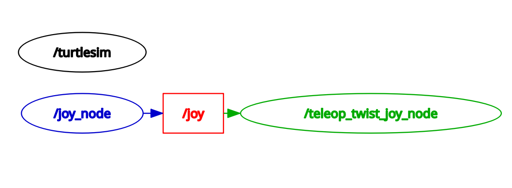
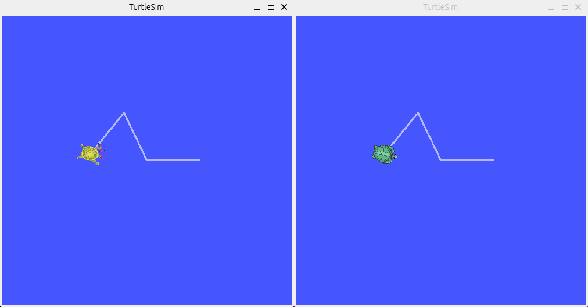
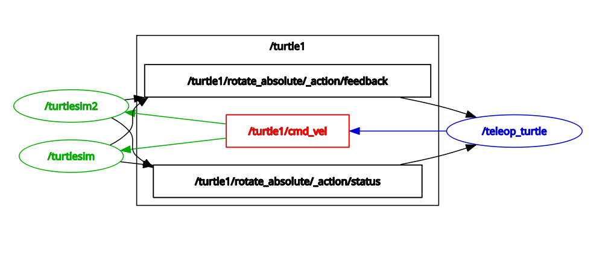
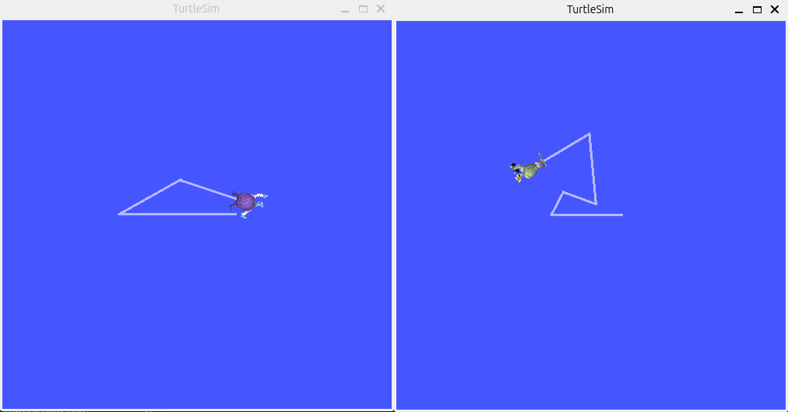
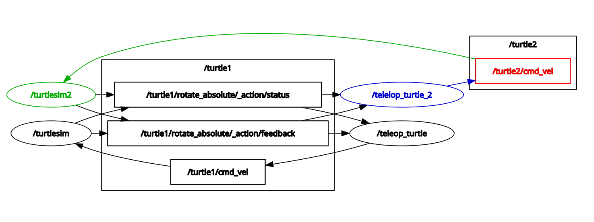

# Topic Remapping

A node isn't really much more than an executable file from a package, and topic remapping isn't much more than simply changing the names of node properties. In our [Lesson 2: Starting Nodes](starting_nodes.md), we've learned how to reassign the name of a node. In this tutorial, we're going to remap topics with command-line interface.

Usage:
```bash
 ros2 run [package_name] [node_name] --ros-args --remap [from]:=[to]
```


## Example-1: Connecting Joy and Turtlesim

**NOTE**: If you don't have a joystick, you could skip this example and jump to *Example-2* and *Example-3*.


### Example-1 Prerequisites

For this tutorial we will usethe `joy` package. Acquire a joystick and ensure the `joy` and `teleop_twist_joy` package are installed:
``` bash
 sudo apt-get install ros-jazzy-joy
 sudo apt-get install ros-jazzy-teleop-twist-joy
```

Read about the "joy" package:
[ROS2 Joy Package](https://docs.ros.org/en/jazzy/p/joy/)
and [ROS Driver for Generic Linux Joysticks](https://github.com/ros-drivers/joystick_drivers/tree/main/joy).

`joy` outputs the messages of type `sensor_msgs/msg/Joy`. `turtlesim` requires the input messages of type `geometry_msgs/msg/Twist`. In order for `joy` to send messages to `turtlesim` we need to be able to convert messages of type `sensor_msgs/msg/Joy` to `geometry_msgs/msg/Twist`.

Let's take a look more in depth at the differences between the two message types. Try:
``` bash
 ros2 interface show sensor_msgs/msg/Joy
```
```
# Reports the state of a joystick's axes and buttons.

# The timestamp is the time at which data is received from the joystick.
std_msgs/Header header
	builtin_interfaces/Time stamp
		int32 sec
		uint32 nanosec
	string frame_id

# The axes measurements from a joystick.
float32[] axes

# The buttons measurements from a joystick.
int32[] buttons
 ```

And try:
``` bash
 ros2 interface show geometry_msgs/msg/Twist
```
```
# This expresses velocity in free space broken into its linear and angular parts.

Vector3  linear
	float64 x
	float64 y
	float64 z
Vector3  angular
	float64 x
	float64 y
	float64 z
```

As you can see, the contents (as well as type) of these two messages are fundamentally different, hence we need a node that can convert one to the other.

The node we will use to convert `sensor_msgs/msg/Joy` messages to `geometry_msgs/msg/Twist` messages is [teleop_twist_joy](https://docs.ros.org/en/jazzy/p/teleop_twist_joy/).

In different terminals we run:
``` bash
 ros2 run turtlesim turtlesim_node
```

``` bash
 ros2 run joy joy_node
```

``` bash
 ros2 run teleop_twist_joy teleop_node
```

Now try using the joystick to move the turtle around.  You'll notice that it doesn't work. Let's investigate this problem using rqt:
``` bash
 rqt
```

You should see something similar to this:


As seen above, all three nodes are running, but `teleop_twist_joy_node` is not communicating with `turtlesim`.  Let's look at what topic `teleop_twist_joy_node` is publishing on and `turtlesim` is subscribing to.

Let's start with `teleop_twist_joy_node`:
``` bash
 ros2 node info /teleop_twist_joy_node
```
```
/teleop_twist_joy_node
  Subscribers:
    /joy: sensor_msgs/msg/Joy
    /parameter_events: rcl_interfaces/msg/ParameterEvent
  Publishers:
    /cmd_vel: geometry_msgs/msg/Twist
    /parameter_events: rcl_interfaces/msg/ParameterEvent
    /rosout: rcl_interfaces/msg/Log
  Service Servers:
    /teleop_twist_joy_node/describe_parameters: rcl_interfaces/srv/DescribeParameters
    /teleop_twist_joy_node/get_parameter_types: rcl_interfaces/srv/GetParameterTypes
    /teleop_twist_joy_node/get_parameters: rcl_interfaces/srv/GetParameters
    /teleop_twist_joy_node/get_type_description: type_description_interfaces/srv/GetTypeDescription
    /teleop_twist_joy_node/list_parameters: rcl_interfaces/srv/ListParameters
    /teleop_twist_joy_node/set_parameters: rcl_interfaces/srv/SetParameters
    /teleop_twist_joy_node/set_parameters_atomically: rcl_interfaces/srv/SetParametersAtomically
  Service Clients:

  Action Servers:

  Action Clients:seperately
```

It appears `teleop_twist_joy_node` is publishing on the `/cmd_vel` topic. Let's see what `turtlesim` is subscribing to:

``` bash
 ros2 node info /turtlesim
```
```
/turtlesim
  Subscribers:
    /parameter_events: rcl_interfaces/msg/ParameterEvent
    /turtle1/cmd_vel: geometry_msgs/msg/Twist
  Publishers:
    /parameter_events: rcl_interfaces/msg/ParameterEvent
    /rosout: rcl_interfaces/msg/Log
    /turtle1/color_sensor: turtlesim/msg/Color
    /turtle1/pose: turtlesim/msg/Pose
  Service Servers:
    /clear: std_srvs/srv/Empty
    /kill: turtlesim/srv/Kill
    /reset: std_srvs/srv/Empty
    /spawn: turtlesim/srv/Spawn
    /turtle1/set_pen: turtlesim/srv/SetPen
    /turtle1/teleport_absolute: turtlesim/srv/TeleportAbsolute
    /turtle1/teleport_relative: turtlesim/srv/TeleportRelative
    /turtlesim/describe_parameters: rcl_interfaces/srv/DescribeParameters
    /turtlesim/get_parameter_types: rcl_interfaces/srv/GetParameterTypes
    /turtlesim/get_parameters: rcl_interfaces/srv/GetParameters
    /turtlesim/get_type_description: type_description_interfaces/srv/GetTypeDescription
    /turtlesim/list_parameters: rcl_interfaces/srv/ListParameters
    /turtlesim/set_parameters: rcl_interfaces/srv/SetParameters
    /turtlesim/set_parameters_atomically: rcl_interfaces/srv/SetParametersAtomically
  Service Clients:
seperatelysim/action/RotateAbsolute
  Action Clients:
   
```

Look at the **"Subscriber"** list. `turtlesim` is subscribing to `/turtle1/cmd_vel` instead of `/cmd_vel`. Let's shut the `turtlesim` and fix this problem by remapping the input of turtlesim to be `/cmd_vel`.
``` bash
 ros2 run turtlesim turtlesim_node --ros-args --remap turtle1/cmd_vel:=cmd_vel
```

Now refresh your rqt. It should now look like:


If you hold down the activation button (for Xbox 360 controllers it's the A button) and move the joystick you should be able to control your turtle! 


### Example-1 Summary

The `joy` package is for interfacing generic joysticks to ROS2. We want to use a joystick to control the turtle in `turtlesim`. However, `joy` outputs messages of type `sensor_msgs/msg/Joy`, and `turtlesim` requires input messages of type `geometry_msgs/msg/Twist`.

Therefore, we need a special node `teleop_twist_joy` which is used for converting `sensor_msgs/msg/Joy` messages to `geometry_msgs/msg/Twist`.

The `teleop_twist_joy_node` is publishing to the topic `/cmd_vel`. However, `turtlesim`, by default, is subscribing to the topic `/turtle1/cmd_vel`. Therefore, we need to **remap** the input topic of turtlesim to be **`/cmd_vel`** instead of **`/turtle1/cmd_vel`**.


## Example-2: Controling Two Turtles Separately

Run two `turtlesim` nodes and rename one of them as "turtlesim2":
```bash
 ros2 run turtlesim turtlesim_node
```

In a **new terminal**:
```bash
 ros2 run turtlesim turtlesim_node --ros-args --remap __node:=turtlesim2
```

In **new terminals**, run two `teleop_turtle` nodes:
```bash
 ros2 run turtlesim turtle_teleop_key
```

No matter which `teleop_turtle` node you're using, the two turtles always move the same way. 


In a **new terminal**, use the `rqt` tool and we'll see why:
```bash
 rqt
```


At this moment, both two `turtlesim` nodes are subscribing to the topic `/turtle1/cmd_vel` published by the `teleop_turtle` nodes. If we want to control two turtles separately, using two different `teleop_turtle` nodes, we need to remap the topics. Close one `turtlesim` node and one `teleop_turtle` node. Instead, we run:
```bash
 ros2 run turtlesim turtlesim_node --ros-args --remap __node:=turtlesim2 -r turtle1/cmd_vel:=turtle2/cmd_vel
```

In **another terminal**, run:
```bash
 roson__node:=telelop_turtle_2 -r turtle1/cmd_vel:=turtle2/cmd_vel
```

The `turtlesim2` node is now subscribing to the topic `/turtle2/cmd_vel` and the `teleop_turtle_2` node is publishing to this topic. Now you should be able to control the two turtles to do different movement. 


In a **new terminal**, use the `rqt` tool and we'll see that the two `turtlesim` nodes are communicating with the `teleop_turtle` nodes through two different topics: `/turtle1/cmd_vel` and `/turtle2/cmd_vel`.
```bash
 rqt
```



### Example-2 Summary

We're trying to control two `turtlesim` nodes separately with two `teleop_turtle` nodes, so we need two separate topics `/turtle1/cmd_vel` and `/turtle2/cmd_vel` for the communication between two pairs of nodes. 

The first `turtlesim` node subscribes to the topic `/turtle1/cmd_vel`, and the first `teleop_turtle` node publishes to this topic. The `turtlesim2` node subscribes to the topic `/turtle2/cmd_vel`, and the `teleop_turtle_2` node publishes to the same topic. 


## Example-3: Controlling Two Separate Turtles in One Window

If you'd love to try another example, you could go to the "*5 Use rqt*" and "*6 Remapping*" parts of the ROS2 official documentation ["Using turtlesim, ros2, and rqt"](https://docs.ros.org/en/jazzy/Tutorials/Beginner-CLI-Tools/Introducing-Turtlesim/Introducing-Turtlesim.html) and give a try to the **/spawn** service in the **Service Caller** of the **rqt** tool and practice on this remapping command:
```bash
 ros2 run turtlesim turtle_teleop_key --ros-args --remap turtle1/cmd_vel:=turtle2/cmd_vel 
```