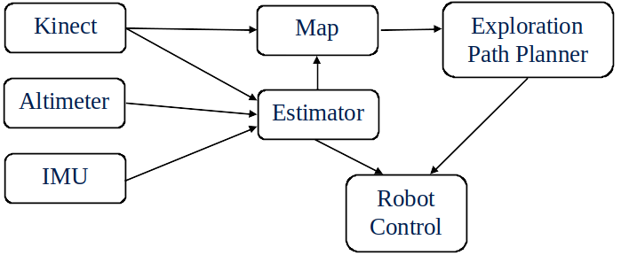
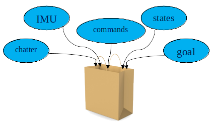
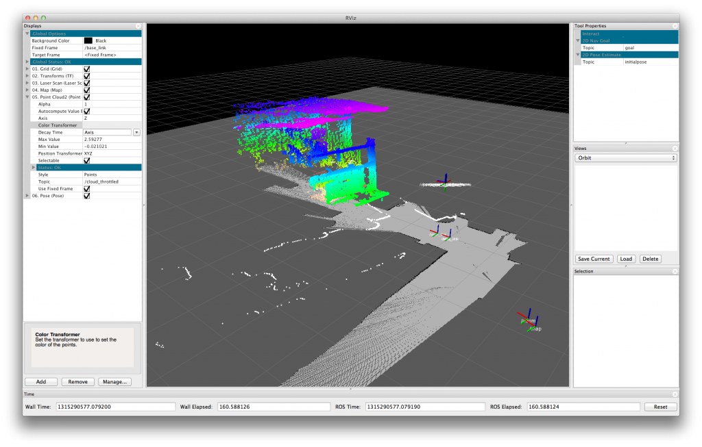

# Introduction to ROS

## Why ROS?

According to the [ROS website](www.ros.org/about-ros/), "The Robot Operating System (ROS) is a flexible framework for writing robot software. It is a collection of tools, libraries, and conventions that aim to simplify the task of creating complex and robust robot behavior across a wide variety of robotic platforms." Specifically, ROS simplifies the plumbing required to connect together the components of a robotic system, it provides tools for simulating and inspecting the behavior of the system, and it provides a common platform that enables the sharing of technologies and ideas.

### Plumbing

One of the challenges of developing a robotic system is developing the "plumbing" to connect data from all of the different subsystems together. Consider, for example the requirements for a robot that, using an altimeter, Xbox Kinect, and IMU, can safely drive through a room making a map as it goes. A graph of the components of this system is depicted below, the arrows indicate the flow of data from one component to another.

Starting from scratch, much of the development time (and frustration) on a system like this would be spent figuring out how to get data from one subsystem to another. If you aren't careful, the result could be very brittle, requiring extensive rework if a component is changed, or if system requirements change. To solve these issues you could spend hours creating a modular system for message passing, or you could use ROS. ROS was developed to solve problems such as this. It enables high modularity by creating standalone nodes that can be easily reused and that have well defined data interfaces. These interfaces are known as topics. Below is a figure depicting the example system from above as a set of ROS *nodes* (blue boxes), communicating with each other through messages known as *topics* (green arrows).

A couple of things to note from this example. Every message "input" on a node is referred to as a subscriber, and every message "output" is known as a publisher. There can only be one publisher for a topic, but there can be many subscribers - note how the estimator and the map nodes both subscribe to the data from the kinect.

### Tools
ROS provides many helpful tools for debugging and inspecting the behavior of a system. This is a brief overview of some of the most useful, for details on how to use them, see the other tutorials, and google.
#### rqt\_graph
rqt\_graph gives a graphical representation of the currently active nodes and topics, allowing you to see what nodes are subscribing to, and to make sure that everything is connected the way you intended.

#### rqt\_plot
rqt\_plot will subscribe to topics and plot their data over time.

#### rosbag
The rosbag command allows you to record all of the data that is being published, and save it into a file known as a rosbag. This file can then be replayed as if the system were currently running, or examined using rqt\_bag.

##### rqt\_bag
rqt\_bag reads a rosbag and provides a nice gui for interacting with it. It shows a graph of when messages were published, and it can plot data from specific messages.

#### tf
tf keeps track of coordinate frames and transformations, doing the kinematics for you.

#### rviz
rviz provides a visualization environment for visualizing coordinate frames, point clouds, paths, goals, models, etc.

This overview was based on a powerpoint by Paul Nyholm and David Wheeler: [ROS Tutorial PowerPoint](https://docs.google.com/presentation/d/1qsfSCJSmvBuR3nP3ah90LNJuTdCqxITZBdDG7mQyiS8/edit?usp=sharing)

## ROS Versions
A new version of ROS is released every year.  Every two years, a Long-Term Support (LTS) version is released.  The LTS version released in 2016 was ROS kinetic, a new version was released in 2017, called Lunar, but Lunar is not LTS, meaning that support for that distribution (distro) will end in April 2018.  Updating ROS distributions can be pretty time-consuming, so to avoid frequent updates, we generally use only the LTS versions of ROS.  As of this writing, we are using kinetic.  _Don't install Luanr_.  It will get confusing to everyone if you install Lunar and your code has weird bugs.

Ubuntu has a similar release schedule, but it is released every 6 months.  Ubuntu 16.04 LTS (April, 2016) Xenial Xerus is the current LTS version that we use, soon to be replaced by Ubuntu 18.04 (April, 2018).  There have been several Ubuntus released since 16.04.  Namely 16.10, 17.04, and 17.10.  (the first two digits are the year, the last two are the month).  Just like ROS, we use 16.04.  It may be tempting to try the latest distribution, but ROS doesn't always support other releases besides the LTS.  To be safe, just stick with the LTS versions.

## Linux Mint, Elementary OS and other distros
There are several variants of Linux, all of which have their own pros and cons.  Theoretically, since many of these distros are based on Debian (which is what Ubuntu is based on), and many of them are based directly on Ubuntu, they will be compatible with ROS.  If you're just getting started, I would not recommend using one of these distros to develop ROS with.  They are kinda fun to toy around with, but don't expect everything to work well, because not all Linux distros are created equal.  Last I checked, Linux Mint was based on Ubuntu 15.10 or something, and Elementary OS is based on 15.10 too, which means only Jade is supported, but don't take my word for it.

## Installing Linux and ROS

Here are links to other pages that go through installing Ubuntu and ROS

- [Installing Ubuntu](getting_started/installing_ubuntu_16.04.md)
- [Installing ROS Kinetic](https://wiki.ros.org/kinetic/Installation/Ubuntu)
