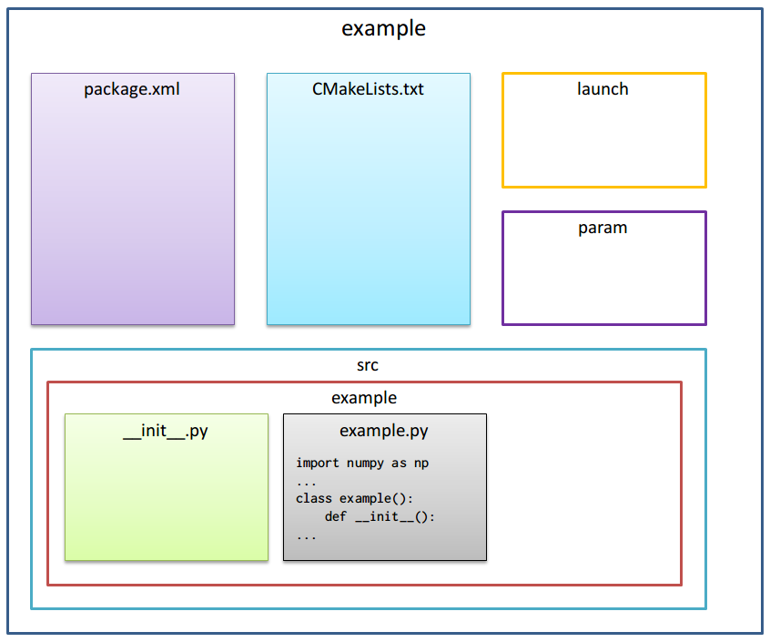

# Nodes Based On Classes (Python)

## Using Python

Python is an awesome language for quickly prototyping.  C++ is way faster than python, but in my experience, I can throw together a python node in about half the time it would take for me to put a C++ node together.  Debugging python is also a lot easier and faster, if only because you don't have to compile between code changes and you have a terminal to try code during a breakpoint.  Often, I'll create a prototype in python, and once it's working, I'll convert it to C++ to get a massive speedup.  I find that this workflow is typically more efficient than trying to do my debugging in C++.

You don't have to just use Python.  There are some awesome libraries that allow you to merge C++ and python into a single node.  This is a more advanced topic, and will probably be covered in later tutorials.  Obviously, you can have both python and C++ in the same package.

## ROS Package organization
Because python doesn't actually have to be compiled, you don't technically need a `CMakeLists.txt`.  You do need a `package.xml`, though, so rospack can recognize your package for what it is.  If you want to install your python node, then you will need to use the CMakeLists.txt, so that catkin can move your python files to the install directories.

## Classes

In short, we use classes because they are convenient. They may not seem so convenient at first, but being able to split up your code into different files makes it a lot easier, and classes make it easy to store variables in between function calls, and limit the scope of functions. You could just program every node in one giant main script, but that eventually becomes unreasonable.

In the MAGICC lab, we generally organize our nodes as follows:



The  `__init__.py` file (which is empty) tells python that your node is a python module.  This is also the reason for putting our scripts in a subfolder of the src folder named the same as our package.  Python is pretty flexible, and you can actually put your files wherever you want, but the above structure is the officially recommended organization.

## Example: Moving Sensor Package

The picture above has the general outline of what is in each node, but I've created an example node which listens to the turtlesim pose message and publishes a boolean flag of whether or not it is moving.  I called my package the "moving_sensor" package.

This package is in a git repo [here](https://gitlab.magiccvs.byu.edu/lab/moving_sensor). If you want, you can download or clone the package and put it in your catkin_ws/src folder.

The file structure appears as follows:

```
moving_sensor
├── CMakeLists.txt
├── package.xml
├── src
│   ├── moving_sensor
│   │   └── __init__.py
│   │   └── moving_sensor.py
```

### CMakeLists.txt
The CMakeLists.txt file is the default file provided by catkin_create_pkg.  If you want to install your node as a python module, a google search will tell you how.

### package.xml
The package.xml is also the default file.

### __init__.py
This is an empty file, that labels your node as a python module.  (This allows you to import your class in other python scripts!)

### moving_sensor.py
This is the meat of your package.
``` python
#!/usr/bin/env python

import rospy
from turtlesim.msg import Pose
from std_msgs.msg import Bool

class movingSensor:
    def __init__(self):
        self.poseSubscriber = rospy.Subscriber("pose", )
        self.isMovingPublisher = rospy.Publisher("is_moving", Bool)

        self.threshold = rospy.get_param("threshold")

    def poseCallback(self, msg):
        out_msg = Bool()
        if msg.linear_velocity > self.threshold:
            out_msg.data = True
        else:
            out_msg.data = False

        self.isMovingPublisher.publish(out_msg)

if __name__ == '__main__':
    thing = movingSensor()

    rospy.spin()

```
