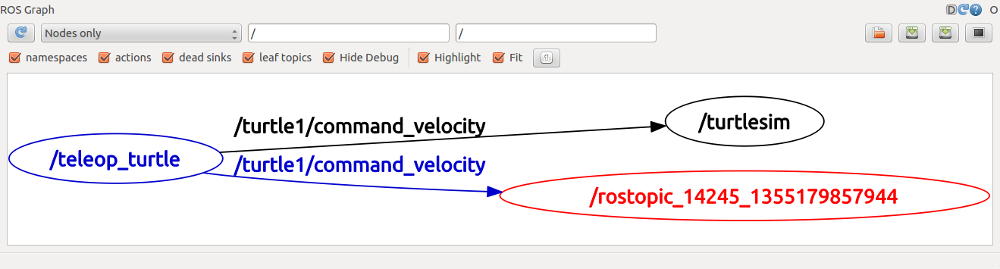
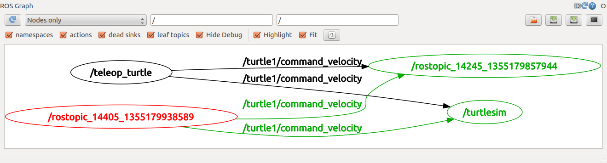

# rostopic

## Prerequisites
Start roscore, turtlesim_node, turtle_teleop_key node, and rqt_graph.

## Introducing rostopic
The `rostopic` tool allows you to get information about ROS **topics**.

You can use the help option to get the available sub-commands for `rostopic`
```
rostopic -h
```
```
rostopic bw     display bandwidth used by topic
rostopic echo   print messages to screen
rostopic hz     display publishing rate of topic
rostopic list   print information about active topics
rostopic pub    publish data to topic
rostopic type   print topic type
```

Let's use some of these topic sub-commands to examine turtlesim.

### Using rostopic list
`rostopic list` returns a list of all topics currently subscribed to and published.

Lets figure out what argument the `list` sub-command needs. In a **new terminal** run:
```
rostopic list -h
```
```
Usage: rostopic list [/topic]
Options:
 -h, --help            show this help message and exit
 -b BAGFILE, --bag=BAGFILE
                       list topics in .bag file
 -v, --verbose         list full details about each topic
 -p                    list only publishers
 -s                    list only subscribers</code>
```

For `rostopic list` use the **verbose** option:
```bash
rostopic list -v
```
This displays a verbose list of topics to publish to and subscribe to and their type.
```
Published topics:
 * /turtle1/color_sensor [turtlesim/Color] 1 publisher
 * /turtle1/command_velocity [turtlesim/Velocity] 1 publisher
 * /rosout [roslib/Log] 2 publishers
 * /rosout_agg [roslib/Log] 1 publisher
 * /turtle1/pose [turtlesim/Pose] 1 publisher

Subscribed topics:
 * /turtle1/command_velocity [turtlesim/Velocity] 1 subscriber
 * /rosout [roslib/Log] 1 subscriber</code>
```
Feel free to try some of the other options.

### Using rostopic type
`rostopic type` returns the message type of any topic being published.

Usage:
```
rostopic type [topic]`
```
Try:
```
rostopic type /turtle1/cmd_vel</code>
```
You should get:
```
geometry_msgs/Twist
```

We can look at the details of the message using `rosmsg`:
```
rosmsg show geometry_msgs/Twist
```
```
geometry_msgs/Vector3 linear
 float64 x
 float64 y
 float64 z
geometry_msgs/Vector3 angular
 float64 x
 float64 y
 float64 z</code>
```

If you can't remember that command, you can also look up geometry_msgs/Twist on the internet.  The first hit on a Google search of "geometry_msgs/Twist" lands in the [the ROS documentation](https://docs.ros.org/api/geometry_msgs/html/msg/Twist.html).  From this, you can also see that the message contains two 3D vectors of translational and rotational velocity.

### Using rostopic echo
`rostopic echo` shows the data published on a topic.

Usage:
```
rostopic echo [topic]
```
Let's look at the command velocity data published by the `turtle_teleop_key` node.

This data is published on the `/turtle1/cmd_vel` topic. **In a new terminal, run:**
```
rostopic echo /turtle1/cmd_vel
```

You probably won't see anything happen because no data is being published on the topic. Let's make `turtle_teleop_key` publish data by pressing the arrow keys. **Remember if the turtle isn't moving you need to select the `turtle_teleop_key` terminal again.**

You should now see the following when you press the up key:
```
 linear:
   x: 2.0
   y: 0.0
   z: 0.0
 angular:
   x: 0.0
   y: 0.0
   z: 0.0
 ---
 linear:
   x: 2.0
   y: 0.0
   z: 0.0
 angular:
   x: 0.0
   y: 0.0
   z: 0.0
 ---
```

Those are the 3D vectors we saw in the documentation.  If you'll notice, when you turn, the angular.z data member changes, and when you move forward and backwards, the linear.x value changes.

So, what if we wanted to control the turtle with something other than the turtle_teleop_key node?  All we would need to do is publish geometry_msgs/Twist messages on the /turtle1/cmd_vel topic.  The turtle will turn if we publish something to the angular.z member, and it will move when we publish something to the linear.x member.

Now let's look at `rqt_graph`. Press the refresh button in the upper-left corner to show the new node. As you can see `rostopic echo`, shown here in red, is now also **subscribed** to the `turtle1/command_velocity` topic.



## ROS Messages
Communication on topics happens by sending ROS **messages** between nodes. For the publisher (`turtle_teleop_key`) and subscriber (`turtlesim_node`) to communicate, the publisher and subscriber must send and receive the same **type** of message. The **type** of the message sent on a topic can be determined using `rostopic type`.

### Using rostopic pub
`rostopic pub` publishes data on to a topic currently advertised.

Usage:
```
rostopic pub [topic] [msg_type] [args]
```
An example is:
```
rostopic pub -1 /turtle1/cmd_vel geometry_msgs/Twist -- '[2.0, 0.0, 0.0]' '[0.0, 0.0, 1.8]'
```
The command sends a single message to turtlesim telling it to move with an linear velocity of 2.0, and an angular velocity of 1.8 .


This is a pretty complicated example, so lets look at each argument in detail.

* This command will publish messages to a given topic:
  ```
  rostopic pub
  ```
* This option (dash-one) causes rostopic to only publish one message then exit:
  ```
  -1
  ```
* This is the name of the topic to publish to:
  ```
  /turtle1/cmd_vel
  ```
* This is the message type to use when publishing the topic:
  ```
  geometry_msgs/Twist
  ```
* This option (double-dash) tells the option parser that none of the following arguments is an option.  This is required in cases where your arguments have a leading dash `-`, like negative numbers.
  ```
  --
  ```
* As noted before, a geometry_msgs/Twist msg has two vectors of three floating point elements each: `linear` and `angular`.  In this case, `'[2.0, 0.0, 0.0]'` becomes the linear value with `x=2.0`, `y=0.0`, and `z=0.0`, and `'[0.0, 0.0, 1.8]'` is the `angular` value with `x=0.0`, `y=0.0`, and `z=1.8`.  These arguments are actually in YAML syntax, which is described more in the [YAML command line documentation](https://wiki.ros.org/ROS/YAMLCommandLine).
```
'[2.0, 0.0, 0.0]' '[0.0, 0.0, 1.8]'
```

You may have noticed that the turtle has stopped moving; this is because the turtle requires a steady stream of commands at 1 Hz to keep moving. We can publish a steady stream of commands using `rostopic pub -r` command:
```
rostopic pub /turtle1/cmd_vel geometry_msgs/Twist -r 1 -- '[2.0, 0.0, 0.0]' '[0.0, 0.0, 1.8]'
```
This publishes the velocity commands at a rate of 1 Hz on the velocity topic.


We can also look at what is happening in `rqt_graph`, The rostopic pub node (here in red) is communicating with the rostopic echo node (here in green):



As you can see the turtle is running in a continuous circle. In a **new terminal**, we can use `rostopic echo` to see the data published by our turtlesim:

### Using rostopic hz
`rostopic hz` reports the rate at which data is published.

Usage:
```
rostopic hz [topic]
```
Let's see how fast the `turtlesim_node` is publishing `/turtle1/pose`:
```
rostopic hz /turtle1/pose
```
You will see:
```
 subscribed to [/turtle1/pose]
 average rate: 59.354
 	min: 0.005s max: 0.027s std dev: 0.00284s window: 58
 average rate: 59.459
 	min: 0.005s max: 0.027s std dev: 0.00271s window: 118
 average rate: 59.539
 	min: 0.004s max: 0.030s std dev: 0.00339s window: 177
 average rate: 59.492
 	min: 0.004s max: 0.030s std dev: 0.00380s window: 237
 average rate: 59.463
 	min: 0.004s max: 0.030s std dev: 0.00380s window: 290
```
Now we can tell that the turtlesim is publishing data about our turtle at the rate of 60 Hz. We can also use `rostopic type` in conjunction with `rosmsg show` to get in depth information about a topic:
```
rostopic type /turtle1/cmd_vel | rosmsg show
```
