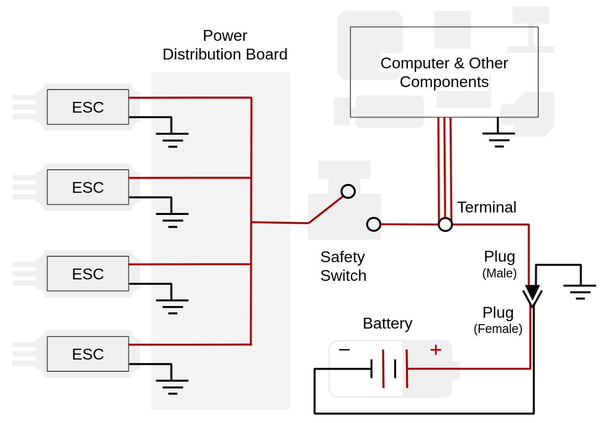

# MAGICC SAFETY #

__There is nothing magic about it.__

Attention! Please research responsibly.

Note: **MAGICC Safety** is an individual __*and*__ a community responsibility.

## General Guidelines ##

- Be up to date on your department training
- If you get a feeling like something could go wrong, change the environment
  - Your agency was given to you to bless your own life and the lives of the people around you - you have the power to change the situation
- Do not sniff the expo markers
- Follow COVID restrictions (wear a mask and social distance as needed)

## Battery Safety ##

Attention!  
There are two buckets of sand under the battery charging workbench. In case of a battery
fire, dump sand on top of the flaming battery. Do not use water or a fire extinguisher on
the flaming battery. Only use water or a fire-extinguisher on other objects that catch
fire in the vicinity.

- Read, study, and internalize [*Battery Basics*]
- Read, study, and internalize the [*Battery Charging Guide*]
- Never cut the postive and negative wires of the battery at the same time (e.g. when replacing a connector)
  - This could short circuit
  - This could ruin the battery
  - This could kill you 😵
- Do **NOT** leave a charging battery unattended
  - Attended means you are physically present in the room with your shoe on the (closed) charging tray lid
  - Definitely do _NOT_ leave a battery charging/discharging over night or even while you go to class
  - If you need to leave, you must get someone else present in the lab to take full responsibility for you
- Do **NOT** leave a discharging battery unattended
- Do **NOT** leave a battery plugged into any device unattended
  - This means both the cell voltage wires and the main power line should be unplugged from everything
- Close the lid of the metal charging tray case while your battery is connected to the charger
  - Leave your shoe on top of the closed case
- Last person to leave the lab:
  - Check if any of the charge cases are closed and, if so, disconnect all batteries and open the cases
  - Take the person's shoe home with you
- If the battery will sit dormant for more than 2 or 3 days, place the battery cell voltages at storage voltage (see [*Battery Basics*])
- Store batteries either in metal ammo boxes or in li-po battery bags
- Do not use the "discharge" function of the charger
  - It zeroes out the voltage, ruining the battery
  - It is meant for battery disposal - we rarely need this

[*Battery Basics*] (hw_guides/lipo_batts.md)
[*Battery Charging Guide*] (hw_guides/charging_lipo_batts.md)

## Build Room ##

- Keep work environment clean and uncluttered, _even_ while you are using it
  - You will be less likely to (a) burn yourself with a soldering iron, or (b) cut yourself with a blade
  - You will be less likely to make a mistake
- Use the correct tool for the job
  - Flathead screwdrivers should not be used with force in the direction of your hand - it is very easy to slip and the screwdriver will insert itself into your hand
  - When cutting small components, use tweezers or pliers to hold that component so ~~you do not cut your hand~~ you reduce the risk of cutting your hand
  - Do not cut anything harder than copper with the wire cutters, it will damage the cutter's blade (some cutters have the names of metals on which they can be used stamped into the cutter, so if it says it can be used with aluminum, then sure, use it on aluminum)
  - Always cut away from your body or appendages and do not cut anything near another person
- If using lead solder, strongly consider arranging good ventilation - then, whatever the consideration results may be, arrange good ventilation regardless
- Safety glasses _must_ be worn while soldering
  - It has happened more than once that hot solder splashed into the eye of a student
  - If you are next to a person soldering, you should also wear safety glasses - it will splash when you least expect it
- Safety glasses _must_ be worn when using the wire cutters
  - The cutters can fling a piece of what is being cut with enough force to damage your eye
- If you are using a saw or power tools of any kind, make sure that the material you are working on is securly fastened or clamped down

## Vehicle Build Design ##

- Incorporate a physical disconnect switch between the battery and the ESC of your vehicle (search something like "emergency safety power switch" on the internet and see image below)
  - Use a switch that is rated for the amount of current that will be drawn from your batteries to your motors.
  - If not possible, reconsider your decisions and ask for ideas from neighbors on how it might become possible
  - The switch only works if you use it - make it the last thing to be engaged, and the first thing to be disengaged
    - If the switch is disengaged first thing upon landing, the risk from the flight controller firmware accidentally being switched to "armed" (either due to a bug or accidentally bumping the "arming" switch on your transmitter) will be reduced, as the physical power to the motors will be cut off
- If there is no physical disconnect switch to the motors, and you need to work on the on-board computer(s), power the computer with a different power source than the main-board battery
  - We do not need anyone getting chopped up at their desk because they powered the motors while changing code on a flight computer
- Every time you flash new firmware to a flight controller, do so with it unplugged from motors
  - Any time you re-attach a freshly-flashed flight controller to your vehicle, remove the propellers first
  - Once your vehicle is powered, tilt the vehicle by hand, and make sure the MIXER is correct by checking each motor is spinning when it should, and in the correct direction - e.g. the lower motors should spin faster, attempting to make the vehicle level
  - You can correct any disparities with the MIXER
  - Double check the direction of the spin of each motor
  - Mount the propellers back on, making sure the correct handed-ness of each propeller is properly matched to the correct spin direction of the motor
- Every time you re-wire your vehicle, double and triple check all connections are strong
  - Loose connections could cause loss of control to the vehicle in the air as vibrations can shake wires loose and disconnect the flight controller
  - Most ESCs will hold the most recent command if they lose connection to the flight controller, granted power from the battery continues to flow
  - Make sure no bare power lines are electrifying your frame - even if there is a small gap between a bare wire and a metal or carbon frame, their is often enough voltage to jump that gap (this has happened even up to a 1/2" gap on a UAS in the lab)
    - Good wire insulation and isolation are paramount - you do not want to fry your onboard electronics, nor yourself
- Get a safety inspection from the safety officer for all newly constructed aircraft, or aircraft that has had major design changes, especially changes to the electrical circuit

## Flight Room ##

- Safety glasses _must_ be worn whenever you are in the flight room while hardware is being used
  - Put on the glasses before connecting a battery to the vehicle
  - Make sure everyone else is wearing glasses before you connect the battery or else politely ask them to leave - just communicate
  - The landscape can change quickly -- wear the safety glasses
- Make sure there is a trained safety pilot whenever the vehicle is armed
  - The safety pilot's __sole responsibility__ is to operate the transmitter, ready to take control
  - Do not set the transmitter down to tune gains or watch plots - request a lab safety pilot's help (see [lab roster])
- If your vehicle is powered and you need to move/touch it --> wear the welding gloves!
  - Or alternately, switch off your safety switch (using a stick, or the glove)
- Be familiar with how to use the fire extinguisher (most departments' new-hire training includes this and it is available on the Y-train website)

[lab roster]: https://internal.magiccvs.byu.edu/#!lab_info/roster.md

## Outdoor Flights ##

### Flight Preparation ###
- Transport all lab supplies, __*especially batteries*__, in appropriately protective containers
  - If a battery gets punctured, it will blow up and burn everything around it to the ground
  - If a battery gets dented, it could very likely blow up and burn everything around it to the ground
  - Do not allow batteries to come in contact with small metal objects that could cause a short circuit
- Use pelican cases - we have plenty
- Inspect all components of the UAS for equipment damage or malfunctions before flight; look for the following:
  - Loose or exposed cables and connections
  - Missing or loose screws
  - Structural cracking
  - Indication of electrical burning
  - Damage to the batteries
- Do not carry hazardous materials on an aircraft, including Lithium batteries that are not in use
- Bring a device to check the voltage on your batteries so that they do not run below 30%
  - Completely discharging a battery will render it useless
- Ensure that your aircraft is registered with the FAA and marked with its registration number - marking should be visible and legible
- Ensure that your UAS weighs less than 55 lbs, including payload

### Asses the Operating Environment ###
- Verify that you will not be in a restricted airspace - in general stay 5 miles away from airports unless you recieve proper authorization from the FAA
- Choose a location that is sparsely poplulated - avoid areas with high traffic, pedestrians or property that could be damaged
- Check the weather for rain, snow, or fog
- Ensure that you have visiblity up to 3 statute miles from the control station
- Be aware of wind curents
  - Obstructions or buildings may affect the flow of wind and may create rapidly changing wind gusts
  - Plowed grounds, rocks, sand, and barren land may result in updrafts
  - Water, trees, and other areas of vegetation can cause downdrafts
  - Note that flying in high winds will likely consume more battery power

### Flight Rules ###
- Any outdoor lab related flights must be performed under supervision of someone with a 14 CFR part 107 license
  - The remote pilot must carry thier remote pilot certificate and personal ID when supervising
- Have a trained safety pilot anytime the vehicle is armed ready to take control of the vehicle
- Do not fly your aircraft faster than 100 mph
- Do not fly higher than 400 ft above ground level - if you are within a 400 ft radius of a structure you may fly 400 ft above the tallest point of that structure
- Stay 500 ft below the clouds, and 2,000 ft horizontally away from clouds
- Keep aircraft within visual line-of-sight
  - This means you are capable of determining its location, altitutde, attitude, and direction of travel without the aid of binoculors or other devices
- Do not fly an aircraft over another person unless that person is directly involved in the operation
- Do not engage in sustained flight over moving vehicles
- Do not operate an aircraft if you are impaired in any way, including impairment due to medication

### Flying at Night ###

The following rules apply anytime after sunset or before sunrise:

- The operating area should be surveyed during daylight hours to identify possible obstacles
- The UAS is equipped with anti-collision lights that are capable of being visible for at least 3 statue miles and have a flash rate sufficient to avoid collision
- There must be a visual observer designated to scan for other aircraft
- A night landing area is established that is dimly illuminated
