UBLOX_read: A Driver for the UBLOX ZED-F9P Module
==========================
This package allows any Linux computer to interact with the ZED-F9P module.

UBLOX ZED-F9P hardware integration is found [here](../hw_guides/ublox_f9p.md).

## Key Features
* Cross-platform support
* Runs headless in a terminal setting
* Optional ROS integration

## Terminology
**Stationary Base** assumes no movement and can thus provide a very stable global position, which translates to high-quality RTK corrections sent to the **Rover**. The **Rover** outputs positional data at 10 Hz.

**Moving Base** is like a stationary base, but does not assume position is fixed. This generally results in heavier RTK computational solutions for the **Rover**. The **Rover** ouputs positional information at 5 Hz.

**Brover** is a moving base which receives RTK corrections from a different base. While this approach helps increase the accuracy of the moving base, it places much more computational strain on the **Brover**, causing it to subsequently send less messages to its **Rovers**.

**Rover** always has a **Base** that it listens to in order to receive RTK corrections. These corrections allow the **Rover** to compute its relative position to a **Base** with an extremely high degree of accuracy (standard deviations are around .025 m horizontally, and .1 m vertially)

## Communication Protocols

The UBLOX GNSS module uses three distinct communication protocols

1. [NMEA](#nmea-(National-Marine-Electronics-Association)
2. [UBX](#ubx-(Ublox-Proprietary-Protocol)
3. [RTCM](#rtcm-(Radio-Technical-Commission-for-Maritime-Services)

## NMEA (National Marine Electronics Association)
See Section 4 of the [Interface Description](https://www.u-blox.com/sites/default/files/u-blox_ZED-F9P_InterfaceDescription_%28UBX-18010854%29.pdf)

## UBX (Ublox Proprietary Protocol)

The computer configures settings on the UBLOX GNSS module via UBX protocol.

The module sends messages containing GNSS data back to the computer via UBX protocol.

These communications happen over a serial port.

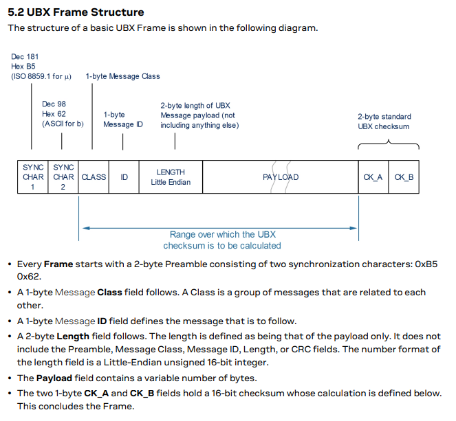

*Taken from UBLOX Interface Description: See [Documentation and Citations](#ublox-documentation-and-citations)*

## RTCM (Radio Technical Commission for Maritime Services)

The UBLOX GNSS **Base** sends its GNSS data to the computer in RTCM format. The **Base** computer then sends this data to the **Rover** computer, which is then forwarded to the **Rover** module via the serial port. 

The **Rover** module then uses this information to calculate RTK corrections and achieve accurate relative position information. The relative position data is sent back to the **Rover** computer via the serial connections

## Non-ROS Installation
1. `git clone https://github.com/byu-magicc/UBLOX_read.git`
2. `cd UBLOX_read/`
3. `git submodule update --init --recursive` 
4. `mkdir build`
5. `cd build/`
6. `cmake ..`
7. `make -j8`

## ROS Installation
Given ROS is installed,
1. Make a catkin workspace if you don't already have one (`mkdir catkin_ws`)
2. `cd catkin_ws && mkdir src`
3. `cd src && git clone https://github.com/byu-magicc/UBLOX_read.git`
4. `cd UBLOX_read`
5. `git submodule update --init --recursive`
6. `cd ../.. && catkin_make`
7. `source devel/setup.sh`

## ROS Launch Files

Attention: Do not modify launch files in UBLOX_read. Only use them as templates for creating your own in a separate package.

A single node corresponds to a single module. All nodes must specify
1. `serial_port`: Serial port to connect to the module from the the computer. Defaults to `/dev/ttyACM0`
2. `rover_quantity`: The number of rovers the computer must send GNSS data from the module to.
3. `local_host`/`local_host1`: The name of the computer on the network. Usually just `localhost`
4. `local_port`: A port number over which UDP communication will occur. See [Communication Protocols](#communication-protocols)

Other *optional* parameters include
1. `rover_host`/`rover_host1`: The IP address of the **Rover** computer.
2. `rover_port`: The port number over which UDP communication will be received by the **Rover** computer.
3. `base_host`: The IP address of the **Base** computer from which the local computer recevies [RTCM](#rtcm-(Radio-Technical-Commission-for-Maritime-Services) correctional data.
4. `base_port`: The port number of the **Base** computer from which the [RTCM](#rtcm-(Radio-Technical-Commission-for-Maritime-Services) data was sent.

Tip: Theoretically N number of rovers can be initialized to a single base by counting up from rover_host1 to rover_hostN, rover_port1 to rover_portN, and any other given param.

## Case Study: One Base + One Rover

Attention: Do not modify these launch files. Only use them as templates for creating your own in a separate package.

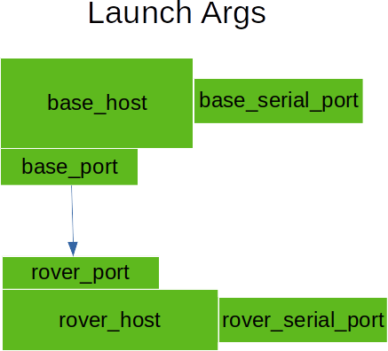
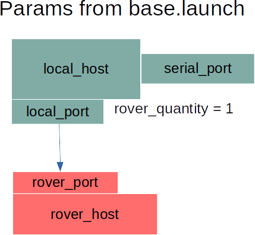
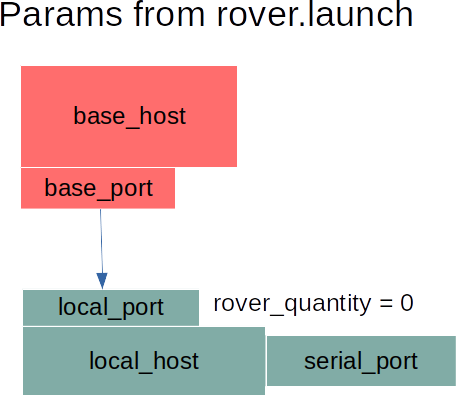

[base.launch](https://github.com/byu-magicc/UBLOX_read/blob/master/launch/base.launch) contains parameters for the base computer.

[rover.launch](https://github.com/byu-magicc/UBLOX_read/blob/master/launch/rover.launch) contains parameters for the rover computer.

## Case Study: One Base + Two Rovers

Attention: Do not modify these launch files. Only use them as templates for creating your own in a separate package.

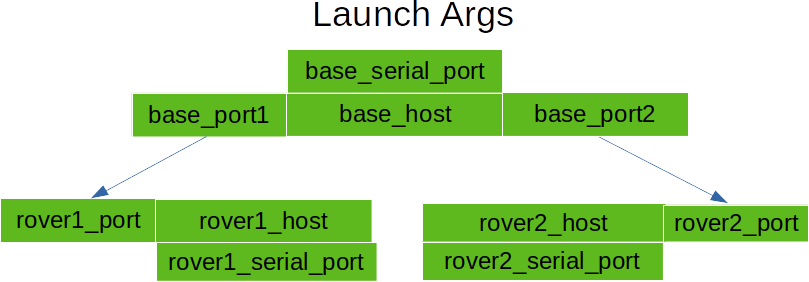
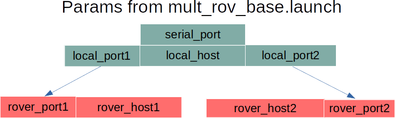

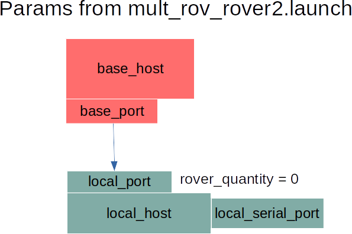

[mult_rov_base.launch](https://github.com/byu-magicc/UBLOX_read/blob/master/launch/mult_rov_base.launch) contains parameters for the base computer.

[mult_rov_rover1.launch](https://github.com/byu-magicc/UBLOX_read/blob/master/launch/mult_rov_rover1.launch) contains parameters for the rover1 computer.

[mult_rov_rover2.launch](https://github.com/byu-magicc/UBLOX_read/blob/master/launch/mult_rov_rover2.launch) contains parameters for the rover2 computer

## Case Study: One Base + One Brover + One Rover

Attention: Do not modify these launch files. Only use them as templates for creating your own in a separate package.

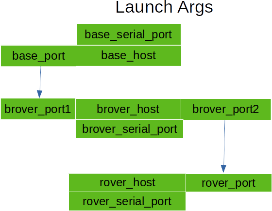
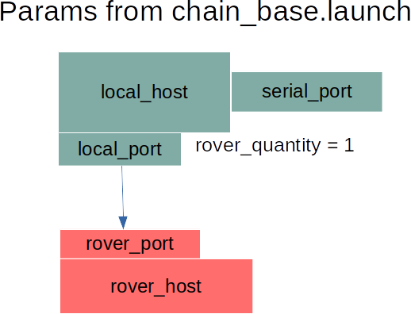
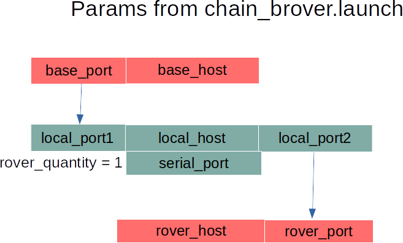
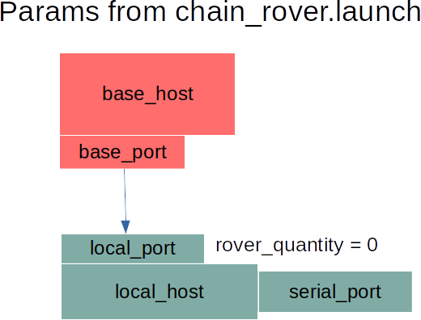

[chain_base.launch](https://github.com/byu-magicc/UBLOX_read/blob/master/launch/chain_base.launch) contains parameters for the base computer.

[chain_brover.launch](https://github.com/byu-magicc/UBLOX_read/blob/master/launch/chain_brover.launch) contains parameters for the brover computer.

[chain_rover.launch](https://github.com/byu-magicc/UBLOX_read/blob/master/launch/chain_rover.launch) contains parameters for the rover computer.

## ROS Messages
* **[PosVelTime](#posveltime):** GNSS Positional/Velocity Data given in LLA format with an accurate timestamp
* **[PosVelEcef](#posvelecef)** GNSS Positional Data given in ECEF frame. (Velocity is copied from PosVelTime message)
* **[RelPos](#relpos):** RTK Corrected Relative Position of the module relative to its base (only output on rover)
* **[RelPosFlags](#relposflags):** Flags from RelPos Message
* **[SurveyStatus](#surveystatus):** Information about Survey-in Parameters including current mean position accuracy (only outputs for a stationary base)

## PosVelTime
GNSS Positional/Velocity Data given in LLA format with an accurate timestamp

| Data Type   | Name    | Description   |
| ----------  | ----    | ----------    |
| Header    |   header  | ROS Timestamp |
| uint16 |year  	| Year (UTC)
| uint8 | month  	|Month, range 1..12 (UTC)
| uint8 | day  	    |Day of month, range 1..31 (UTC)
| uint8 | hour  	    | Hour of day, range 0..23 (UTC)
| uint8 | min  	        | Minute of hour, range 0..59 (UTC)
| uint8 | sec  	        | Seconds of minute, range 0..60 (UTC)
| int32 | nano  	    | Fraction of second, range -1e9 .. 1e9 (UTC)
| uint32 | tAcc  	    | Time accuracy estimate (UTC)
| uint8 | valid  		| Validity flags (see below )
| uint8 | fixType 	    | GNSSfix Type
| uint8 | flags  		| Fix status flags
| uint8 | flags2  	    | Additional flags
| uint8 | numSV  		| Number of satellites used in Nav Solution
| float64[3] | lla 		| lat, lon, altitude (deg, deg, m)
| float64 | hMSL  		| Height above mean sea level (m)
| float64 | hAcc  		|  Horizontal accuracy estimate (m)
| float64 | vAcc  		| Vertical accuracy estimate (m)
| float64[3] | velNED	| NED velocity (m/s)
| float64 | gSpeed  	| m/s Ground Speed (2-D)
| float64 | headMot 	| deg Heading of motion (2-D)
| float64 | sAcc  		| m/s Speed accuracy estimate
| float64 | headAcc		| deg Heading accuracy estimate (both motion and vehicle)
| float64 | pDOP  		| Position DOP
| float64 | headVeh  	| deg Heading of vehicle (2-D)

## PosVelEcef
GNSS Positional Data given in ECEF frame. (Velocity is copied from PosVelTime message)

| Data Type   | Name    | Description   |
| ----------  | ----    | ----------    |
|Header header # Estimated ROS time at moment of measurement
|uint8      |fix    |fix type, see below
|float64[3] |lla    |deg, deg, m
|float64[3] |position | m, ECEF frame
|float64 |horizontal_accuracy | m
|float64 | vertical_accuracy | m
|float64[3] |velocity | m/s, ECEF frame
|float64 |  speed_accuracy | m/s

## RelPos
RTK Corrected Relative Position of the module relative to its base (only output on rover)

| Data Type   | Name    | Description   |
| ----------  | ----    | ----------    |
|Header | header        | ROS Timestamp
|uint16 | refStationId 	| Reference Station ID. Must be in the range 0..4095
|float64[3] | relPosNED	| NED component of relative position vector (m)
|float64 | relPosLength 	| Length of relative position vector (m)
|float64 | relPosHeading 	| Heading of the relative position vector. (rad)
|float64[3] | relPosHPNED 	| High precision NED, the measurment portion less than a mm. (m)
|float64 | relPosHPLength 	| High precision Length, the measurment portion less than a mm. (m)
|float64[3] | accNED 		| Accuracy of relative position North component (m)
|float64 | accLength 		| Accuracy of Length of the relative position vector (m)
|uint32 | accHeading 		| Accuracy of heading of the relative position vector (rad)
|uint32 | flags 			|See [RelPosFlags](#relposflags)
|float64[3] | arrowNED  |Difference vector from one rover to the other. (m)
|float64 | arrowLength |Length of difference vector. (m)
|float64[3] | arrowRPY |Roll/Pitch/Yaw from rover1 to rover2 (rad)

## RelPosFlags
Flags from RelPos Message

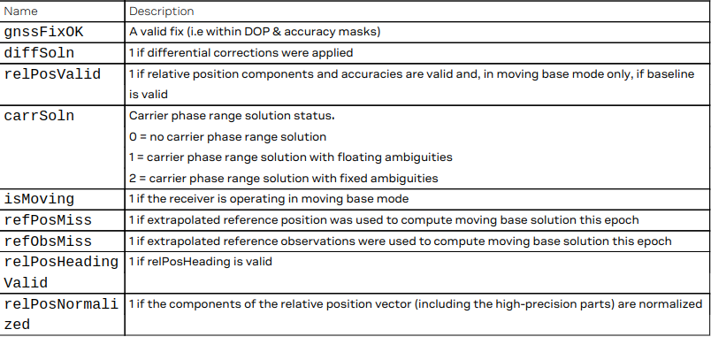

*Taken from UBLOX Interface Description: See [Documentation and Citations](#ublox-documentation-and-citations)*

## SurveyStatus
Information about Survey-in Parameters including current mean position accuracy (only outputs for a stationary base)

| Data Type   | Name    | Description   |
| ----------  | ----    | ----------    |
|Header | header        | ROS Timestamp
|uint32 | dur 			| Passed survey-in observation time (s)
|float64[3] | meanXYZ	| Current survey-in mean position ECEF coordinate frame cm
|uint32 | meanAcc		| Current survey-in mean position accuracy mm
|uint32 | obs 			| number of position observations used during survey-in
|float64[3] | meanXYZHP | Current high-precision survey-in mean position ECEF coordinate frame 0.1_ mm (Range -99...+99)
|uint8 | valid 			| Survey-in postion validity flag, 1=valid, otherwise 0
|uint8  | active	    | survey-in in progress flag, 1 = in-progress, otherwise 0

## Configuration Key IDs

Configurations in the ZED-F9P recevier are indexed by key IDs. These keys are always little endian and 4 bytes (32 bits) in length.

| Bit # | Meaning |
| ----- | ------- |
| 0-7 (Byte 1) | ID within Group |
| 8-15 (Byte 2)| Reserved   |
| 16-23 (Byte 3)| Group     |
| 24-27         | Reserved  |
| 28-30         | Size of Configuration Value |
| 31            | Reserved  |

The size of Configuration Values is represented by bits 28-30 as follows:

| # | Size of Configuration Value   | #     | Size of Configuration Value |
| - | ----------------------        | -----|-------     |
|0x01 | 1 Bit (Uses 1 Byte to Store)| 0x04 | 4 Bytes    |
|0x02 | 1 Byte                      | 0x05 | 8 Bytes    |
|0x03 | 2 Bytes                     |

Example: `CFG-RATE-MEAS` is key `0x30210001`. Its configuration value size identifier is given by second-to-left-most byte, which is `3`. This translates to 2 Bytes (see table above). Its group name is given by the middle word `RATE` This group corresponds to the ID `0x21`, which are digits 3-4 from the left. The next two digits `0x00` are reserved. The final two digits `0x01` represent the specific type within the group, in this case `MEAS`.

Some keys function as wild cards that can mean more than one configuration.

| Wild Card Key ID | Group | Wild Card Key ID | Group |
| ---------- | ------------- | ---------- | ------------- |
| 0x0fff0000 | All           | 0x00c7ffff | RINV          |
| 0x0024ffff | GEOFENCE      | 0x0031ffff | SIGNAL        |
| 0x00a3ffff | HW (Hardware) | 0x0064ffff | SPI           |
| 0x0051ffff | I2C           | 0x0079ffff | SPIINPROT     |
| 0x0071ffff | I2CINPROT     | 0x007affff | SPIOUTPROT    |
| 0x0072ffff | I2COUTPROT    | 0x0003ffff | TMODE         |
| 0x0092ffff | INFMSG        | 0x0005ffff | TP            |
| 0x0041ffff | ITFM          | 0x00a2ffff | TXREADY       |
| 0x00deffff | LOGFILTER     | 0x0052ffff | UART1         |
| 0x0025ffff | MOT           | 0x0073ffff | UART1INPROT   |
| 0x0091ffff | MSGOUT        | 0x0074ffff | UART1OUTPROT  |
| 0x0014ffff | NAVHPG        | 0x0053ffff | UART2         |
| 0x0011ffff | NAVSPG        | 0x0075ffff | UART2INPROT   |
| 0x0093ffff | NMEA          | 0x0076ffff | UART2OUTPROT  |
| 0x0022ffff | ODO           | 0x0065ffff | USB           |
| 0x0021ffff | RATE          | 0x0077ffff | USBINPROT     |
|            |               | 0x0078ffff | USBOUTPROT    |

## CfgValGet
Access configuration settings on the ZED-F9P module via [UBX protocol](#ubx-(Ublox-Proprietary-Protocol)
    
#### Request
Template: `rosservice call /base/CfgValGet <layer> <position> <keyID> <filepath>` 

`<layer>`: The layer to request configuration from. Usually 0

| # | Layer     |
| - | -----     |
| 0 | RAM       |
| 1 | BBR       |
| 2 | Flash     |
| 7 | Default   |

`<position>`: How many key values to skip before responding. Usually 0

`<keyId>`: Key ID of the requested configuration value. May be in hexadecmial (prefix with `0x`), decimal (no prefix), or binary (prefix with `0b`) format.

`<filepath>`: Global path for writing the response to a text file. If the file does not exist, one is created. If the file already exists, its contents are overwritten by this service. Usually `''`

#### Specializations

**CfgValGetAll:** Gets every configuration setting from the module
Template: `rosservice call /base/CfgValGetAll <layer> <position> <filepath>`

#### Response
The module returns a vector of Configuration Data, which is constructed as follows

version     Always 1
layer       Layer data came from--matches request layer
position    Number of key values skipped before output
keyID       keyID returned
keyName     Name of keyID returned
data        Configuration Value

The module also returns
ack: The receiver acknowledged the request
nack: The receiver did not acknowledge the request
gotcfg: Received configuration value

## CfgValDel
Delete configuration settings. 

#### Request
Template: `rosservice call /base/CfgValDel <layer> <keyID>`

`<layer>`: The layer to delete configuration from.

| # | Layer     |
| - | -----     |
| 2 | BBR       |
| 4 | Flash     |

`<keyID>`: keyID of the configuration value to be deleted. May be in hexadecmial (prefix with `0x`), decimal (no prefix), or binary (prefix with `0b`) format.

#### Response
The module returns
ack: The receiver acknowledged the request (you may assume the configuration was deleted)
nack: The receiver did not acknowledge the request (the configuration was not deleted)

## CfgValSet
Set configuration settings.
 
#### Request
Template: `rosservice call /base/CfgValGet <layer> <keyID> <cfgData>`

`<layer>`: The layer to set configurations

| # | Layer |
| - | ----- |
| 1 | RAM   |
| 2 | BBR   |
| 4 | Flash |

`<keyID>`: keyID of the configuration value to be set. May be in hexadecmial (prefix with `0x`), decimal (no prefix), or binary (prefix with `0b`) format.

`<cfgData>`: The configuration is set to this value

#### Response
The module returns
ack: The receiver acknowledged the request (you may assume the configuration was set)
nack: The receiver did not acknowledge the request (the configuration was not set)

## CfgReset
Resets the configurations on the module.

#### Request
Template: `rosservice call /base/CfgReset <uint16 navBbrMask> <uint8_t resetMode>`

`<navBbrMask>`: BBR sections to clear. 

| Special Codes         | Meaning           |
|------                 | ----------------- |
| 0x0000                | Hot Start         |
| 0x0001                | Warm Start        |
| 0xFFFF                | Cold Start        |

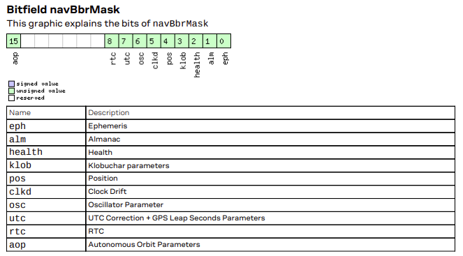

*Taken from UBLOX Interface Description: See [Documentation and Citations](#ublox-documentation-and-citations)*

`<resetMode>`: Reset Type

| # | Reset Type    |
| - | ----------    |
| 0 | Immediate Hardware Reset (Watchdog triggered) |
| 1 | Controlled Software Reset                     |
| 2 | Controlled Software Reset (GNSS only)         |
| 4 | Hardware Reset after shutdown                 |
| 8 | Controlled GNSS stop                          |
| 9 | Controlled GNSS start                         |

#### Response
Responds with a translation of navBbrMask into boolean values

## GetVersion
Gets software and hardware versions of the module

#### Response
string softwareVersion
string hardwareVersion
string[] extension contains extra information. See UBLOX Documentation for more details

## UBLOX Documentation and Citations

* [Interface Description](https://www.u-blox.com/sites/default/files/u-blox_ZED-F9P_InterfaceDescription_%28UBX-18010854%29.pdf) contains information about various messages from the module.
* [Integration Manual](https://www.u-blox.com/en/docs/UBX-18010802)
* [Moving Base Application Note](https://www.u-blox.com/en/docs/UBX-19009093)
* [Data Sheet](https://www.u-blox.com/en/docs/UBX-17051259)
* [The Official UBLOX F9P Site](https://www.u-blox.com/en/product/zed-f9p-module) contains more useful documents

## Credits

 A special thanks goes to
 *James Jackson, Matthew Rydalch, Taylor Pool*: UBLOX_read Code Development

