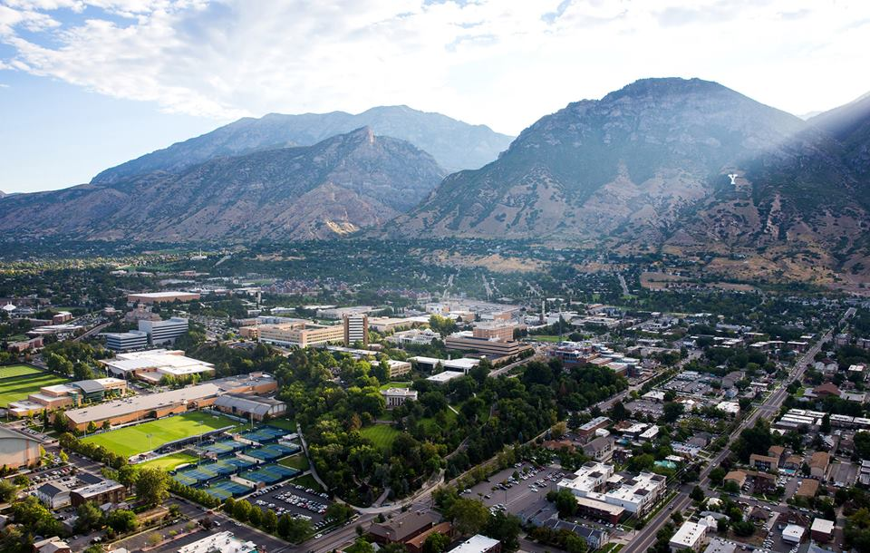

# Adding a Ground Image

## Adding a Ground Plane Image
It can be helpful in gazebo to have an image on the ground plane rather than the default background. For instance, several applications in the lab deal with visual odometry or navigation. In this lesson, we learn how to add a ground plane image and add it to our gazebo texture library. While the method put forth here works, it may not be the ideal way of doing it.

## Image Selection and Location
Any image can be used as the ground image, but ideally it is a high-resolution image. JPEG, PNG, and BMP images have been shown to work, but other static image types probably work as well.

Gazebo keeps all image textures in the protected directory /usr/share/gazebo-(version_number)/media/materials/textures/ (make sure to replace (version_number) with the appropriate path. My current version is gazebo-2.2). Navigating to that location in Ubuntu, you can see a number of images. Move your desired image to this location using sudo. For this tutorial, we are using the image shown below with the name `Byu.jpg`.



Image textures in gazebo are stored as models, so we want to make a new model file in gazebo. To make a non-root model, we create a new directory in ~/.gazebo/models, naming the directory our desired model name. We'll call our model directory 'byu'.

In the byu directory, we want to create the following directory structure:

```
+---byu
    \---model.config
    \---model.sdf
    +---materials
        +---scripts
            \---byu.material
```
In the root of this directory, we fill `model.config` with
```xml
<model>
  <name>BYU Ground</name>
  <version>1.0</version>
  <sdf version="1.4">model.sdf</sdf>

  <description>
    My image ground plane
  </description>

</model>
```
and make `model.sdf`
```xml
<?xml version="2.0"?>
<sdf version="1.4">
<model name="byu">
  <static>true</static>
    <link name="link">
      <collision name="collision">
        <geometry>
          <plane>
            <normal>0 0 1</normal>
            <size>10 10</size>
          </plane>
        </geometry>
        <surface>
          <friction>
            <ode>
              <mu>100</mu>
              <mu2>50</mu2>
            </ode>
          </friction>
        </surface>
      </collision>
      <visual name="visual">
        <cast_shadows>false</cast_shadows>
        <geometry>
          <plane>
            <normal>0 0 1</normal>
            <size>100 100</size>
          </plane>
        </geometry>
        <material>
          <script>
            <uri>model://byu/materials/scripts/byu.material</uri>
            <name>BYU/ground</name>
          </script>
        </material>
      </visual>
    </link>
  </model>
</sdf>
```
We now only have one more file to set up - `byu.material`. In this file, we put:
```
material BYU/ground
{
  technique
  {
    pass
    {
      ambient 1.0 1.0 1.0 1.0
      diffuse 0.8 0.8 0.8 1.0
      specular 0.0 0.0 0.0 1.0 2.0

      texture_unit
      {
        texture byu.jpg
        filtering trilinear
      }
    }
  }
}
```
In this file, the name of the texture image must match the name of the image you put in the gazebo textures directory at the very beginning. The ambient, diffuse, and specular parameters change the lighting on the figure; you can play around with these if you wish.

Notice the lines for "uri" and "name" in the `model.sdf` file. It is important that these match the name of the `.material` file and the material parameter in the first line of that file, if you choose to change the name of the material to be more descriptive of your application. For instance, if you wanted to make a model named "magicc", you would need to change your material file to the name `magicc.material`, your uri to "model://(name of directory)/materials/scripts/magicc.material", and your texture name to the name of the image. It is also good practice to name your root directory to the name of the material as well as changing your model name (here BYU/ground) to something descriptive of your ground image. Make sure to change that name both in your material file as well as in your `model.sdf` file. The `<model name="byu">` needs to be changed as well.

## Place The Ground Image
From here, you should be able to start gazebo and import your image plane. Start a vanilla instance of gazebo, go to the "insert" tab, and you should see "BYU Ground" listed under your models. Click the model, and you should be able to place it in your gazebo simulation. The ground plane size may be too large for you; you can change that under the `<size>` tag immediately before the `<material>` tag in `model.sdf`. The size is set to 100x100 in the model as given.
