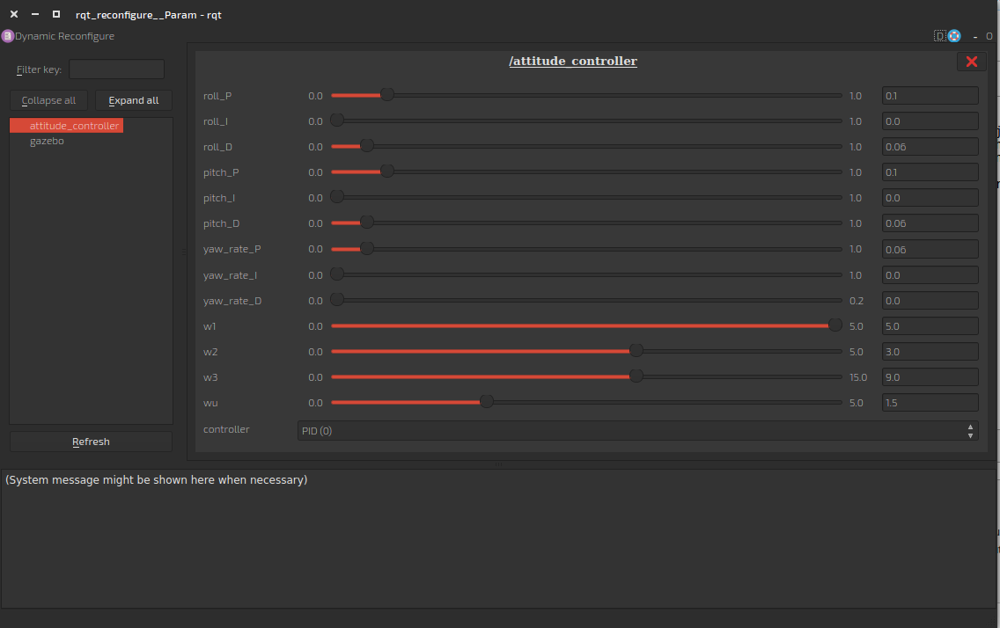

# Flying Your MAV

## Flying Your MAV
In this assignment, you'll fly the MAV you made earlier. 

## Multirotor
Use the launch file in the previous lesson to launch your MAV with joystick commands. (You'll need a joystick). Because different joysticks have different mappings, you may need to change the parameters in the launch file to get your MAV to act appropriately. While that sounds easy, getting parameters to agree is probably the hardest part of getting the simulation to work properly, hence that is your assignment. The default mapping is included in the yaml file loaded by the `joy_sim` node. The `sim_reset` node is also included to allow you to restart your simulation without closing gazebo and re-launching. It writes to the `set_model_state` topic and resets everything when you press the reset button (default is start if your mappings are right). 

```xml
<launch>
  <arg name="mav_name"            default="hummingbird"/>

  <!-- Start Gazebo -->
  <include file="$(find gazebo_ros)/launch/empty_world.launch">
    <arg name="world_name" value="$(find rotor_gazebo)/worlds/basic.world"/>
    <arg name="paused" value="false"/>
    <arg name="gui" value="true"/>
  </include>

  <!-- Spawn MAV -->
  <include file="$(find rotor_gazebo)/launch/spawn_mav.launch">
    <arg name="mav_name"            value="$(arg mav_name)" />
    <arg name="model"               value="$(find rotor_gazebo)/urdf/$(arg mav_name)/$(arg mav_name)_base.xacro" />
  </include>

  <!-- Joystick -->
  <node name="xbox"                pkg="joy"                 type="joy_node"/>
  <node name="joy_sim" pkg="joy_sim" type="joy_sim" >
    <rosparam command="load" file="$(find joy_sim)/param/xbox.yaml"/>
    <rosparam command="load" file="$(find joy_sim)/param/$(arg mav_name).yaml"/>
  </node>
  <node name="sim_reset" pkg="sim_reset" type="sim_reset_node">
    <param name="reset_button" value="9"/>
    <param name="model_name" value="$(arg mav_name)"/>
  </node>

  <!-- Attitude Control -->
  <rosparam command="load" file="$(find attitude_controller)/param/$(arg mav_name).yaml"/>
  <node name="attitude_controller" pkg="attitude_controller" type="attitude_controller_node">
    <rosparam command="load" file="$(find rotor_gazebo)/param/$(arg mav_name).yaml"/>
    <remap from="odometry" to="$(arg mav_name)/ground_truth/odometry"/>
    <remap from="command/motor_speed" to="$(arg mav_name)/gazebo/command/motor_speed"/>
  </node>
</launch>
```

### Tune the Attutude Controller
You'll also need to tune your attitude controller. Lucky for you, the attitude controller has been built with dynamic reconfigure. This means that you can change parameters on the fly. When you first launch the controller, it will read defaults from the yaml file in the attitude controller node block, however, if while the simulation is running, you type 

```xml
rosrun rqt_reconfigure rqt_reconfigure
```

Something like the following window will appear

This will allow you to change the gains on the fly. Parameters from `rqt_reconfigure` are *not* saved on close. Once you've tuned in your gains, change the defaults in the yaml file loaded by the attitude controller node. 

## Fixed Wing
Flying the Fixed Wing is even easier. Well, it's easier to set up in ROS, but it's actually really hard to fly in gazebo with joysticks. The same `joy_sim` node can be used, but gazebo will use the `/FWcommand` topic.

```xml
  <arg name="mav_name"            default="junker"/>

  <include file="$(find gazebo_ros)/launch/empty_world.launch">
    <arg name="world_name" value="$(find rotor_gazebo)/worlds/blue.world"/>
    <arg name="paused" value="false"/>
    <arg name="gui" value="true"/>r
  </include>

  <!-- Spawn MAV -->
  <include file="$(find rotor_gazebo)/launch/spawn_mav.launch">
    <arg name="mav_name"            value="$(arg mav_name)" />
    <arg name="model"               value="$(find rotor_gazebo)/urdf/$(arg mav_name)/$(arg mav_name)_base.xacro" />
  </include>

  <!-- Joystick -->
  <node name="xbox"                pkg="joy"                 type="joy_node"/>
  <node name="joy_sim" pkg="joy_sim" type="joy_sim" >
    <rosparam command="load" file="$(find joy_sim)/param/xbox.yaml"/>
  </node>
  <node name="sim_reset" pkg="sim_reset" type="sim_reset_node">
    <param name="reset_button" value="9"/>
    <param name="model_name" value="$(arg mav_name)"/>
  </node>

</launch>
```

It is also really difficult to get orientation in gazebo. As a result, I have created a world with a blue floor instead of gray. It's boring, and really quite ugly, but it allows you to see the horizon. The following launch file will generate the junker model and allow you to fly it. 

you may wish to view the chase camera, rather than the gazebo window. To do this, simply type 
```xml
rosrun image_view image_view image:=/junker/camera/chase/rgb
```
or add it to the launch file as follows: 
```xml
  <node name="chase_camera" pkg="image_view" type="image_view">
    <remap from="image" to="$(arg mav_name)/camera/chase/rgb"/>
  </node>
```
As with the multirotor, you will probably need to change the mappings on your joystick to control it properly, but it flies like an airplane! 
