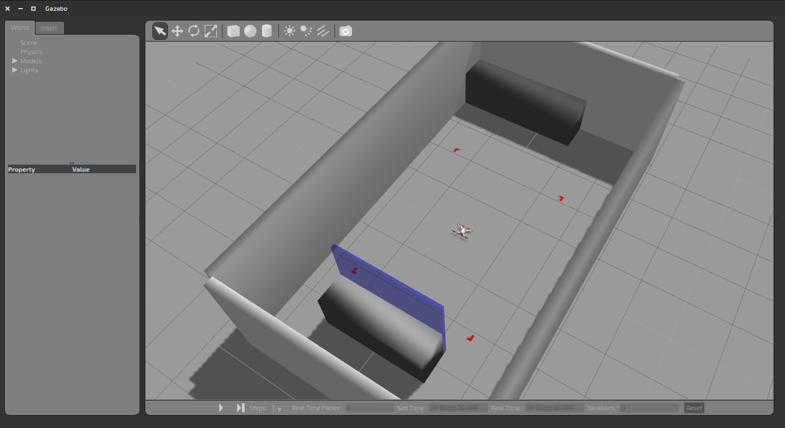

# Make Your Own Gazebo World 

## Make Your Own Gazebo World

Using the methods described in the previous lesson, build a world, and fly your MAV in it.  You will probably want to use your multirotor unless you want to make a really big world for your fixed wing MAV.

save the world in `rotor_gazebo/worlds` and use the `test.launch` file supplied below, changing the `mav_name` and `world_file` lines appropriately

```xml
<pre class="prettyprint">
<launch>
  <arg name="mav_name"            default="hummingbird"/>
  <arg name="world_file"          default="your_world.world"/>

  <include file="$(find gazebo_ros)/launch/empty_world.launch">
    <arg name="world_name" value="$(find rotor_gazebo)/worlds/$(arg world_file)"/>
    <arg name="paused" value="false"/>
    <arg name="gui" value="true"/>r
  </include>

  <!-- Spawn MAV -->
  <include file="$(find rotor_gazebo)/launch/spawn_mav.launch">
    <arg name="mav_name"            value="$(arg mav_name)" />
    <arg name="model"               value="$(find rotor_gazebo)/urdf/$(arg mav_name)/$(arg mav_name)_base.xacro" />
  </include>

  <!-- Joystick -->
  <node name="xbox"                pkg="joy"                 type="joy_node"/>
  <node name="joy_sim" pkg="joy_sim" type="joy_sim" >
    <rosparam command="load" file="$(find joy_sim)/param/xbox.yaml"/>
    <rosparam command="load" file="$(find joy_sim)/param/$(arg mav_name).yaml"/>
  </node>
  <node name="sim_reset" pkg="sim_reset" type="sim_reset_node">
    <param name="reset_button" value="9"/>
    <param name="model_name" value="$(arg mav_name)"/>
  </node>

  <!-- Attitude Control -->
  <rosparam command="load" file="$(find attitude_controller)/param/$(arg mav_name).yaml"/>
  <node name="attitude_controller" pkg="attitude_controller" type="attitude_controller_node">
    <rosparam command="load" file="$(find rotor_gazebo)/param/$(arg mav_name).yaml"/>
    <remap from="odometry" to="$(arg mav_name)/ground_truth/odometry"/>
    <remap from="command/motor_speed" to="$(arg mav_name)/gazebo/command/motor_speed"/>
  </node>
</launch>
</pre>
```

Here is a screenshot of the motion capture room with the hummingbird MAV inside.  To build this world, I used only boxes of different colors.



