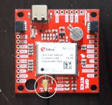
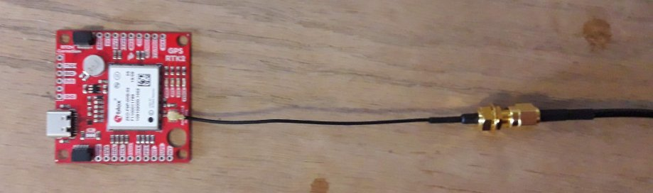
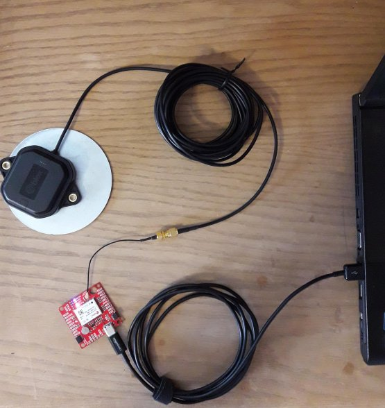

RTK GPS: F9P Modules
========================
This article will outline all the necessary steps in order to set up a simple base/rover RTK system using two ZED-F9P modules. It focuses on **hardware**. For UBLOX_read **software** documentation, click [here](../sw_guides/ublox_read.md).

Real Time Kinematics (RTK) is a GNSS technique used to obtain a centimeter-level accurate position of one module (called a **rover**) relative to a correction provider (often another module called a **base**).

## Required Hardware

1. Two computers with at least one USB 2.0 port each
2. A high-bandwidth, low-latency connection between the two computers. See [Ubiquiti](ubiquiti.md) page
3. Two [USB-C to USB 2.0 cables](https://www.showmecables.com/usb-3-1-generation-1-type-c-male-to-usb-3-0-type-a-male-cable-3-foot?gclid=CjwKCAjw5Ij2BRBdEiwA0Frc9bHLV14vPEc8vQT7E467ofJwrcr6P2htnfTZXF7UMjn6rLhoIVEZpRoCV2EQAvD_BwE)
4. Two [UBLOX ZED-F9P modules](https://www.digikey.com/product-detail/en/sparkfun-electronics/GPS-15136/1568-1983-ND/9856841?utm_adgroup=Evaluation%20Boards%20-%20Expansion%20Boards%2C%20Daughter%20Cards&utm_source=google&utm_medium=cpc&utm_campaign=Shopping_Development%20Boards%2C%20Kits%2C%20Programmers&utm_term=&utm_content=Evaluation%20Boards%20-%20Expansion%20Boards%2C%20Daughter%20Cards&gclid=CjwKCAjw5Ij2BRBdEiwA0Frc9dcK2qY4n5Ppg5T-fswhbmnNMlJXQImKcmQkLKaeRlxzLblbiYyPExoCGRcQAvD_BwE)
5. Two GNSS antennas with male SMA connector ends (we recommend [UBLOX patch antennas](https://www.digikey.com/product-detail/en/u-blox/ANN-MB-00-00/672-ANN-MB-00-00-ND/9817928))
6. Two [Female SMA to U.FL Interface Cables](https://www.sparkfun.com/products/9145)
7. Two 3-D printed protective cases (.stl files found [here](https://cad.onshape.com/documents/ba44982c60b7acd2527212b1/w/83c5d60e0c3d1c7ae5b09bf5/e/6e4ae4e57b49996dc6b8877f))
8. Two ground plates (preferably circular)

## Assembly

1. Gently push the female SMA/U.FL connector onto the port labeled *Active L1/L2 Antenna* on the ZED-F9P module until it snaps into place

2. Screw the male SMA end of the GNSS antenna into the end of the female SMA/U.FL connector

3. Attach the GNSS antenna to the center of the ground plate

4. Plug the USB-C cable into the F9P module and plug the other end into Computer #1

5. Repeat steps 1-4 for the second antenna, F9P module, Female SMA/U.FL connector, USB-C to USB 2.0 cable, and Computer #2

## Software Installation

The MAGICC Lab has developed its own software for interacting with the UBLOX F9P module.

On each computer, perform the following steps **given ROS is installed.**

1. Make a catkin workspace if you don't already have one (`mkdir catkin_ws`)
2. `cd catkin_ws && mkdir src`
3. `cd src && git clone https://github.com/byu-magicc/UBLOX_read.git`
4. `cd UBLOX_read`
5. `git submodule update --init --recursive`
6. `cd ../.. && catkin_make`
7. `source devel/setup.sh`

## Networking

Because of the time-sensitive nature of the data streamed from the base to the rover, it is important that you have a very low-latency connection. Stationary base may allow using WiFi, but the best option is a [Rocket-Bullet](ubiquiti.md) connection.

In order to ensure the computers can communicate, perform the following steps:

1. Computer #1: Open a terminal and enter `hostname -I` in order to find its IP address
2. Computer #1: Enter `netcat -l 1640`
3. Computer #2: Open a terminal and enter `netcat {IP address of Computer #1} 1640`
4. Enter `Hello` on Computer #2 and `World` on Computer #1
5. If you can see
 `Hello`
 `World` 
 in both terminals, then the connection is configured correctly. Otherwise, troubleshoot. You may need to disable firewalls

In order to see information from each F9P module on either computer, set `ROS_MASTER_URI` on one computer to the IP address of the other computer. Do this as follows: `export ROS_MASTER_URI={IP address of the other computer}` **Do not perform the same step for the other computer.**

Start a roscore on one computer. You must be able to see the node /rosout by entering `rosnode list` in the other computer's terminal. Shut the roscore down by typing Ctrl-C.

Attention: Do not modify the launch files below. Only use them as templates for creating your own in a separate package.

On the **base** computer,
1. `cp catkin_ws/src/UBLOX_read/launch/base.launch catkin_ws/src/<your own rospackage>/launch/basefile.launch`
2. Using your favorite text editor, open `basefile.launch`
3. Modify the line `<arg name="base_host" default="192.168.0.115"/>` base computer IP address
4. Modify the line `name="rover_host" default="192.168.0.143"/>` rover computer IP address
5. Save and close

On the **rover** computer, open
1. `cp catkin_ws/src/UBLOX_read/launch/rover.launch catkin_ws/src/<your own rospackage>/launch/roverfile.launch`
2. Using your favorite text editor, open `roverfile.launch`
2. Modify the line `<arg name="base_host" default="192.168.0.115"/>` base computer IP address
3. Modify the line `name="rover_host" default="192.168.0.143"/>` rover computer IP address
4. Save and close

## Moving or Stationary Base

The base F9P module supports two different configurations as follows:

1. Stationary base assumes that the base is does not move. This results in easier, faster, and more accurate RTK calculations for the rover. (~ 10 Hz)
2. Moving base does not assume that the base moves. This configuration has slower and generally less accurate RTK calculations. (~ 4 Hz)

The param `base_type` controls this configuration setting. The param value can be set to either `stationary` or `moving`. This is found in all launch files.

Check `catkin_ws/src/UBLOX_read/params/ublox.yaml` for the default param value.

## Startup

1. On one computer, enter the command `roslaunch <your own rospackage> basefile.launch`
2. On the other computer, enter `roslaunch <your own rospackage> roverfile.launch`

## Debugging

* `[async_comm][ERROR]: open: device or resource busy`: Launched a file before the USB connection to the module was fully operational.
    *Solution:* Ctrl-C, wait 10 seconds, relaunch
* `[async_comm][ERROR]: open: No such file or directory`: The serial port specified in the launch file has nothing connected to it
    *Solution:* Ctrl-C
    In a terminal, enter `ls /dev -a | grep ttyACM` to find which USB ports are currently in use. One of those will be the F9P serial port.
    In the launch file, edit the param `serial_port` to match
* `[async_comm][ERROR]: invalid argument`: Check `base_host` and `rover_port`
* `[async_comm][ERROR]: bind: Address already in use`: Check `base_port` and `rover_port`
* The number and position of satellites at any given time significantly influences the accuracy of RTK-GNSS. If data is messy, wait an hour and try again. You may get a more favorable constellation
* As a last resort, consider turning off some GNSS constellations by setting them to 0 in `params/ublox.yaml`. Turn off GLONAS first (it requires more computational effort than the others)
* The base sends data to the rover via a UDP connection, which by nature may send packets out of order. Occasionally, you may see terminal output such as: 
`Returning false because checksums did not match! Message cka: 0, calculated cka: 150 Message ckb: 90, calculated ckb: 158`
or
`Failed to parse message, f9pID: 1, ParseState: 8, CLASS_ID: 1, MSG_ID: 1`
Do not be concerned if this happens occassionally as hundreds of data packets are sent over the network. However, if hundreds of these error messages print, then something may wrong with the connection.

`f9pID`: The f9P computer the message came from. 0 is the local computer. 1 is from its relative base.

`ParseState`: Stage the parser was at in the UBX Protocol

|`ParseState`   | Meaning   |
| ---------     | --------  |
| 0             |    START  |
| 1             |  GOT_START_FRAME |
| 2             |   GOT_CLASS |
| 3             | GOT_MSG_ID |
| 4             |  GOT_LENGTH1 |
| 5             |  GOT_LENGTH2 |
| 6             |    GOT_PAYLOAD |
| 7             |    GOT_CK_A |
| 8             |    GOT_CK_B |

`CLASS_ID`: UBX message class

`MSG_ID`: UBX message ID within class

## Best Practices

1. Open sky with minimal surrounding obstructions
2. Place antennas in the same orientation as each other (this is more important with shorter baselines)

## Base and Rover From One Computer

To run ZED-F9P modules from one computer: 
1. Plug both modules into the computer 
2. `cp catkin_ws/src/UBLOX_read/launch/OneComp.launch catkin_ws/src/<your own rospackage>/launch/OneComp.launch`
2. `roslaunch <your own rospackage> OneComp.launch`

## ROS Topics

Helpful ROS Topics include
1. **/rover/RelPos:** Position of rover relative to base in NED frame
2. **/rover/RelPosFlags:** Flags that determine the validity of RTK calculations
3. **/rover/PosVelTime:** Rover global position/velocity in LLA format
4. **/base/PosVelTime:** Base global position/velocity in LLA format
5. **/rover/PosVelEcef:** Rover global position/velocity in ECEF frame

See [UBLOX_read Documentation](../sw_guides/ublox_read.md) for more information about the content of these messages.
Ex: `rostopic echo /rover/RelPos`

## Firmware Update

UBLOX periodically releases firmware updates for the ZED-F9P module. To tell if the module is running the latest verion, `roslaunch ublox debug.launch` The output will annouce if an update is needed.

If an update is needed, follow these steps on a **Windows Machine** with [U-Center](https://www.u-blox.com/en/product/u-center) installed (like the flight-simulator computer in the lab):
1. Navigate to the [official UBLOX ZED-F9P Page](https://www.u-blox.com/en/product/zed-f9p-module#tab-documentation-resources)
2. Scroll down to click the tab **Documentation and Resources**.
3. Scroll down to the section **Firmware Update**
4. Download the latest firmware version
5. Follow the instructions for updating firmware from the [U-Center User Guide](https://www.u-blox.com/sites/default/files/u-center_Userguide_%28UBX-13005250%29.pdf). As of May 2020, the instructions are located in Section 8.1. Alternatively, watch this [video](https://www.youtube.com/watch?v=KQFQZPX5rwk). **Uncheck "Enter safeboot before update"**

## UBLOX Documentation and Citations

 * [Interface Description](https://www.u-blox.com/sites/default/files/u-blox_ZED-F9P_InterfaceDescription_%28UBX-18010854%29.pdf) contains information about various messages from the module.
 * [Integration Manual](https://www.u-blox.com/en/docs/UBX-18010802)
 * [Moving Base Application Note](https://www.u-blox.com/en/docs/UBX-19009093)
 * [Data Sheet](https://www.u-blox.com/en/docs/UBX-17051259)
 * [UBLOX F9P Site](https://www.u-blox.com/en/product/zed-f9p-module) contains more useful documents

## Credits

 A special thanks goes to
 *Nathan Toombs*: ZED-F9P Protective Case Design
