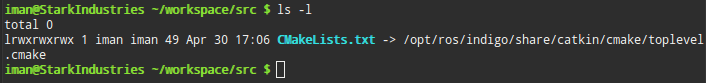
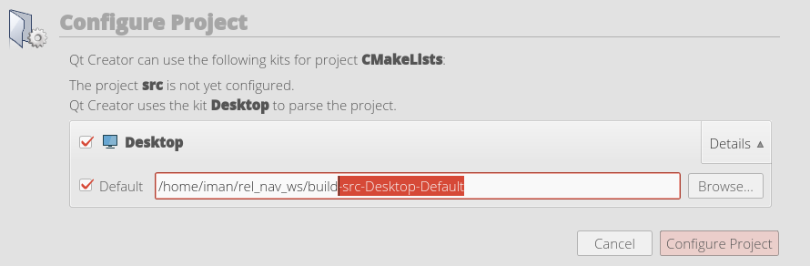
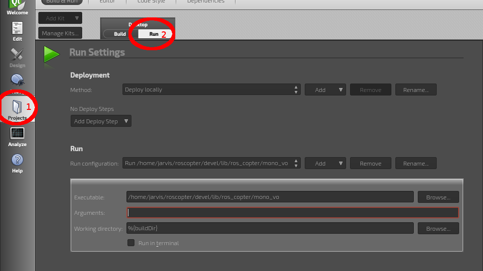
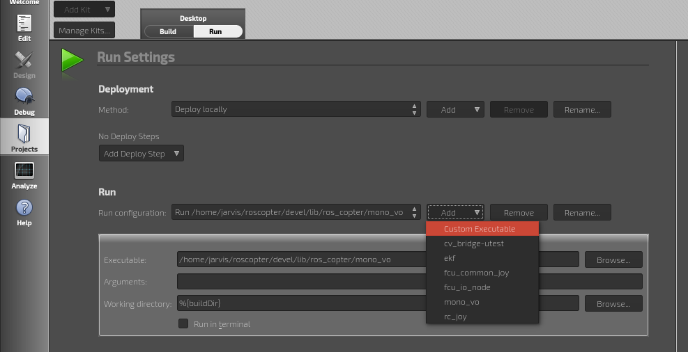
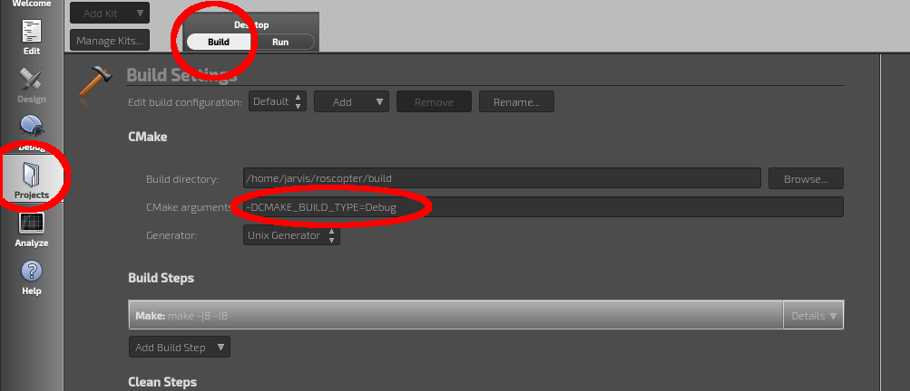

# Qt Creator #

We generally use Qt Creator ([officially](https://en.wikipedia.org/wiki/Qt_%28software%29) pronounced "cute" but that sounds stupid, so most of us call it it "Q-T" creator instead) to do our C++ ROS development in the MAGICC lab. Technically, there are ways to use Eclipse as well, and a lot of times, you end up using vim or sublime (plain text editors) to make quick modifications, but Qt does a good job of linking between documents, and helping you code efficiently.

Using Qt creator is super easy, given that you know a few things about setting it up.

First, install Qt creator

```bash
sudo apt install -y qtcreator
```

## Setting Up the Environment ##
---
The installation of Qt Creator will automatically create an icon for you to use in the launcher, however if you don't make a modification to that shortcut, then it will not load the ROS environment if you use the icon in the unity bar to launch the program.

To fix this, you have two options:

  1. always start qtcreator from the command line
  2. replace the contents of the /usr/share/applications/qtcreator.desktop with the following (You'll need to sudo)

```bash
[Desktop Entry]
Exec=bash -i -c qtcreator %F
Icon=qtcreator
Type=Application
Terminal=false
Name=Qt Creator
GenericName=Integrated Development Environment
MimeType=text/x-c++src;text/x-c++hdr;text/x-xsrc;application/x-designer;application/vnd.nokia.qt.qmakeprofile;application/vnd.nokia.xml.qt.resource;
Categories=Qt;Development;IDE;
InitialPreference=9
```
This will load the environment variables when you start qt creator, and you won't need to always start it from the command line

## Loading your project ##
---
To load your project, simply open Qt Creator, then click "Load Project" and open the CMakeLists.txt file in your /src folder. This will often return an error about Qt Creator not having privileges to edit some toplevel.cmake file.

To check this out, cd into your <workspace>/src folder and type
```bash
ls -l
```


You'll notice that there will be a "symlink" between CMakeLists.txt and /opt/ros/indigo/share/catkin/cmake/toplevel.cmake. What this means is that CMakeLists.txt is not a real file, it's just a link to that toplevel.cmake file, which requires sudo privileges to edit. We don't actually want to modify that file anyway, so all we'll do is delete the symlink and then make a new copy of that toplevel file in our folder right here.
```bash
rm CMakeLists.txt
cp /opt/ros/indigo/share/catkin/cmake/toplevel.cmake CMakeLists.txt
```
by the way, I made this an alias in my .rosalias file
```bash
alias fixCMake="rm CMakeLists.txt && cp /opt/ros/indigo/share/catkin/cmake/toplevel.cmake CMakeLists.txt"
```
After you've fixed that, Qt Creator should have no problem loading the project.

## Set the Build Folder ##
---
After you have opened CMakelists.txt and cleared the write permissions error, you'll see something like the following:



You need to delete the part highlighted above. This makes the QtCreator build tool actually run the same process that a catkin_make would do.

After this, Qt will build the project, and you'll be able to edit the code! Simply press Ctrl+B or F5 to run a catkin_make.

## Running ROS nodes within Qt Creator ##
---
QtCreator can be used to actually run the ros node without using the terminal. This can be accomplished by changing a few of the run settings within the project. Go to the Projects Tab on the left side of the screen. Then near the top, toggle from "build" to "run"



Under the Run, portion, click "Add", then "Custom Executable" from the drop-down menu.



Then, navigate to <workspace_location>/devel/lib/<package>/<node> . This is the compiled executable created by catkin_make. With this selected, now when you press the play button at the bottom of Qtcreator, it will run the ros node. Be sure you have a roscore running in the background, and that all messages you need are being published.

To change which node runs when you press play, just go change the custom executable you selected in the previous step.

## Debugging Executables (Nodes) Compiled with CMake in Qt Creator ##
---
QtCreator has a pretty nice little debugger. It allows you to set watches on variables, set breakpoints, etc.. It is pretty easy to set up for your CMake projects too. When debugging, your node will go much slower than in run mode, so there are some issues with messages being lost in memory during debugging, because messages aren't persistent. If you're aware of this, however, it can be pretty nice for debugging ROS nodes.

All you have to do is add the CMake argument -DCMAKE_BUILD_TYPE=Debug to the Project build step.



Then, just click the play button with a bug on it to debug your code. It will take quite a bit longer to compile in debug mode, especially if you have a lot of nodes in your project, but it can be a life saver for finding bugs.
